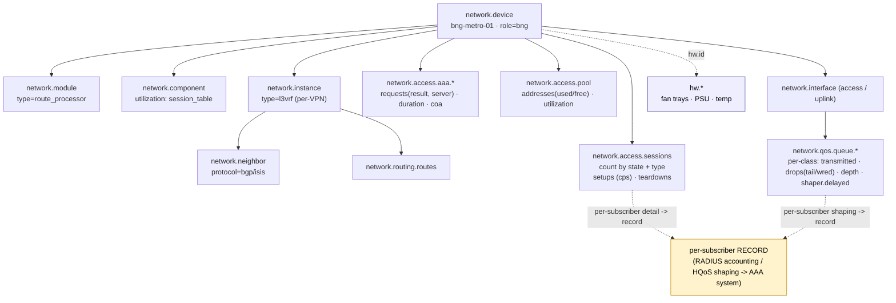

# Example: BNG / BRAS (broadband subscriber edge)

A worked, end-to-end mapping of a **Broadband Network Gateway** onto `network.*`,
with each value traced back to the SNMP MIB object and OpenConfig/RADIUS source it
comes from.

> **Who this is for.** You operate a BNG/BRAS terminating millions of PPPoE/IPoE
> subscriber sessions and want to emit OpenTelemetry network conventions for the
> subscriber edge — session-table load, client-side AAA/RADIUS, address pools — at a
> scale where the obvious modelling (one entity per subscriber) would melt your
> monitoring system. This example is really about **one rule**: the
> [cardinality firewall](../../docs/conventions.md#the-cardinality-firewall). It
> builds on the [core router](../core-router/README.md) (modular chassis, BGP, VRFs)
> and the [OLT/ONT](../olt-ont/README.md) (the access estate it aggregates), so those
> shapes are referenced rather than repeated.

---

## 1. The device

`bng-metro-01` is a modular metro BNG aggregating OLT/DSLAM/Ethernet access and
terminating residential and business subscribers.

```
   ┌──────────────────────────────────────────────────────────────────────────┐
   │ BNG  bng-metro-01   type=router · role=bng                                │
   │  ├─ RP0 / RP1   route processors (redundant)                             │
   │  └─ LC0…LCn ── NPU + session table (forwarding component)                │
   │                                                                          │
   │ Northbound:  2×400G core uplinks · IS-IS + iBGP · per-VPN L3VRFs         │
   │ Southbound:  millions of PPPoE / IPoE subscriber sessions               │
   │              RADIUS AAA + CoA · IPv4 / IPv6-NA / IPv6-PD address pools   │
   │                                                                          │
   │   subscriber ──S/C-VLAN──▶ session ──▶ AAA (RADIUS) ──▶ address pool     │
   │   (millions)               (count+record, NEVER an entity)               │
   └──────────────────────────────────────────────────────────────────────────┘
```

| Property | Value |
|----------|-------|
| Identity | `network.device.id = bng-metro-01` |
| Type / role | `type = router` · `role = bng` (open `role` value; `bras` is the synonym) |
| Scale | millions of PPPoE / IPoE sessions |
| AAA | RADIUS (auth + accounting), CoA / Disconnect |
| Addressing | IPv4, IPv6-NA, IPv6-PD pools |
| Northbound | 2×400G core uplinks, IS-IS + iBGP, per-VPN L3VRFs |

`role=bng` is an open `network.device.role` string. LAC/LNS are **not** roles —
wholesale L2TP is carried by `network.access.session.type = l2tp`. See
[type vs role](../../docs/entity-model.md#type-vs-role).

---

## 2. Structure at a glance



The one thing to read off this diagram: the millions of subscribers on the left
collapse into a handful of **aggregate metrics** (`network.access.sessions` bucketed
by a few low-cardinality dimensions). Per-subscriber detail leaves as a **record**
toward the AAA/mediation system — never as a per-session entity or per-subscriber
metric series.

---

## 3. The cardinality firewall — the whole point

A BNG holds millions of sessions. Modelling each one as a `network.*` entity, or
emitting a metric series per subscriber, is the exact cardinality explosion the
conventions exist to prevent. The rule is: **subscriber detail is count + record,
never an entity.** See [the cardinality firewall](../../docs/conventions.md#the-cardinality-firewall).

| The subscriber dimension | How it is modelled | Why |
|--------------------------|--------------------|-----|
| Millions of sessions | **aggregate count** (`network.access.sessions` by state + type) | bounded, low-cardinality |
| Setup / teardown rate | **counters** (`network.access.session.setups` / `.teardowns`) | rates, not per-session series |
| Per-subscriber identity (username, circuit-id, address, usage) | **a record** owned by the AAA/mediation system (RADIUS accounting) | high-cardinality, PII — belongs off the metric path |
| A per-session entity, or a per-subscriber metric series | **never emitted** | the explosion the firewall blocks |

So the per-subscriber subinterface — "is this an entity or an attribute bag?" — is
answered: it is **neither**; it contributes to an aggregate count and an external
record. The S-VLAN/C-VLAN-per-subscriber encapsulation is the same
[routed sub-interface encap](../cpe-router/README.md#5-vlan-trunk--mac) seen on the
CPE, not a per-subscriber object.

---

## 4. Subscriber sessions — the aggregate

The single most important southbound signal: how many sessions, in what state, and
how fast they are churning.

| What | `network.*` | SNMP | OpenConfig / source |
|------|-------------|------|---------------------|
| Active session count (by state + type) | `network.access.sessions` (+ `network.access.session.state`, `.type`) | vendor subscriber-MIB | vendor subscriber-mgmt YANG |
| Session type | `network.access.session.type` = `pppoe`/`ipoe`/`l2tp` | vendor subscriber-MIB | subscriber session-type leaf |
| Session state | `network.access.session.state` = `up`/`connecting`/`terminating`/`down` | vendor subscriber-MIB | subscriber oper-state |
| Setup rate (calls-per-second) | `network.access.session.setups` (counter, + type) | vendor subscriber-MIB | subscriber setup counter |
| Teardown rate | `network.access.session.teardowns` (counter, + type) | vendor subscriber-MIB | subscriber teardown counter |
| Session-table exhaustion | `network.component.utilization` (`resource=session_table`) | vendor resource-MIB | `oc-platform` utilization |

The **setup rate** (`network.access.session.setups`) is the #1 BNG control-plane load
signal — a re-auth storm after a link flap shows up here before anything else. The
session-table fill rides the same `network.component.utilization` shape the
[core router uses for FIB/label table fill](../core-router/README.md#7-mplssrsrv6-forwarding-plane).
There is deliberately **no per-session metric series** — the count bucketed by state
and type is the whole metric surface.

---

## 5. AAA / RADIUS — the client (NAS) view

The BNG is a RADIUS *client*. This is its own observation of authenticating and
accounting — "can my subscribers authenticate, are my accounting packets ACKed, am I
being CoA'd" — **not** the AAA platform's authoritative records (a separate producer).

| What | `network.*` | SNMP | source |
|------|-------------|------|--------|
| AAA requests (by op / result / server) | `network.access.aaa.requests` (+ `operation`, `result`, `protocol`, `server.id`) | RADIUS-AUTH/ACC-CLIENT-MIB (RFC 4668/4670) | RADIUS client counters |
| Result classes | `network.access.aaa.result` = `accept`/`reject`/`timeout`/`error` | RADIUS client MIB | — |
| Request latency (client-measured) | `network.access.aaa.request.duration` (histogram) | — | RADIUS client RTT |
| Server + failover role | `network.access.aaa.server.id` / `.server.role` (`primary`/`secondary`) | RADIUS client MIB server index | — |
| CoA / Disconnect received + ACK/NAK | `network.access.coa.requests` (+ `coa.type`, `coa.result`) | RADIUS-DYNAUTH-CLIENT-MIB (RFC 6614) | dynamic-authz counters |

The `result` dimension is the cause-of-the-day when subscribers can't get online
(`reject` vs `timeout` points straight at policy vs reachability). A `coa.result=nak`
spike is a real incident. All dimensions here are low-cardinality (a BNG points at a
handful of servers) — this stays inside the cardinality firewall by construction.

---

## 6. Address pools

The pool is the one subscriber-edge object that **is** an entity — it's bounded,
durable, and the thing operators alert on. Pool exhaustion is a silent
subscriber-onboarding outage.

| What | `network.*` | SNMP | source |
|------|-------------|------|--------|
| Address pool as an object | `network.access.pool` entity (`pool.id`, `pool.type`) | vendor pool-MIB | vendor address-pool YANG |
| Pool family / kind | `network.access.pool.type` = `ipv4`/`ipv6_na`/`ipv6_pd` | vendor pool-MIB | pool address-family leaf |
| Used / free / size | `network.access.pool.addresses` (+ `pool.state`) | vendor pool-MIB used/free | pool used/free counters |
| **Pool utilisation (the alert signal)** | `network.access.pool.utilization` (ratio 0.0–1.0) | derived | derived |
| DHCPv6 prefix delegation | `pool.type = ipv6_pd` | vendor pool-MIB | IA_PD pool |

The pool entity's identity is scoped by its device — `(network.device.id,
network.access.pool.id)` — the same [sub-entity identity](../../docs/entity-model.md#sub-entity-identity-is-scoped-by-its-parent)
rule the VRF and LAG follow. Alert on `network.access.pool.utilization` (e.g. at 0.9);
only NF-local pools (the ones the BNG allocates from) are in scope — RADIUS-framed and
external-IPAM addressing is a different producer's concern.

---

## 7. QoS — the per-class queue plane

A BNG is an HQoS box: traffic is shaped and scheduled in a port→S-VLAN→subscriber→queue
hierarchy. That hierarchy lives at **three different cardinalities**, and the model
authors only the bounded one — which is the same cardinality discipline §3 is built
around.

| Plane | What | How it is modelled |
|-------|------|--------------------|
| **A — per-class queue counters** (~8 forwarding classes/port) | "which class is dropping, tail or WRED?" | **authored** — `network.qos.*` metrics on `network.interface`, dimensioned by `network.qos.class` |
| **B — per-subscriber HQoS shaping** (10⁵–10⁶ subjects) | "is *this* subscriber being throttled?" | a **record** in the usage/accounting family — never a per-subscriber metric series |
| **C — scheduler / classifier config** (match/set, WRR weights, CIR/PIR) | the shaping policy itself | config-plane, deferred (aligns to `openconfig-qos`) |

The per-class plane (A) applies to the BNG's access-facing and uplink interfaces. The
`network.qos.class` dimension is the bounded discriminator (~8 DiffServ classes) that
keeps it cardinality-safe — it is not a queue entity and not the per-subscriber axis.

| What | `network.*` | SNMP | OpenConfig |
|------|-------------|------|------------|
| Forwarding class (the discriminator) | `network.qos.class` (`voice`/`best_effort`/`scavenger`/…) | DIFFSERV-MIB class | `openconfig-qos` forwarding-group |
| Bytes / packets serviced per class | `network.qos.queue.transmitted` / `.packets` (+ `network.io.direction`) | QOS-MIB per-class | `openconfig-qos` queue counters |
| **Drops, by mechanism** | `network.qos.queue.drops` (+ `network.qos.drop.reason` = `tail`/`wred`/`buffer`/`policer`/`shaper`) | DIFFSERV-MIB drops | `openconfig-qos` queue dropped-pkts |
| Queue occupancy / watermark | `network.qos.queue.depth` / `.depth.max` | vendor buffer-MIB | `openconfig-qos` queue depth |
| Policer drops, by color | `network.qos.policer.drops` (+ `network.qos.color` green/yellow/red) | DIFFSERV-MIB meter | `openconfig-qos` scheduler dropped |
| **Shaper-delayed packets** (per class) | `network.qos.shaper.delayed` | vendor HQoS-MIB | `openconfig-qos` scheduler |

`network.qos.queue.drops` is the **per-class decomposition** of the queueing subset of
[`network.interface.discards`](../cpe-router/README.md#4-interfaces--counters) — a
backend must not add the two. The `drop.reason` dimension answers the WRED-vs-tail
question `network.interface.discards` alone cannot.

`network.qos.shaper.delayed` (per class) is the **aggregate twin** of the
per-subscriber HQoS shaping answer: "which classes are being throttled on this port"
is a metric; "is *this subscriber* being throttled" is the Plane-B record. The split is
the [cardinality firewall](../../docs/conventions.md#the-cardinality-firewall) again —
exactly the rule §3 makes for sessions, applied to shaping.

---

## 8. Northbound, system & hardware health

North of the subscriber edge the BNG is a conventional router and maps exactly like
the [core router](../core-router/README.md): `network.interface` uplinks + optics,
`network.neighbor` (IS-IS / BGP, `protocol` key), `network.routing.routes` per AF, and
per-VPN L3VRFs as `network.instance type=l3vrf`.

Hardware health follows the [namespace boundary](../../docs/architecture.md#namespace-layering):
fans, PSUs and temperatures are `hw.*`; device uptime, per-RP CPU/memory (via
`network.component.id`) are `network.device.*`.

| What | `network.*` / `hw.*` | SNMP | OpenConfig |
|------|----------------------|------|------------|
| Per-VPN forwarding context | `network.instance` `type=l3vrf` | `mplsL3VpnVrfTable` (MPLS-L3VPN-MIB) | `/network-instances/network-instance` |
| BGP / IS-IS peers | `network.neighbor` (+ `protocol`) | BGP4-MIB / `mib-2 isis` | `/.../protocols/protocol/...` |
| Per-RP CPU / memory | `network.device.cpu.utilization` / `.memory.utilization` (+ `component.id`) | `cpmCPUTotal5minRev` | `/components/component/state/utilization` |
| Fans / PSU / temp | `hw.status` / `hw.temperature` | ENTITY-SENSOR-MIB | `oc-platform` sensors |

---

## 9. What this device does NOT model

Deliberately out of scope, to keep the boundaries honest:

- **Per-subscriber HQoS shaping as a metric** and the **scheduler/classifier config
  plane** — the per-*class* queue plane (§7) is authored, but the per-*subscriber*
  shaping answer ("is this subscriber being throttled?") is a record, not a
  per-subscriber metric series, and the scheduler-map/classifier config (WRR weights,
  CIR/PIR, match/set rules) is deferred to a future config-plane alignment with
  `openconfig-qos`.
- **The per-subscriber usage / billing record schema** — the *rule* is settled (usage
  is a RADIUS-accounting record toward the AAA/mediation system, never a metric series),
  but the authored record type is deferred to the events/records package.
- **Disaggregated BNG (CUPS / TR-459)** — one logical BNG split across a control-plane
  and user-plane device, where a single session's state and counters live on
  *different* boxes. Needs typed multi-device relationship work; deferred. (This is
  distinct from route-processor redundancy, which *is* modelled —
  `network.redundancy.role` on the two `type=route_processor` modules plus
  `network.redundancy.switchover`: CUPS splits one function across two *devices*,
  whereas RP active/standby is two *modules* inside one device.)
- **Subscriber-session / AAA-unreachable / pool-exhausted events** — authored:
  `network.access.session.state.changed`, `network.access.aaa.unreachable`, and
  `network.access.pool_exhausted` complement the reconstructable counters
  (`setups`/`teardowns`, `aaa.requests` by result, `pool.utilization`). Event-storm
  sampling guidance for the high-churn session transitions remains deferred.

Everything else — the aggregate session count + setup/teardown rates, session-table
fill, client-side AAA/RADIUS + CoA, the address-pool entity with its utilisation
alert, and the per-class QoS queue plane — is authored, and the per-subscriber
cardinality question is answered by construction.
