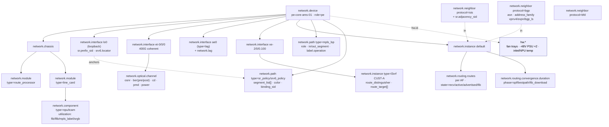

# Example: core / PE router

A worked, end-to-end mapping of a modular backbone **provider-edge (PE) router**
onto `network.*`, with each value traced back to the SNMP MIB object and OpenConfig
path it comes from.

> **Who this is for.** You operate a backbone P/PE router and want to emit
> OpenTelemetry network conventions for the full forwarding plane — the modular
> chassis, the IGP/BGP control plane, the MPLS/SR/SRv6 label-switched paths, and
> coherent optics. This is the most complete device in the set; it builds on the
> [CPE router](../cpe-router/README.md) (identity, interfaces, BGP, optics) and the
> [L2 switch](../l2-switch/README.md) (LAG), so those shared shapes are referenced
> rather than repeated.

---

## 1. The device

`pe-core-ams-01` is a 16-slot modular backbone router in Amsterdam, acting as both a
provider-edge (PE) and a transit P/LSR.

```
   ┌────────────────────────────────────────────────────────────────────────────┐
   │ Chassis (16-slot)                                                            │
   │  ├─ RP0 / RP1  route processors (redundant)                                  │
   │  ├─ FC0…FC5    fabric cards                                                   │
   │  └─ LC0…LC9    line cards ── each with NPU + TCAM (forwarding components)     │
   │                                                                              │
   │ Control plane:  IS-IS L2 + SR-MPLS · iBGP to 2 route-reflectors              │
   │                 AFs: ipv4/ipv6 unicast, vpnv4, vpnv6, l2vpn-evpn, bgp-ls     │
   │                 SRGB 16000–23999 · RSVP-TE · SRv6 locator · BFD              │
   │ Data plane:     400G coherent uplinks · L3VPN / EVPN / VPWS services         │
   │                                                                              │
   │ et-0/0/0  400G coherent uplink (OSNR/BER/CD/PMD)                             │
   │ ae0       LAG uplink (members et-0/1/0, et-0/1/1)                            │
   │ lo0       loopback (node-SID / SRv6 locator anchor)                          │
   │ xe-2/0/0.{100,200,300}  L3VPN sub-interfaces (per-customer VRFs)             │
   └────────────────────────────────────────────────────────────────────────────┘
```

| Property | Value |
|----------|-------|
| Identity | `network.device.id = pe-core-ams-01` |
| Type / role | `type = router` · `role = pe` (also acts as `p` / `route_reflector`-client) |
| IGP | IS-IS Level 2 with SR-MPLS (SRGB 16000–23999) |
| BGP | iBGP to two route-reflectors; AFs ipv4/ipv6 unicast, vpnv4, vpnv6, l2vpn-evpn, bgp-ls |
| Forwarding | MPLS (LDP + RSVP-TE), SR-MPLS, SRv6 locator, BFD |
| Optics | 400G coherent (`et-0/0/0`) |
| Services | L3VPN, EVPN, VPWS |

Unlike the fixed-form CPE and switch, this device **is** modular — the
chassis/module/component hierarchy is the right tool here. See the
[entity catalogue](../../docs/entity-model.md#entity-catalogue).

---

## 2. Structure at a glance



Two things are new versus the simpler examples:

- **The forwarding plane is reachable.** An MPLS LSP or SR policy is a
  `network.path` — a *cross-device* primitive (it is **not** scoped to one device,
  like `network.link`). Each device emits its own segment carrying the shared
  `network.path.id`; "the whole LSP" is a query over that id.
- **SIDs anchor on the entities that own them.** The `sr` package mints no entity —
  the node-SID and SRv6 locator live on the loopback interface, the adjacency-SID on
  the `network.neighbor`, and table occupancy on the NPU `network.component`.

---

## 3. Inventory — the modular hierarchy

This is where the core router diverges most from the fixed-form examples. The
chassis, modules, and forwarding components are all entities.

| `network.*` | SNMP (ENTITY-MIB) | OpenConfig (`/components/component`) |
|-------------|-------------------|-------------------------------------|
| `network.device` `role=pe` | `sysName` / `sysObjectID` | `/system/state/hostname` |
| `network.chassis` *(identity:* device.id, chassis.id*)* | `entPhysicalClass=chassis(3)` | `[type=CHASSIS]` |
| `network.chassis.slot` | `entPhysicalParentRelPos` | `.../state/location` |
| `network.module` `type=route_processor` | `entPhysicalClass=module(9)` | `[type=CONTROLLER_CARD]` |
| `network.module` `type=fabric_card` | `entPhysicalClass=module(9)` | `[type=FABRIC]` |
| `network.module` `type=line_card` | `entPhysicalClass=module(9)` | `[type=LINECARD]` |
| `network.module.parent.id` *(recursive sub-modules)* | `entPhysicalContainedIn` | `/components/component/state/parent` |
| `hw.serial_number` *(per module)* | `entPhysicalSerialNum` | `.../state/serial-no` |
| `network.component` `type=npu`/`tcam` | `entPhysicalClass` (sensor/other) | `[type=INTEGRATED_CIRCUIT]` |

The `network.component` exists **only** because forwarding-table-fill telemetry
attaches to the NPU/TCAM (§7.3). Physical health of every module (temperature,
voltage) stays in `hw.*` keyed by `hw.id` — see
[namespace layering](../../docs/architecture.md#namespace-layering).

The two route-processor modules are a redundant pair: each carries
`network.redundancy.role` (`active` / `standby`) within a
`network.redundancy.group.type=route_processor` group, and a supervisor switchover
raises `network.redundancy.switchover` (carrying the `network.module.id` that became
active). This is the **intra-device** corner of the redundancy model — the members are
modules of one device, with none of the shared-address reconciliation wrinkle that
anycast/MLAG/FHRP groups have.

---

## 4. Interfaces

All `network.interface`; state and counters map as in the
[CPE example §4](../cpe-router/README.md#4-interfaces). The core-router-specific
interfaces:

| Interface | `type` | Notes |
|-----------|--------|-------|
| `et-0/0/0` | `ethernet` | 400G coherent uplink (optics in §8) |
| `ae0` | `lag` | LAG bundle; members `et-0/1/0`, `et-0/1/1` — see the [L2 switch LAG section](../l2-switch/README.md#7-the-lacp-uplink-bundle) |
| `lo0` | `loopback` | anchors the node-SID and SRv6 locator (§7) |
| `xe-2/0/0.{100,200,300}` | `subinterface` | `parent.id=xe-2/0/0`; each bound to a customer VRF (§5) |

The loopback `lo0` is the most overloaded object on a core router — it anchors the
SR identities the device advertises into the IGP. Those identities attach to it as
opt-in attributes (§7), while the interface itself still models the port.

---

## 5. Forwarding contexts — VRFs / instances

Per-customer L3VPNs are `network.instance` entities; the global table is the
`default` instance.

| `network.*` | SNMP | OpenConfig (`/network-instances/network-instance`) |
|-------------|------|----------------------------------------------------|
| `network.instance` name=`default`, type=`default` | global routing context | `[name=default]` |
| `network.instance` type=`l3vrf` (CUST-A) | `mplsVpnVrfTable` (MPLS-L3VPN-STD-MIB) | `[type=L3VRF]` |
| `network.instance.route_distinguisher` | `mplsL3VpnVrfRD` | `.../state/route-distinguisher` |
| `network.instance.route_target` *(list)* | `mplsL3VpnVrfRTTable` | `.../inter-instance-policies/.../route-target` |
| interface ↔ instance binding | `mplsL3VpnIfConfTable` | `.../interfaces/interface` |

EVPN MAC-VRF and VPWS use the same entity with `type=l2vsi` / `l2p2p`. Routes,
neighbours, and interface bindings attach to a `network.instance`, never to a VLAN —
see [`network.instance` vs `network.vlan`](../../docs/entity-model.md#networkinstance-vs-networkvlan).

---

## 6. Control plane — IS-IS, BGP, BFD

Each adjacency/session is a `network.neighbor`. `protocol` is **identifying**, so the
same peer being both a BGP and a BFD neighbour is cleanly two entities.

### 6.1 IS-IS (IGP)

| `network.*` | SNMP | OpenConfig |
|-------------|------|------------|
| `network.neighbor` `protocol=isis` | ISIS-MIB `isisISAdjTable` | `.../protocols/protocol[ISIS]/isis/.../adjacencies/adjacency` |
| `network.neighbor.state` + `native_state` | `isisISAdjState` | `.../adjacency/state/adjacency-state` |
| `network.sr.adjacency_sid` *(on the neighbor)* | IS-IS SR ext | `.../adjacency/.../sid` |
| `network.protocol.messages` (`message.type`, direction) | `isisPduCounters` | `.../isis/.../state/...` |
| `network.routing.convergence.duration` `phase=spf` | (vendor SPF stats) | `.../isis/.../state/spf-...` |

### 6.2 BGP (multi-AF, route-reflector client)

| `network.*` | SNMP | OpenConfig |
|-------------|------|------------|
| `network.neighbor` `protocol=bgp`, `asn`, `address` | `bgpPeerTable` (BGP4-MIB) | `.../bgp/neighbors/neighbor` |
| `network.neighbor.state` = `up` + `native_state` = `Established` | `bgpPeerState` | `.../neighbor/state/session-state` |
| `network.address_family` = `ipv4_unicast` / `vpnv4_unicast` / `vpnv6_unicast` / `l2vpn_evpn` / `bgp_ls` | AFI/SAFI | `.../afi-safis/afi-safi/state/afi-safi-name` |
| `network.device.role = route_reflector` *(on the RRs)* | — | — |

### 6.3 BFD

| `network.*` | SNMP | OpenConfig |
|-------------|------|------------|
| `network.neighbor` `protocol=bfd` | BFD-STD-MIB `bfdSessTable` | `.../bfd/.../sessions/session` |
| `network.neighbor.state` + `native_state` | `bfdSessState` | `.../session/state/session-state` |

> Which client (an IS-IS adjacency, a BGP session, an LSP) a BFD session protects has
> no explicit binding attribute yet — folded into the evolving relationship model.

---

## 7. The MPLS / SR / SRv6 forwarding plane

This is what makes a core router a core router, and what the simpler examples never
reach. An LSP or SR policy is a `network.path`; the device-local SID plane is the
`sr` package.

### 7.1 MPLS LSPs (`network.path`)

Each device on an LSP emits its own segment with its `role` (ingress/transit/egress)
and its LFIB row. A transit LSR's whole job — *swap labels* — is a
`label.operation=swap`.

| `network.*` | SNMP (MPLS-*-STD-MIB) | OpenConfig (`/network-instances/.../mpls`) |
|-------------|-----------------------|--------------------------------------------|
| `network.path` `type=mpls_lsp` *(identity:* path.id, cross-device*)* | `mplsTunnelTable` / `mplsXCTable` | `.../lsps/...` |
| `network.path.role` = `ingress`/`transit`/`egress` | derived | derived |
| `network.path.local.in_segment` / `out_segment` *(the LFIB row)* | `mplsInSegmentTable` / `mplsOutSegmentTable` | `.../forwarding/...` |
| `network.path.label.operation` (`push`/`swap`/`pop`) | `mplsXCTable` | derived |
| `network.path.fec` | `mplsFTNTable` | `.../lsps/.../state/...` |
| `network.path.signaling` (`ldp`/`rsvp_te`/`sr`) | MIB module in use | `.../signaling-protocols/...` |
| `network.path.io` / `network.path.packets` *(per-LSP traffic)* | `mplsTunnelPerfTable` | `.../state/counters/...` |

### 7.2 Segment Routing (SR-MPLS + SRv6)

| `network.*` | Anchored on | Source |
|-------------|-------------|--------|
| `network.sr.prefix_sid` (node-SID) | the `lo0` `network.interface` | IS-IS SR ext / `oc-segment-routing` |
| `network.sr.adjacency_sid` | the `network.neighbor` | IS-IS SR ext |
| `network.sr.srgb.lower` / `.upper` = 16000 / 23999 | the device | `oc-segment-routing` srgb |
| `network.sr.srlb.lower` / `.upper` | the device | `oc-segment-routing` srlb |
| `network.srv6.locator` | the `lo0` interface / instance | RFC 9352 / `oc-srv6` |
| `network.srv6.sid.function` (`end`/`end_dt4`/`un`/…) | the local SID table | RFC 8986 |
| `network.path` `type=sr_policy` / `srv6_policy` + `segment_list[]` + `color` + `binding_sid` | the path | RFC 9256 SR Policy |

An SRv6 SID is simultaneously an IPv6 address, a routing prefix, and a forwarding
function. It is recorded as **one thing with three faces, counted once**: the locator
appears once in `network.routing.routes` (the route face), `srv6.sid.function` is the
forwarding face, and the SID value is the address — never triple-counted.

### 7.3 Table occupancy (the NPU component)

The SR/MPLS/FIB table fill is the pressing capacity signal on a core router. It is
`network.component.utilization` on the NPU/TCAM, **not** a new metric:

| `network.*` | Meaning |
|-------------|---------|
| `network.component.utilization` `resource=fib` | FIB fill |
| `network.component.utilization` `resource=lfib` | label-forwarding table fill |
| `network.component.utilization` `resource=mpls_label` | local label-space fill |
| `network.component.utilization` `resource=srgb` / `srlb` | SR block occupancy |

---

## 8. Coherent optics — 400G uplink

The 400G coherent uplink is the device the coherent optical metrics were written for.
The carrier is a `network.optical.channel` linked to `et-0/0/0` via `interface.id`;
module environmental telemetry stays in `hw.*` (as in the
[CPE optics section](../cpe-router/README.md#8-optical-transceiver-dom)).

| `network.*` | Source |
|-------------|--------|
| `network.optical.channel` `interface.id=et-0/0/0` (frequency/wavelength/grid/modulation/`fec.type`) | `oc-platform` transceiver / optical-channel |
| `network.optical.power` (rx/tx, `dB[mW]`) | `.../optical-channel/state/{input,output}-power/instant` |
| `network.optical.osnr` | `.../optical-channel/state/osnr/instant` |
| `network.optical.ber` (pre-FEC / post-FEC) | `.../optical-channel/state/...-fec-ber/instant` |
| `network.optical.chromatic_dispersion` | `.../optical-channel/state/chromatic-dispersion/instant` |
| `network.optical.pmd` | `.../optical-channel/state/...polarization...` |
| module temperature / voltage / status → `hw.*` | `entPhySensorValue` / `oc` transceiver state |

Coherent optical media channels routed across ROADM degrees would be
`network.path` `type=optical_lightpath` — the cross-device sibling of the LSP.

---

## 9. Routing at scale — RIB / FIB

Route **counts** per AF were always the easy part; **churn** and **convergence** are
the health signals.

| `network.*` metric | SNMP | OpenConfig |
|--------------------|------|------------|
| `network.routing.routes` (`address_family`, `route.state` ∈ received/active/advertised/**fib**) | per-AF RIB/FIB counts | `.../afi-safi/state/prefixes/...` |
| `network.routing.updates` *(churn, direction)* | `bgpPeer*Updates` | `.../neighbor/state/messages/.../UPDATE` |
| `network.routing.convergence.duration` (`phase` ∈ spf/bestpath/fib_download) | vendor convergence stats | `.../state/...` |
| `network.routing.ecmp.routes` (`ecmp.width`, `address_family`) | `inetCidrRouteTable` rows per prefix | `.../afts/ipv4-unicast/ipv4-entry` → `next-hop-group` |

The RIB-vs-FIB gap is expressed as `route.state=active` vs `route.state=fib`. ECMP
fan-out is `network.routing.ecmp.routes` — FIB routes bucketed by
`network.routing.ecmp.width`, so the `width=1` bucket is the unprotected-prefix count
and a drained high-width bucket means a lost path. Per-member traffic imbalance across a
group is read from per-interface `network.interface.io`.

---

## 10. Environment & events

| Hardware (`hw.*`) | Source |
|-------------------|--------|
| fan trays | `hw.fan.speed` / `hw.status` |
| dual −48V PSU | `hw.power.*` / `hw.voltage` / `hw.status` |
| inlet / NPU temperature | `hw.temperature` (+ `hw.sensor_location`) |

NPU temperature is `hw.temperature` keyed by `hw.id`, not `network.component` —
physical health is always `hw.*`.

Reconstructable transition **counters** exist today (`network.neighbor.state_changes`,
`network.routing.updates`, `network.path.protection.switches`), so post-restart state
is recoverable. The point-in-time **events** refine the
[standard envelopes](../../docs/conventions.md#events):

| Trap | Authored event |
|------|----------------|
| IS-IS / BGP / BFD neighbour change | `network.neighbor.state.changed` |
| module insert / remove / fail | `network.module.state.changed` |
| LSP / SR-policy down | `network.path.state.changed` |
| route-churn anomaly | derived from `network.routing.updates` |
| fan / PSU / temperature | `network.hardware.alarm` (keyed by `hw.id`) |
| device reboot | `network.device.state.changed` |

---

## 11. What this router does *not* (yet) model

- **ECMP per-member load-balance imbalance** — path *count* is now modelled
  (`network.routing.ecmp.routes` by width); per-member traffic skew across a group's
  members is read from `network.interface.io`, not a dedicated routing metric.
- **BFD → protected-client binding** — which IGP adjacency / BGP session / LSP a BFD
  session protects has no explicit attribute yet.

Everything else — modular inventory, the IGP/BGP/BFD control plane, per-AF route
state, the full MPLS/SR-MPLS/SRv6 label-switched forwarding plane, and coherent
optics — is modellable end-to-end as inventory + state.
