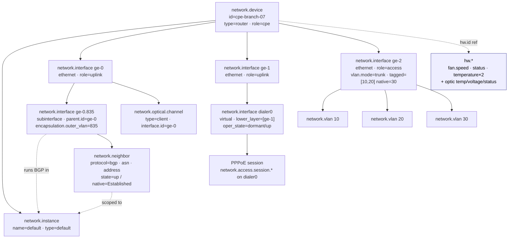

# Example: branch CPE router

A worked, end-to-end mapping of a small fixed-form **customer-premises
equipment (CPE)** router onto `network.*`, with each value traced back to the SNMP
MIB object and OpenConfig path it comes from.

> **Who this is for.** You operate a branch/home CPE and want to emit OpenTelemetry
> network conventions for it. This shows exactly which entities to create, which
> metrics and events to emit, and where each value is read from on the box.

---

## 1. The device

`cpe-branch-07` is a fixed-form branch router — one box, no removable cards.

```
                         ┌──────────────────────────────────────────────┐
   ISP-A (fiber/SFP) ────┤ ge-0 ── ge-0.835 (sub-if, S-VLAN 835) ── BGP ─┼─▶ ISP-A
                         │  └─ SFP optical transceiver (DOM)             │
   ISP-B (copper)    ────┤ ge-1 ── dialer0 (virtual) ── PPPoE session ───┼─▶ ISP-B
                         │                                                │
   LAN / switch      ────┤ ge-2 (trunk: VLAN 10 data, 20 voice, 30 mgmt) │
                         │                                                │
                         │  1× fan · temp @ fan-inlet + main CPU · CPU+RAM│
                         └──────────────────────────────────────────────┘
```

| Property | Value |
|----------|-------|
| Identity | `network.device.id = cpe-branch-07` |
| Type / role | `type = router` (what it *is*) · `role = cpe` (where it *sits*) |
| WAN A | fiber, SFP, routed sub-interface `ge-0.835` (802.1ad S-VLAN 835), eBGP to ISP-A |
| WAN B | copper, PPPoE session on virtual `dialer0` over `ge-1` |
| LAN | `ge-2`, 802.1Q trunk: VLAN 10 (data), 20 (voice), 30 (mgmt) |
| Hardware | 1 fan, 2 temperature sensors (fan-inlet, CPU), single CPU + RAM |

Because it is **fixed-form**, the `network.device` *is* the inventory unit — no
`chassis` / `module` / `component` entities are emitted (see the
[fixed-form profile](../../docs/entity-model.md#the-fixed-form-profile)).

---

## 2. Structure at a glance



All identity is relationship-based, not nested: every sub-entity carries
`network.device.id`, and metrics associate with their entity via
`entity_associations`. See
[logical containment is not OTel nesting](../../docs/entity-model.md#logical-containment-is-not-otel-nesting).

---

## 3. Inventory & identity

The `network.device` entity and its descriptive attributes.

| `network.*` | SNMP | OpenConfig |
|-------------|------|------------|
| `network.device.id` *(identifying)* | — (operator-assigned; derive & document) | — (operator-assigned) |
| `network.device.name` | `sysName` (SNMPv2-MIB) | `/system/state/hostname` |
| `network.device.type = router` | inferred from `sysServices` / `sysObjectID` | derived (no direct leaf) |
| `network.device.role = cpe` | — (operator metadata) | — (operator metadata) |
| `network.device.vendor.name` | from `sysObjectID` enterprise | `/system/state/.../vendor` (platform-dependent) |
| `network.device.vendor.id` (IANA PEN) | enterprise number in `sysObjectID` | — |
| `hw.model` | `entPhysicalModelName` (ENTITY-MIB, chassis row) | `/components/component/state/part-no` |
| `hw.serial_number` *(descriptive)* | `entPhysicalSerialNum` (ENTITY-MIB) | `/components/component/state/serial-no` |
| `os.name` / `os.version` | `entPhysicalSoftwareRev` / `sysDescr` | `/system/state/software-version` |
| `network.instance` name=`default` | default routing context | `/network-instances/network-instance[name=default]` |

> **Tip.** `network.device.id` is the one value you must define yourself — it has no
> single MIB source. Pick a stable, opaque key (a persisted UUID, a controller
> system-ip, or a deterministic hash) and document how each collection method
> populates it. See
> [the reconciliation problem](../../docs/entity-model.md#the-reconciliation-problem).

---

## 4. Interfaces

Five interface objects, all `network.interface`, identity scoped by
(`network.device.id`, `network.interface.id`).

| # | Interface | `type` | layering | `role` |
|---|-----------|--------|----------|--------|
| 1 | `ge-0` (fiber WAN) | `ethernet` | — | `uplink` |
| 2 | `ge-0.835` | `subinterface` | `parent.id=ge-0` · `encapsulation.outer_vlan=835` | `uplink` |
| 3 | `ge-1` (copper WAN) | `ethernet` | — | `uplink` |
| 4 | `dialer0` | `virtual` | `lower_layer.id=[ge-1]` | `uplink` |
| 5 | `ge-2` (LAN trunk) | `ethernet` | — | `access` |

`parent.id` expresses 1:1 containment (a sub-interface on its parent);
`lower_layer.id[]` expresses protocol stacking (the dialer over `ge-1`).

### 4.1 Interface state & attributes

| `network.*` | SNMP | OpenConfig |
|-------------|------|------------|
| `network.interface.index` *(descriptive)* | `ifIndex` (IF-MIB) | `/interfaces/interface/state/ifindex` |
| `network.interface.admin_state` | `ifAdminStatus` (IF-MIB, RFC 2863) | `/interfaces/interface/state/admin-status` |
| `network.interface.oper_state` | `ifOperStatus` (IF-MIB, RFC 2863) | `/interfaces/interface/state/oper-status` |
| `network.interface.speed` (entity + gauge) | `ifHighSpeed` (Mbit/s → bit/s) | `/interfaces/interface/.../state/port-speed` |
| `network.interface.mtu` | `ifMtu` | `/interfaces/interface/state/mtu` |
| `network.interface.duplex` | `dot3StatsDuplexStatus` (EtherLike-MIB) | `/interfaces/interface/ethernet/state/duplex-mode` |
| `network.interface.mac.address` | `ifPhysAddress` | `/interfaces/interface/ethernet/state/mac-address` |

`oper_state` carries the full RFC 2863 `ifOperStatus` vocabulary, including
`dormant` — exactly the dialer's pre-PPP state — and `lower_layer_down`,
`not_present`.

### 4.2 Counters

One metric per concept, with `network.io.direction` (`receive` / `transmit`) as the
only required dimension. Emitted per interface, including `ge-0.835` and `dialer0`.

| `network.*` metric | Unit | SNMP (rx / tx) | OpenConfig (under `.../state/counters/`) |
|--------------------|------|----------------|------------------------------------------|
| `network.interface.io` | `By` | `ifHCInOctets` / `ifHCOutOctets` | `in-octets` / `out-octets` |
| `network.interface.packets` | `{packet}` | `ifHCInUcastPkts` (+ multicast/broadcast) / `ifHCOutUcastPkts` | `in-unicast-pkts` / `out-unicast-pkts` |
| `network.interface.errors` (+ `error.type`) | `{error}` | `ifInErrors` / `ifOutErrors` | `in-errors` / `out-errors` |
| `network.interface.discards` | `{packet}` | `ifInDiscards` / `ifOutDiscards` | `in-discards` / `out-discards` |

### 4.3 Routed sub-interface encapsulation

`ge-0.835` terminates a single 802.1ad S-VLAN. The tag is recorded explicitly rather
than left implicit in the interface id:

| `network.*` | SNMP | OpenConfig |
|-------------|------|------------|
| `network.interface.encapsulation.outer_vlan = 835` | (vendor sub-interface MIB) | `/interfaces/interface/subinterfaces/subinterface/vlan/match/single-tagged/config/vlan-id` |
| `network.interface.encapsulation.inner_vlan` *(QinQ only)* | (vendor) | `.../double-tagged/config/second-vlan-id` |

This is distinct from the switchport `vlan.*` membership family in §6 (`vlan.outer`
is the tag a `dot1q_tunnel` switchport *pushes*; `encapsulation.outer_vlan` is the
tag a routed sub-interface *terminates*).

---

## 5. WAN routing — the BGP session

The eBGP session to ISP-A runs on `ge-0.835`, scoped to the `default` instance.

| `network.*` | SNMP | OpenConfig |
|-------------|------|------------|
| `network.neighbor` *(identity:* `device.id`, `protocol`, `neighbor.id`*)* | `bgpPeerTable` row (BGP4-MIB) | `/network-instances/.../protocols/protocol/bgp/neighbors/neighbor` |
| `network.neighbor.protocol = bgp` | (table identity) | (BGP protocol container) |
| `network.neighbor.address` | `bgpPeerRemoteAddr` | `.../neighbor/state/neighbor-address` |
| `network.neighbor.asn` | `bgpPeerRemoteAs` | `.../neighbor/state/peer-as` |
| `network.neighbor.state = up` + `native_state = Established` | `bgpPeerState` (1–6) | `.../neighbor/state/session-state` |
| `network.address_family = ipv4_unicast` | `bgp4PathAttrAddrFamily` (AFI/SAFI) | `.../neighbor/afi-safis/afi-safi/state/afi-safi-name` |

The `state`/`native_state` pair is the
[normalized-plus-native pattern](../../docs/conventions.md#state-modelling):
`Established` → `up`, native term preserved.

### 5.1 Routing metrics

| `network.*` metric | SNMP | OpenConfig |
|--------------------|------|------------|
| `network.routing.routes` `route.state=advertised` | (announced count, vendor) | `.../afi-safi/state/prefixes/sent` |
| `network.routing.routes` `route.state=received` | `bgpPeerInUpdates`-derived RIB | `.../afi-safi/state/prefixes/received` |
| `network.routing.routes` `route.state=active`/`fib` | RIB/FIB count (vendor) | `.../afi-safi/state/prefixes/installed` |
| `network.routing.updates` (churn, direction) | `bgpPeerInUpdates` / `bgpPeerOutUpdates` | `.../neighbor/state/messages/{received,sent}/UPDATE` |
| `network.protocol.messages` (`message.type`, direction) | `bgpPeer*Messages` | `.../neighbor/state/messages/...` |
| `network.neighbor.state_changes` | `bgpPeerFsmEstablishedTransitions` | `.../neighbor/state/.../established-transitions` |

---

## 6. WAN access — the PPPoE session

WAN-B terminates exactly one PPPoE session on the virtual `dialer0`. Because a CPE
holds a *single* config-bounded session (the symmetric opposite of a BNG holding
millions), per-session detail is permitted and hangs off the dialer interface.

| `network.*` (on `dialer0`) | Source |
|----------------------------|--------|
| `network.access.session.type = pppoe` + `.state` | PPP/PPPoE control plane (vendor PPP-MIB / oc-ppp) |
| `network.access.session.id` | PPPoE session-id (PADS) |
| `network.access.session.ac_name` | PPPoE AC-Name (which BNG/BRAS terminates it) |
| `network.access.session.service_name` | PPPoE Service-Name |
| `network.access.session.mru` | negotiated LCP MRU (the "why is my MTU 1492" number) |
| `network.access.session.uptime` (gauge `s`) | session uptime, CPE side |

The negotiated IP and default route appear as `network.routing.routes`
`route.state=received`. Session down/up is a
`network.interface.state.changed` event on the dialer (`dormant` ↔ `up`).

> PPPoE session detail intentionally lives here, **not** on `network.neighbor` (a
> session is session-shaped, not adjacency-shaped) and not on the BNG-side aggregate
> `network.access.sessions`. The CPE is the one place the *single* session matters.

---

## 7. LAN — VLAN trunk & MAC table

`ge-2` is an 802.1Q trunk. VLANs are entities; per-VLAN MAC occupancy associates
with the VLAN directly — no synthetic `l2vsi` instance is required (see
[`network.instance` vs `network.vlan`](../../docs/entity-model.md#networkinstance-vs-networkvlan)).

| `network.*` | SNMP | OpenConfig |
|-------------|------|------------|
| `network.vlan` 10 / 20 / 30 *(scoped by device)* | `dot1qVlanStaticTable` (Q-BRIDGE-MIB) | `/network-instances/.../vlans/vlan` |
| `network.interface.vlan.mode = trunk` | `dot1qPortVlanTable` | `/interfaces/interface/ethernet/switched-vlan/config/interface-mode` |
| `network.interface.vlan.tagged = [10,20]` | `dot1qVlanStaticEgressPorts` (tagged set) | `.../switched-vlan/config/trunk-vlans` |
| `network.interface.vlan.native = 30` | `dot1qPvid` | `.../switched-vlan/config/native-vlan` |
| `network.l2.mac.entries` → `network.vlan` (`entry.type`) | `dot1qTpFdbTable` / `dot1qFdbTable` | `/network-instances/.../fdb/mac-table/entries` |

---

## 8. Optical transceiver (DOM)

The fiber WAN's SFP reports digital optical monitoring. The optical carrier is a
`network.optical.channel` linked to its port via `interface.id`; environmental
telemetry of the module is `hw.*`.

| `network.*` | SNMP | OpenConfig |
|-------------|------|------------|
| `network.optical.channel` `type=client`, `interface.id=ge-0` | (entity / vendor DOM) | `/components/component[transceiver]` ↔ interface |
| `network.optical.power` `direction=receive` (`dB[mW]`) | vendor DOM (e.g. `*OpticalMonitor*RxPower`) | `.../transceiver/physical-channels/channel/state/input-power/instant` |
| `network.optical.power` `direction=transmit` | vendor DOM Tx power | `.../channel/state/output-power/instant` |
| `network.optical.bias_current` (`A`) | vendor DOM bias | `.../channel/state/laser-bias-current/instant` |
| `network.optical.threshold_crossed` *(event)* | DOM warn/alarm flags | `.../state/...-power/...` threshold leaves |
| Module temperature → `hw.temperature` | `entPhySensorValue` (ENTITY-SENSOR-MIB) | `/components/component/transceiver/state/...` |
| Supply voltage (Vcc) → `hw.voltage` | `entPhySensorValue` | `/components/component/transceiver/state/...` |
| Module status → `hw.status` | `entPhySensorValue` / vendor | `/components/component/state/oper-status` |

OSNR / BER / chromatic-dispersion / PMD (`network.optical.{osnr,ber,...}`) are
opt-in coherent metrics — simply **absent** on a grey CPE SFP, where the only DOM
value typically reported is `network.optical.power`.

---

## 9. System health & the `hw.*` boundary

Device-level health uses `network.device.*`; physical/environmental health uses
`hw.*`. The rule: **if `hw.*` has a concept for it, use `hw.*`.**

| Requirement | `network.*` metric | Unit | SNMP | OpenConfig |
|-------------|--------------------|------|------|------------|
| uptime | `network.device.uptime` | `s` | `sysUpTime` | `/system/state/boot-time` (derive) |
| CPU | `network.device.cpu.utilization` | `1` | vendor CPU MIB / `hrProcessorLoad` | `/components/component/cpu/utilization/state/instant` |
| memory ratio | `network.device.memory.utilization` | `1` | vendor memory MIB | `/components/component/state/memory/...` (derive) |
| memory bytes | `network.device.memory.usage` / `.limit` | `By` | vendor memory MIB | `/components/component/state/memory/{utilized,available}` |
| restart | `network.device.state.changed` *(event)* | — | `coldStart` / `warmStart` trap | (gNMI) |

| Hardware (lives in `hw.*`) | `hw.*` | SNMP |
|----------------------------|--------|------|
| fan speed | `hw.fan.speed` | `entPhySensorValue` (fan sensor) |
| fan / PSU status | `hw.status` | `entPhySensorValue` / `*EnvMon*State` |
| temperature (fan-inlet, CPU) | `hw.temperature` (+ `hw.sensor_location`) | `entPhySensorValue` (ENTITY-SENSOR-MIB) |

A CPE has no forwarding-table fill telemetry worth reporting, so it emits **no**
`network.component` at all — CPU/ASIC temperature is `hw.temperature`, keyed by
`hw.id`. (The one table that *does* fill on a CPE — the NAT translation table — is the
NAT-domain `network.nat.translations` gauge of §10, not a `network.component`.)

---

## 10. NAT44 — the translation table

This CPE source-NATs the private LAN behind its single public WAN address — the everyday
home/branch **NAT44** (PAT / "masquerade" / overload). The
[`network.nat` package](../../model/nat) splits NAT into a control plane and a data
plane: the per-flow post-translation tuple (the ECS-aligned `source.nat.ip:port`) is a
flow **record** facet, deferred with the flow record; the live **translation-table
occupancy** is device *state*, and that is the half a CPE emits.

| `network.*` | SNMP | OpenConfig / TR-181 |
|-------------|------|---------------------|
| `network.nat.translations` `type=source` — active xlate count, assoc `network.device` | NAT-MIB session table (RFC 4008); vendor / Linux `nf_conntrack_count` | no standard OpenConfig NAT model; TR-181 `Device.NAT` |
| `network.nat.type = source` — the PAT discriminator (the only kind a single-WAN CPE does) | implicit (overload NAT) | — |

`network.nat.translations` is the NAT analogue of `network.session.count`: one
updowncounter, dimensioned only by the low-cardinality `network.nat.type`, hung off
`network.device`. It is the count that climbs toward the ~64k-per-address PAT ceiling
when a P2P/CGNAT-unfriendly app opens thousands of flows — the CPE's NAT-exhaustion
signal. Per the
[cardinality firewall](../../docs/conventions.md#the-cardinality-firewall), the
individual translations are **never** a per-translation series.

Because the box owns a *single* dynamic WAN address (not a pool), it emits **no**
`network.nat.pool` entity and **no** port-blocks — those are the carrier **CG-NAT** story
(a shared public pool + per-subscriber port-block logging) that lives on
[the BNG](../bng/README.md), not a home box.

> **DNAT port-forwards are config, not state.** "Forward TCP 25565 to the games console"
> is a NAT *rule*: `network.nat.type = destination` exists for the flow record it
> produces, but the rule *itself* is firewall/policy-rulebase config, still deferred
> (§12).

---

## 11. Events (traps)

Every SNMP trap / syslog transition this CPE generates has an authored event home.
Events refine one of two envelopes (`network.state.changed`, `network.alarm`) — see
[events](../../docs/conventions.md#events).

| Trap (SNMP origin) | Authored event |
|--------------------|----------------|
| linkUp / linkDown | `network.interface.state.changed` (operational) |
| interface admin shut | `network.interface.state.changed` (administrative) |
| BGP up/down (`bgpBackwardTransition`) | `network.neighbor.state.changed` (`Established` ↔ `Idle`) |
| PPPoE session down | `network.interface.state.changed` on `dialer0` (`up` ↔ `dormant`) + §6 session detail |
| device reboot (`coldStart` / `warmStart`) | `network.device.state.changed` |
| fan / PSU failure | `network.hardware.alarm` (keyed by `hw.id`, `cause=power_failure`) |
| optical Rx-power-low | `network.optical.threshold_crossed` (`cause=threshold_crossed` + threshold/observed) |

A device **config change** is modelled as an observation *record* (what changed +
commit-id), not a state transition — see
[events](../../docs/conventions.md#events).

---

## 12. What this CPE does *not* emit

- **No `chassis` / `module` / `component`** — it is fixed-form; the device is the
  inventory unit.
- **No NAT *rule* config** — the NAT44 translation *table* is emitted (§10), but DNAT
  port-forwards and static-NAT mappings as *configuration* are firewall-rulebase
  territory, deferred with the policy package.
- **No coherent optics metrics** (OSNR/BER/CD/PMD) — grey SFP reports power only.
- **No `network.instance` beyond `default`** — flat 802.1Q switching uses the VLAN
  as the bridge domain directly.
- **Availability / SLO** is not device self-telemetry — it belongs to the active
  test domain (`network.test.*`), measured by a probe, not reported by the CPE.
