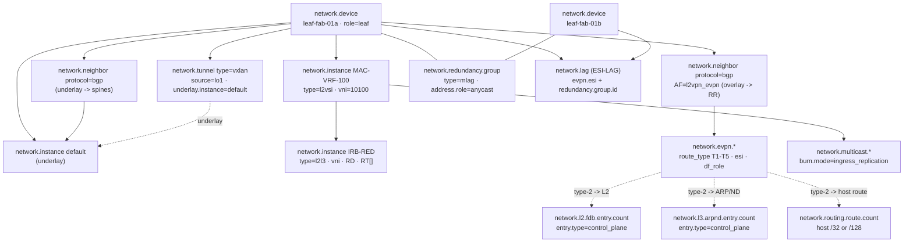
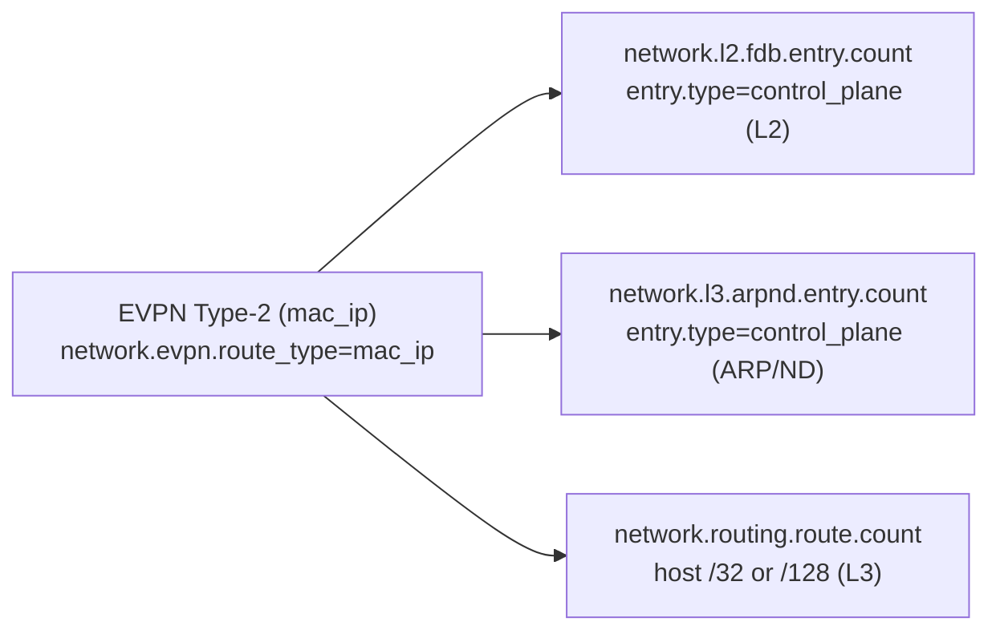

# Example: DC fabric leaf (VXLAN + EVPN)

A worked, end-to-end mapping of a **leaf in an EVPN-VXLAN Clos fabric** onto
`network.*`, with each value traced back to the SNMP MIB object and OpenConfig path it
comes from.

> **Who this is for.** You operate a leaf/spine data-centre fabric and want to emit
> OpenTelemetry network conventions for the things that make a fabric a *fabric* — the
> VXLAN VTEP, BGP-EVPN route types, the anycast gateway, the ESI-LAG/MLAG bond across
> two leaves, and BUM/multicast replication. The recurring theme is **many-to-many by
> reference**: a fabric is multi-device and meshed, but the model never mints a
> cross-device "fabric" or "mesh" entity — every many-to-many construct collapses to
> "carry a shared id, query over it." It builds on the
> [core router](../core-router/README.md) (BGP, VRFs, redundancy) and the
> [L2 switch](../l2-switch/README.md) (MAC table, LAG), so those shapes are referenced
> rather than repeated.

---

## 1. The fabric

`leaf-fab-01a` is a fixed-form top-of-rack leaf, modelled **as part of** a 4-spine
Clos fabric.

```
                 ┌────────┐ ┌────────┐ ┌────────┐ ┌────────┐
                 │ spine-1│ │ spine-2│ │ spine-3│ │ spine-4│   (EVPN route-reflectors)
                 └───┬────┘ └───┬────┘ └───┬────┘ └───┬────┘
                     │   4-way ECMP underlay (eBGP)    │
            ┌────────┴────┬────────────────┬───────────┴────────┐
       ┌────┴─────┐  ┌────┴─────┐                          (… more leaves)
       │leaf-01a  │══│leaf-01b  │   MLAG pair · shared anycast VTEP lo1
       └────┬─────┘  └────┬─────┘
            └──ESI-LAG────┘   (dual-homed server, all-active)
                 │
            ┌────┴────┐
            │ server  │
            └─────────┘

   leaf-fab-01a:  role=leaf · VTEP on anycast lo1 · L2VNI 10100/10200 · L3VNI 50000
                  anycast gateway on Vlan100 · ingress-replication BUM
```

| Property | Value |
|----------|-------|
| Identity | `network.device.id = leaf-fab-01a` · `type = switch` · `role = leaf` |
| Underlay | eBGP to 4 spines, 4-way ECMP |
| Overlay | BGP-EVPN to spines-as-RR, AF `l2vpn_evpn` |
| VTEP | VXLAN on anycast `lo1` (shared with `leaf-fab-01b` via MLAG) |
| VNIs | L2VNI 10100 / 10200 · L3VNI 50000 |
| Gateway | anycast gateway on `Vlan100` (shared IP **and** MAC across all leaves) |
| Multi-homing | ESI-LAG to a dual-homed server, all-active |
| BUM | ingress replication |

A whitebox/SONiC leaf is also a `host.*` — emit both entity sets and relate them by
shared host identity. See [the device may also be a host](../../docs/entity-model.md#a-network-device-may-also-be-a-host).

---

## 2. Structure at a glance



Two things to read off this diagram: (1) every cross-device construct — the VTEP mesh,
the anycast group, the ESI bond, the BUM flood list — is **membership-by-reference**
(both leaves emit their own view carrying a shared id; there is no n-ary "fabric"
entity); and (2) a single EVPN **Type-2** advertisement fans out into three local
tables (§5).

---

## 3. The instance model — the overlay context

The cleanest mapping in the fabric: every forwarding context is a `network.instance`,
typed, with its VNI and route targets. This is the same entity the
[core router uses for L3VPN](../core-router/README.md#5-forwarding-contexts), extended
with the L2 and combined types.

| Real thing | `network.instance` | `type` | Authored attributes |
|------------|--------------------|--------|---------------------|
| Underlay global table | `default` | `default` | — |
| Tenant VRF (RED) | `TENANT-RED` | `l3vrf` | RD, RT[], `vni=50000` (L3VNI) |
| MAC-VRF for VLAN100 | `MAC-VRF-100` | `l2vsi` | `vni=10100`, MAC learning/limit |
| Symmetric IRB | `IRB-RED` | `l2l3` | `vni`, RD, RT[] |

| What | `network.*` | SNMP | OpenConfig |
|------|-------------|------|------------|
| Forwarding context | `network.instance` (+ `type`) | `mplsL3VpnVrfTable` / vendor EVPN-MIB | `/network-instances/network-instance` |
| VNI binding | `network.instance` VNI / `network.tunnel.vni` | vendor VXLAN-MIB | `.../config/vni` |
| Per-MAC-VRF MAC occupancy | `network.l2.fdb.entry.count` (+ `network.l2.fdb.entry.type=control_plane`) | `dot1qTpFdbTable` | `.../fdb/mac-table` |
| ARP/ND cache (the L2↔L3 binding) | `network.l3.arpnd.entry.count` (+ `entry.type=control_plane`, `adjacency.state`) | `ipNetToPhysicalTable` | `.../neighbors/neighbor` |

`entry.type=control_plane` is the marker that distinguishes an EVPN-learned MAC/ARP
entry from a data-plane-learned one — the operator's "is this from BGP or from the
wire?" question.

---

## 4. Underlay & overlay BGP

The fabric runs two BGP planes on the same neighbours-as-`network.neighbor` shape the
[core router uses](../core-router/README.md#6-control-plane), distinguished by address
family and instance.

| What | `network.*` | SNMP | OpenConfig |
|------|-------------|------|------------|
| Underlay BGP to each spine | `network.neighbor` `protocol=bgp` (AF `ipv4_unicast`) | BGP4-MIB | `/.../protocols/protocol[BGP]/.../neighbors` |
| Underlay route count | `network.routing.route.count` (`ipv4_unicast`) on `default` | `bgp4PathAttrTable` | `/.../bgp-rib` |
| Overlay (EVPN) BGP to RR | `network.neighbor` `protocol=bgp`, AF `l2vpn_evpn` | BGP4-MIB | `/.../afi-safis/afi-safi[L2VPN_EVPN]` |
| Underlay vs overlay | distinguished by `network.address_family` + `network.instance` | — | — |

> **ECMP fan-out is modelled** as `network.routing.ecmp.route.count` — FIB routes bucketed by
> `network.routing.ecmp.width` (and `network.address_family`). The 4-way ECMP to each
> VTEP is the spine layer's entire purpose, so "did losing spine-3 rebalance the paths?"
> is now derivable: routes drain from the `width=4` bucket into `width=3`. Per-member
> *traffic* imbalance across a group is still read from per-interface
> `network.interface.io`, not a routing metric.

---

## 5. The overlay — EVPN route types, and the Type-2 fusion

EVPN is **not** a protocol or an address family of its own — it is BGP carrying the
`l2vpn_evpn` family. `network.evpn.*` is the route/signalling layer *beneath* that
family, and its key attribute is the route **type**, which exposes three operator
signals that a flat route count hides.

| What | `network.*` | SNMP | OpenConfig |
|------|-------------|------|------------|
| EVPN route type (T1–T5) | `network.evpn.route_type` = `ethernet_ad`/`mac_ip`/`imet`/`ethernet_segment`/`ip_prefix` | vendor EVPN-MIB | `oc-network-instance` evpn |
| EVPN route counts by type | `network.evpn.route.count` (+ `route_type`, `network.routing.route.state`) | vendor EVPN-MIB | EVPN RIB counters |

The three signals: **`mac_ip` churn = MAC mobility** (a moving/flapping VM), **`imet` =
BUM mesh membership**, **`ip_prefix` = external reachability**.

A single **Type-2 (`mac_ip`)** advertisement is the shared control-plane source of
*three* local tables — the L2/L3 fusion that makes EVPN EVPN:



These three are **related by their shared EVI `network.instance`, never
triple-counted** — the same typed-slice discipline that keeps `network.evpn.route.count`
out of the unicast RIB. The "one advertisement, three tables" relation is documented;
the typed edge between them is deferred to the OTel entity model.

---

## 6. The VTEP — a source, not N tunnels

A VXLAN VTEP is the classic many-to-many trap: forcing it into a tunnel-per-peer gives
N×(N−1) phantom entities. The model treats the VTEP as a **local source endpoint** the
device owns and emits, with the discovered peer mesh as dimensions/records — the
overlay analogue of the [PON point-to-multipoint link](../olt-ont/README.md#4-the-pon-port-as-a-1n-tree).

| What | `network.*` | SNMP | OpenConfig |
|------|-------------|------|------------|
| The VTEP (local source) | `network.tunnel` `type=vxlan`, `source.address=lo1` | vendor VXLAN-MIB | `.../tunnel-interfaces` |
| Per-VNI binding | `network.tunnel.vni` | vendor VXLAN-MIB | `.../config/vni` |
| **Underlay↔overlay binding** | `network.tunnel.underlay.instance = default` | — | — |
| Discovered remote-VTEP mesh | metric dimensions / records — **not** entities (cardinality firewall) | vendor VXLAN peer table | — |
| Anycast/MLAG-shared VTEP IP | `network.address.role=anycast` (§7) | — | — |

The `underlay.instance` reference is the "which underlay carries this overlay?" answer
— overlay instance → VTEP (by VNI) → underlay context — the single most common DC
troubleshooting motion, now a plain id reference.

---

## 7. Anycast gateway & MLAG — deliberately-replicated identity

A fabric *intentionally* puts the same gateway IP (and MAC) on every leaf, and the
same anycast VTEP IP across an MLAG pair. Naively, a reconciliation step would merge
those leaves or raise a false duplicate-IP alarm. The model marks the intent so a
consumer treats the non-uniqueness as designed. See
[never reconcile on a shared address](../../docs/entity-model.md#the-reconciliation-problem).

| What | `network.*` | Source |
|------|-------------|--------|
| Same gateway IP+MAC on every leaf | `network.address.role = anycast` | the never-reconcile rule |
| Shared anycast VTEP IP across the MLAG pair | `network.address.role = anycast` | on `lo1` |
| The cooperating-leaf group | `network.redundancy.group.id` (+ `group.type = mlag`/`anycast`) | membership-by-reference |
| FHRP virtual IP/MAC (VRRP/HSRP) | `network.address.role = virtual` (+ `group.type = vrrp`/`hsrp`) | — |

The rule is explicit: an address marked `anycast` or `virtual` **must not** be used as
an identity or reconciliation key — the inverse of "an IP locates one device." This is
the same `network.redundancy.group` primitive the
[core router uses for its route-processor pair](../core-router/README.md#3-inventory--the-modular-hierarchy),
here applied across *devices* (`type=mlag`) rather than across modules.

---

## 8. ESI-LAG / MLAG — a bond across two leaves

A server dual-homed to two leaves is one logical bond spanning two devices —
`network.lag` is device-scoped and cannot represent it directly. The fabric expresses
it by **membership-by-reference**: both leaves emit their local LAG member carrying the
shared Ethernet Segment id.

| What | `network.*` | SNMP | OpenConfig |
|------|-------------|------|------------|
| LAG aggregate + members + LACP | `network.lag` (members, min-links, LACP) | IEEE8023-LAG-MIB | `/lacp/interfaces` |
| **Ethernet Segment (ESI)** | `network.evpn.esi` (carried by every leaf on the segment) | vendor EVPN-MIB | `oc-network-instance` ethernet-segments |
| Multi-homing mode | `network.evpn.multihoming` = `single_active`/`all_active` | vendor EVPN-MIB | ES redundancy-mode |
| Designated Forwarder | `network.evpn.df_role` = `df`/`non_df` (elected role) | vendor EVPN-MIB | ES DF state |
| MLAG/vPC domain + peer-link | `network.redundancy.group` `type=mlag`/`vpc` + peer-link as `network.link` | vendor MLAG-MIB | vendor MLAG model |
| ESI-LAG on an MLAG pair | the `network.lag` carries **both** `network.evpn.esi` and `network.redundancy.group.id` | — | — |

"The leaves of this bond" is a query over the ESI; no cross-chassis LAG entity is
invented. The Designated Forwarder is an **elected role, not a health state** — a
`non_df` leaf is healthy and intentional — so it stays off any `state` enum, the same
discipline as the [spanning-tree port role](../l2-switch/README.md#6-spanning-tree).

---

## 9. BUM replication & multicast

Broadcast/unknown-unicast/multicast traffic — which carries ARP, IPv6 ND and DHCP — is
flooded across the overlay. How is the one new attribute; the rest reuses the multicast
plane.

| What | `network.*` | SNMP | OpenConfig |
|------|-------------|------|------------|
| BUM replication mode | `network.multicast.bum.mode` = `ingress_replication`/`multicast` (on the VNI/VTEP) | vendor EVPN-MIB | evpn BUM config |
| Ingress-replication flood list | discovered-peer set → dimension/record (tied to EVPN Type-3) | vendor VXLAN peer table | — |
| Underlay multicast mroutes | `network.multicast.route.count` (+ `route.type` sg/star_g, AF) | IPMROUTE-STD-MIB | `oc-network-instance` mroutes |
| PIM neighbour / DR | `network.neighbor` `protocol=pim` + `network.multicast.pim.dr` | PIM-STD-MIB | `.../pim/neighbors` |
| IGMP/MLD membership | `network.multicast.group.count` (+ `membership.protocol`) | IGMP-STD-MIB | `.../igmp` |
| RPF failures | `network.multicast.rpf_failures` | IPMROUTE-STD-MIB | mroute RPF drops |
| Querier role | `network.multicast.querier` (elected role) | IGMP-STD-MIB | igmp querier |

For `ingress_replication` the flood list (remote VTEPs) is a discovered-peer set
carried as a dimension/record, **never N tunnel entities** — the same VTEP-mesh
discipline as §6, tied to the EVPN Type-3 (`imet`) route. `rpf_failures` is the
signature multicast fault (a unicast-vs-multicast topology mismatch).

---

## 10. Inventory, environment & hardware health

A fixed-form leaf follows the [fixed-form profile](../../docs/entity-model.md#the-fixed-form-profile):
no chassis/module shells — the `network.device` is the inventory unit. The ASIC is
promoted to a `network.component` only because overlay/VTEP/MAC/ECMP table-fill
telemetry attaches to it.

| What | `network.*` / `hw.*` | SNMP | OpenConfig |
|------|----------------------|------|------------|
| Overlay / VTEP / MAC table fill | `network.component.utilization` (`resource=overlay`/`mac_table`/`vtep`) | vendor resource-MIB | `oc-platform` utilization |
| Fans / PSU / temp | `hw.status` / `hw.temperature` | ENTITY-SENSOR-MIB | `oc-platform` sensors |
| Device uptime / CPU / memory | `network.device.uptime` / `.cpu.utilization` / `.memory.utilization` | `sysUpTime` / vendor | `/system/state` |

---

## 11. What this device does NOT model

Deliberately out of scope, to keep the boundaries honest:

- **ECMP per-member load-balance imbalance** — path *count* is now modelled
  (`network.routing.ecmp.route.count` by width, §4); per-member traffic skew across a group's
  members is read from `network.interface.io`, not a dedicated routing metric.
- **EVPN / VTEP / MLAG / DF events** — MAC mobility (VM move), VTEP up/down, MLAG
  peer-link down / split-brain, DF change, BUM storm. The reconstructable counters and
  current-state attributes exist (`evpn.routes` by type for MAC-mobility churn,
  `df_role` and `redundancy.role` as gauges), so rates and current state are visible;
  the point-in-time transitions are deferred to the events package. (The MLAG
  peer-link / split-brain case *is* covered by `network.redundancy.switchover`.)
- **Typed multi-device relationships** — the fabric models every many-to-many construct
  by shared-id membership; the richer *typed* edge ("this VTEP ↔ those peers," "this
  Type-2 ↔ those three tables") is deferred to the upstream OTel entity model.

Everything else — the instance/EVI model, EVPN route types and the Type-2 fusion, the
VTEP-as-source, anycast/MLAG shared identity, the ESI bond, and the BUM/multicast plane
— is authored, with every fabric-wide construct expressed as membership-by-reference.
