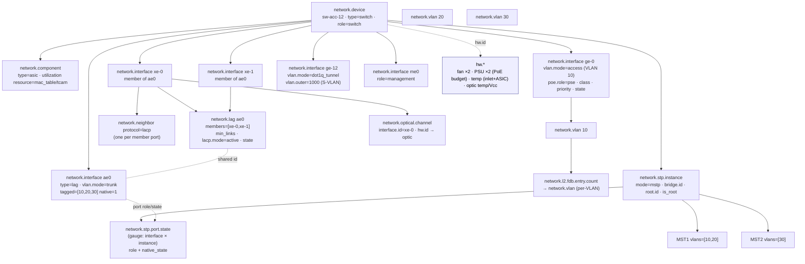

# Example: managed L2 access switch

A worked, end-to-end mapping of a pure layer-2 access/distribution switch onto
`network.*`, with each value traced back to the SNMP MIB object and OpenConfig path
it comes from.

> **Who this is for.** You operate a managed L2 switch and want to emit
> OpenTelemetry network conventions for it — including the parts a switch lives or
> dies by: VLAN membership, spanning tree, the LACP uplink bundle, and the MAC
> table. This is the layer-2 control-plane companion to the
> [CPE router example](../cpe-router/README.md).

---

## 1. The device

`sw-acc-12` is a fixed-form 1U managed switch. It is pure L2 — the only L3 is the
out-of-band management port.

```
   ┌──────────────────────────────────────────────────────────────────────┐
   │ ae0 ── LACP LAG (2×10G) ── trunk VLAN 10/20/30 native 1 ── MSTP uplink │──▶ distribution
   │   ├─ xe-0  (SFP+ optic, DOM)                                           │
   │   └─ xe-1  (SFP+ optic, DOM)                                           │
   │                                                                        │
   │ ge-0 … ge-11  copper access (PoE)  (vlan.mode=access, VLAN 10/20/30)   │──▶ APs / phones
   │ ge-12         dot1q-tunnel port  ── pushes S-VLAN 1000 (802.1ad)       │──▶ metro
   │ me0           OOB management port (role=management, mgmt VRF)          │──▶ NMS
   │                                                                        │
   │ Switching ASIC (MAC table / TCAM) · 2× fan · 2× PSU · inlet+ASIC temp  │
   └──────────────────────────────────────────────────────────────────────┘
```

| Property | Value |
|----------|-------|
| Identity | `network.device.id = sw-acc-12` |
| Type / role | `type = switch` · `role = switch` |
| Uplink | `ae0`, 2×10G LACP LAG, 802.1Q trunk (VLAN 10/20/30, native 1), MSTP |
| MSTP | MST1 ⊃ {10, 20}, MST2 ⊃ {30}, CIST otherwise |
| Access | `ge-0…11`, `vlan.mode=access` in VLAN 10/20/30, **PoE** (802.3at/bt) |
| QinQ | `ge-12`, `vlan.mode=dot1q_tunnel`, pushes S-VLAN 1000 |
| PoE | PSE on `ge-0…11` — feeds APs / IP phones / cameras; per-port class, priority, state; budget on the PSU |
| Management | `me0`, `role=management`, management VRF |
| Hardware | switching ASIC, 2 fans, 2 PSUs (PoE budget), inlet + ASIC temp sensors |

Fixed-form, so the `network.device` *is* the inventory unit — no
`chassis`/`module`. The switching **ASIC is the one exception**: it becomes a
`network.component` *only* because forwarding-table-fill telemetry (MAC table /
TCAM) attaches to it. See the
[fixed-form profile](../../docs/entity-model.md#the-fixed-form-profile).

---

## 2. Structure at a glance



Two dualities to note:

- **LAG ↔ interface.** `ae0` is *both* a `network.lag` (the bundle view: members,
  min-links, LACP, bundle health) **and** a `type=lag` `network.interface` (the
  forwarding/counter view). They share the same id; counters stay on the interface,
  bundle health on the LAG.
- **Component = ASIC.** The only sub-entity below the device, justified solely by
  table-fill telemetry.

---

## 3. Inventory & identity

Same shape as the CPE — see the
[CPE example §3](../cpe-router/README.md#3-inventory--identity) for the full
identity table. The switch-specific addition is the ASIC component:

| `network.*` | SNMP | OpenConfig |
|-------------|------|------------|
| `network.device` `type=switch`, `role=switch` | `sysName` / `sysObjectID` | `/system/state/hostname` |
| `network.component` `type=asic` *(only because table-fill attaches)* | `entPhysicalClass` (ENTITY-MIB) | `/components/component[type=INTEGRATED_CIRCUIT]` |
| `network.component.utilization` `resource=mac_table` | vendor FDB-capacity MIB | `/components/component/.../utilization` |
| `network.component.utilization` `resource=tcam` | vendor TCAM MIB | vendor `oc-platform` ext |

---

## 4. Interfaces & switchport membership

All ports are `network.interface`; state and counters map exactly as the
[CPE example §4](../cpe-router/README.md#4-interfaces). The switch-specific layer is
**switchport mode + VLAN membership**.

| `network.*` | SNMP | OpenConfig |
|-------------|------|------------|
| `network.interface.vlan.mode` (`access`/`trunk`/`hybrid`/`dot1q_tunnel`) | `dot1qPortVlanTable` / vendor | `/interfaces/.../switched-vlan/config/interface-mode` |
| `network.interface.vlan.tagged = [10,20,30]` *(trunk)* | `dot1qVlanStaticEgressPorts` (tagged set) | `.../switched-vlan/config/trunk-vlans` |
| `network.interface.vlan.native = 1` *(trunk)* | `dot1qPvid` | `.../switched-vlan/config/native-vlan` |
| access VLAN *(access port)* | `dot1qPvid` | `.../switched-vlan/config/access-vlan` |
| `network.interface.role = management` *(me0)* | — (operator metadata) | derived |

### 4.1 QinQ / dot1q-tunnel

`ge-12` is a service-provider tunnel port: a customer's frames enter and the switch
pushes an outer 802.1ad S-VLAN.

| `network.*` | Meaning | Source |
|-------------|---------|--------|
| `network.interface.vlan.mode = dot1q_tunnel` | the port is a QinQ tunnel | vendor switchport MIB / `oc` interface-mode |
| `network.interface.vlan.outer = 1000` | the S-VLAN the port *pushes* | vendor QinQ MIB |
| `network.vlan.tag.role` (`customer`/`service`) | S-tag vs C-tag role of VLAN 1000 | configuration |
| `network.vlan.tag.ethertype` | the TPID (e.g. `0x88A8` for 802.1ad) | configuration |

Note the distinction from the [CPE's routed sub-interface
encapsulation](../cpe-router/README.md#43-routed-sub-interface-encapsulation):
`vlan.outer` is the tag a switchport *pushes*; `encapsulation.outer_vlan` is the tag
a routed sub-interface *terminates*.

### 4.2 PoE — powering the access ports

The copper access ports `ge-0…11` are **PoE**: the switch is the *power-sourcing
equipment* (PSE) feeding the APs, IP phones, and cameras attached to them. PoE splits
along the [namespace boundary](../../docs/architecture.md#namespace-layering). The
**physical** power telemetry — actual draw, voltage, current, port power status — is a
hardware fact and stays on `hw.*` (keyed by `hw.id`, the same FRU boundary as the PSU
and optic sensors in [§9](#9-system--hardware-health)). The **negotiation outcome** —
the result `hw.*` structurally cannot express — is `network.interface.poe.*`, the PoE
sibling of `network.interface.duplex`: a negotiated, operational, per-port fact.

| `network.*` | SNMP (RFC 3621 POWER-ETHERNET-MIB) | OpenConfig |
|-------------|------------------------------------|------------|
| `network.interface.poe.role = pse` *(this port sources power)* | port present in `pethPsePortTable` | `oc-if-poe` (`.../ethernet/poe`) |
| `network.interface.poe.standard` (`802.3af`/`802.3at`/`802.3bt_type3`/`802.3bt_type4`) | vendor PoE-MIB (type) | vendor `oc-if-poe` ext |
| `network.interface.poe.class` (`0`–`8`) | `pethPsePortPowerClassifications` | `.../ethernet/poe/state/power-class` |
| `network.interface.poe.priority` (`critical`/`high`/`low`) | `pethPsePortPowerPriority` | `.../ethernet/poe/config/power-priority` |
| `network.interface.poe.state` (`delivering`/`searching`/`denied`/`fault`/`disabled`) | `pethPsePortDetectionStatus` | `.../ethernet/poe/state` |

`poe.class` is the **classification-handshake result** — the power class the PD signalled
and the PSE granted (class 0–4 for 802.3af/at, 5–8 for 802.3bt) — the PoE analogue of the
speed/duplex auto-negotiation outcome. `poe.state` is the runtime delivery state, finer
than the coarse `hw.status` of the port FRU: it separates a healthy idle port
(`searching`) from a budget refusal (`denied`) from a hardware fault (`fault`).

The negotiated **watt contract** is two gauges, not attributes — an operator sums and
trends them (the PoE budget dashboard):

| `network.*` | Meaning | Source |
|-------------|---------|--------|
| `network.interface.poe.power.allocated` (`W`) | watts the PSE has **reserved** for the port | RFC 3621 / vendor |
| `network.interface.poe.power.requested` (`W`) | watts the PD **asked for** via LLDP-MED | LLDP-MED extended power-via-MDI (ANSI/TIA-1057) |
| chassis PoE budget + actual draw | the PSE budget and the real consumption | `hw.power` on the PSU (`hw.id`) — [§9](#9-system--hardware-health) |

`sum(network.interface.poe.power.allocated)` across the switch versus the PSU budget
(`hw.power`) is the **budget-headroom** signal you alert on (e.g. at 80% of budget). When
the budget is exceeded the PSE sheds `low`-priority ports first and keeps `critical` ones
up, so `poe.priority` is the knob that decides which ports survive a power event. The
PD's ask rides **LLDP-MED**, tying PoE to the device's LLDP neighbour discovery;
`requested` above `allocated` is the panel that explains why a PD runs in a reduced-power
mode. The `delivering → denied` (budget refusal) and `→ fault` (over-current / short)
transitions are the PoE instance of the `power_failure` alarm cause — see
[§10](#10-events-traps).

---

## 5. VLANs & the MAC forwarding database

VLANs are entities; per-VLAN MAC occupancy associates with the VLAN **directly** — no
synthetic `l2vsi` instance is needed for flat 802.1Q switching (see
[`network.instance` vs `network.vlan`](../../docs/entity-model.md#networkinstance-vs-networkvlan)).

| `network.*` | SNMP | OpenConfig |
|-------------|------|------------|
| `network.vlan` 10 / 20 / 30 / 1000 *(scoped by device)* | `dot1qVlanStaticTable` (Q-BRIDGE-MIB) | `/network-instances/.../vlans/vlan` |
| `network.vlan.fdb.limit` *(per-VLAN limit)* | vendor MIB | vendor ext |
| `network.l2.fdb.entry.count` → `network.vlan` (`entry.type` ∈ dynamic/static/control_plane) | `dot1qTpFdbTable` (Q-BRIDGE-MIB) | `/network-instances/.../fdb/mac-table/entries` |
| `network.component.utilization` `resource=mac_table` *(fill %)* | vendor FDB-capacity MIB | `/components/component/.../utilization` |

MAC *learn / age* are deliberately **not** events (a per-MAC firehose) — the
occupancy gauge plus churn cover steady state. Only the anomalous **move** is
recorded (§8).

---

## 6. Spanning tree

The switch runs MSTP. Each spanning-tree instance is a `network.stp.instance`
entity; per-port role and state are a gauge associated with **both** the
`network.interface` and the `network.stp.instance` (so a port forwarding in MST1 and
blocking in MST2 is fully expressible).

### 6.1 Instance / bridge level

| `network.*` | SNMP | OpenConfig |
|-------------|------|------------|
| `network.stp.instance` *(identity:* device.id, instance.id*)* | `dot1dStp` / MSTP-MIB instance | `/network-instances/.../protocols/protocol[STP]/.../mstp/mst-instances/mst-instance` |
| `network.stp.mode = mstp` | (MIB module in use) | `.../spanning-tree/global/config/enabled-protocol` |
| `network.stp.instance.priority` | `dot1dStpPriority` / MSTP per-instance | `.../mst-instance/config/bridge-priority` |
| `network.stp.bridge.id` | `dot1dBaseBridgeAddress` + priority | `.../mst-instance/state/bridge-address` |
| `network.stp.root.id` | `dot1dStpDesignatedRoot` | `.../mst-instance/state/designated-root-address` |
| `network.stp.root.path_cost` | `dot1dStpRootCost` | `.../mst-instance/state/root-cost` |
| `network.stp.root.port` | `dot1dStpRootPort` | `.../mst-instance/state/root-port` |
| `network.stp.is_root` | derived (`bridge.id == root.id`) | derived |
| `network.stp.instance.vlans = [10,20]` *(MSTI↔VLAN map)* | MSTP-MIB instance-VLAN table | `.../mst-instance/config/vlan` |

### 6.2 Per-port (per-instance) role + state

| `network.*` | SNMP | OpenConfig |
|-------------|------|------------|
| `network.stp.port.role` (`root`/`designated`/`alternate`/`backup`/`master`) | RSTP-MIB / MSTP per-port role | `.../mst-instance/interfaces/interface/state/role` |
| `network.stp.port.state` (gauge: `forwarding`/`discarding`/`blocking`/…) | `dot1dStpPortState` | `.../interfaces/interface/state/port-state` |
| `network.stp.port.native_state` | (verbatim vendor string) | (vendor) |
| `network.stp.topology_changes` *(counter)* | `dot1dStpTopChanges` | `.../mst-instance/state/topology-change-count` (or global) |

A blocking/alternate port is a **role + state**, not normalized to `down` — a
blocked alternate port is healthy by design. See
[state modelling](../../docs/conventions.md#state-modelling).

---

## 7. The LACP uplink bundle

`ae0` is the LAG/interface duality in action: the bundle view on `network.lag`, the
forwarding view on the `type=lag` `network.interface`, related by shared id.

| `network.*` | SNMP | OpenConfig |
|-------------|------|------------|
| `network.lag` `ae0` *(bundle view)* | IEEE8023-LAG-MIB `dot3adAggTable` | `/interfaces/interface[ae0]/aggregation` |
| `network.lag.members = [xe-0, xe-1]` | `dot3adAggPortListPorts` | `.../aggregation/state/member` |
| `network.lag.min_links` | vendor / `dot3adAgg…` | `.../aggregation/config/min-links` |
| `network.lag.lacp.mode = active` | `dot3adAggPortActorAdminState` (Activity bit) | `/lacp/interfaces/interface/config/lacp-mode` |
| `network.lag.lacp.rate` | `dot3adAggPortActorAdminState` (Timeout bit) | `.../lacp/interfaces/interface/config/interval` |
| `network.lag.lacp.system_id` | `dot3adAggActorSystemID` | `/lacp/state/system-id-mac` |
| `network.lag.state` (`up`/`down`/`degraded`) | derived from member/min-links | derived |
| `network.lag.native_state` | (verbatim vendor string) | (vendor) |
| `network.neighbor` `protocol=lacp` *(one per member)* | `dot3adAggPortPartner*` per port | `/lacp/interfaces/interface/members/member` |

The `type=lag` interface `ae0` carries the usual `network.interface.{io,packets,…}`
counters (speed = sum of members); per-member counters stay on each member's own
interface.

### 7.1 LACP operational statistics

The PDU counters, the actor/partner oper-state octet, and the churn machine are the
LACP *health* layer — emitted **per member port** (each member runs its own LACP
state machine against the partner across that physical link). They are
**neighbour-scoped**: each counter has exactly one identifiable partner, which is
already the `network.neighbor` `protocol=lacp` above. So — unlike LLDP, whose stats
have no identifiable neighbour and earn their own `network.lldp.*` namespace — LACP
reuses the **generic** control-plane counters, with no new metric names.

| `network.*` | IEEE 802.1AX YANG (`ieee802-dot1ax`) | SNMP (IEEE8023-LAG-MIB) | OpenConfig |
|-------------|--------------------------------------|-------------------------|------------|
| `network.protocol.messages` `protocol=lacp` `message.type=lacpdu` + `network.io.direction` | `aggregation-port-stats/lacp-pdu-{rx,tx}` | `dot3adAggPortStatsLACPDUs{Rx,Tx}` | `.../members/member/state/counters/lacp-{in,out}-pkts` |
| `network.protocol.messages` `message.type=marker` | `.../marker-pdu-{rx,tx}` | `dot3adAggPortStatsMarkerPDUs*` | `.../lacp-{in,out}-pkts` (marker) |
| `network.protocol.messages` `message.type=marker_response` | `.../marker-response-pdu-{rx,tx}` | `dot3adAggPortStatsMarkerResponsePDUs*` | `.../lacp-{in,out}-pkts` (marker-resp) |
| `network.protocol.errors` `protocol=lacp` `error.type=unknown` | `aggregation-port-stats/unknown-rx` | `dot3adAggPortStatsUnknownRx` | `.../state/counters/lacp-unknown-errors` |
| `network.protocol.errors` `error.type=illegal` | `.../illegal-rx` | `dot3adAggPortStatsIllegalRx` | `.../state/counters/lacp-errors` |
| `network.neighbor.lacp.state` *(per-flag StateSet)* `role` + `state.flag` | `actor-oper-state` / `partner-oper-state` | `dot3adAggPortActorOperState` / `PartnerOperState` | `.../members/member/state` (activity/timeout/synchronization/collecting/distributing/…) |
| `network.neighbor.lacp.churn` `role` | debug churn group | `dot3adAggPortDebug{Actor,Partner}ChurnCount` | `.../members/member/state` (churn) |

The 802.1AX oper-state is an **octet of independent flags** (activity, timeout,
aggregation, synchronization, collecting, distributing, defaulted, expired), so it
is decomposed into a per-flag StateSet (one value-1 series per set flag) rather than
a packed integer — the same treatment as `system.network.interface.status`, and what
makes "show members where `collecting=false`" a label filter. The coarse partner
up/down is the existing `network.neighbor.state` (`Collecting_Distributing`→`up`,
`Detached`→`down`); these flags are the diagnostic layer beneath it, and `churn` is
the convergence-failure signal distinct from `network.neighbor.state_changes`.

The deeper per-member partner detail (partner system-id + port + key + the full mux
FSM) is further `network.neighbor` (`protocol=lacp`) refinement, not yet authored —
LACP is adjacency-shaped, so it stays on the neighbour (the `network-session` package
is for connection/IPsec-SA tables and explicitly excludes adjacency sessions). See
[§11](#11-what-this-switch-does-not-emit).

---

## 8. Optics on the LAG members

The 10G SFP+ on each member maps exactly as the
[CPE optical section](../cpe-router/README.md#8-optical-transceiver-dom):
`network.optical.channel` with `interface.id = xe-0`, `network.optical.power` /
`bias_current`; module temperature / voltage / status in `hw.*`. The member→bundle
correlation ("which member's optic is failing?") is answerable via
`network.lag.members[]` and `network.interface.lower_layer.name[]`.

---

## 9. System & hardware health

Device health is `network.device.*`; physical health is `hw.*` (see the
[CPE health section](../cpe-router/README.md#9-system-health--the-hw-boundary)).
Switch-specific capacity telemetry is the ASIC's table fill:

| `network.*` | Source |
|-------------|--------|
| `network.device.uptime` / `cpu.utilization` / `memory.utilization` | `sysUpTime` / vendor CPU + memory MIBs |
| `network.component.utilization` `resource=mac_table` / `tcam` / `fib` | vendor capacity MIBs / `oc-platform` utilization |
| `hw.fan.speed` / `hw.status` / `hw.temperature` (inlet, **ASIC**) / `hw.power.*` (PSU) | `entPhySensorValue` (ENTITY-SENSOR-MIB) |

ASIC temperature is `hw.temperature` keyed by `hw.id`, **not**
`network.component.temperature` — physical health is always `hw.*`. The
`network.component` exists only for the forwarding-table fill above.

---

## 10. Events (traps)

The switch's defining traps all have authored homes. Events refine the
`network.state.changed` / `network.alarm` envelopes (see
[events](../../docs/conventions.md#events)).

| Trap | Authored event |
|------|----------------|
| linkUp / linkDown / flap | `network.interface.state.changed` |
| STP topology / root change | `network.stp.topology.changed` |
| STP port forwarding ↔ blocking | `network.stp.port.state.changed` |
| MAC move | `network.l2.mac.moved` *(record: mac + old/new port + VLAN)* |
| MAC-limit exceeded | `network.l2.fdb.limit_exceeded` *(alarm, `cause=table_exhausted`)* |
| LAG member up/down | `network.interface.state.changed` on the member port |
| LAG below min-links | `network.alarm` (`cause=redundancy_lost`) |
| PoE port denied / fault | `network.alarm` (`cause=power_failure`) — the `poe.state` `denied`/`fault` transition |
| fan / PSU failure | `network.hardware.alarm` (keyed by `hw.id`) |
| device reboot | `network.device.state.changed` |

---

## 11. What this switch does *not* emit

- **No `chassis` / `module`** — fixed-form; the device is the inventory unit. The
  only sub-entity is the ASIC `network.component`, justified by table-fill telemetry.
- **No `network.instance` for switching** — flat 802.1Q uses the VLAN as the bridge
  domain directly. The management VRF is an `l3vrf` tagged
  `network.instance.label.purpose=management` (a *purpose*, not a `type`).
- **No per-MAC learn/age events** — only the anomalous MAC *move* is recorded.
- **No routing / BGP** — this is a pure L2 device (contrast the
  [CPE example](../cpe-router/README.md#5-wan-routing--the-bgp-session)).
- **Deferred:** selective QinQ (C-VLAN→S-VLAN map), 802.1ah backbone tags, and the
  deeper per-member LACP partner detail (partner system-id/port/key + the full mux
  FSM) — a not-yet-authored `network.neighbor` (`protocol=lacp`) refinement, since
  LACP is adjacency-shaped (the `network-session` package owns connection/IPsec-SA
  tables, not adjacency sessions).
