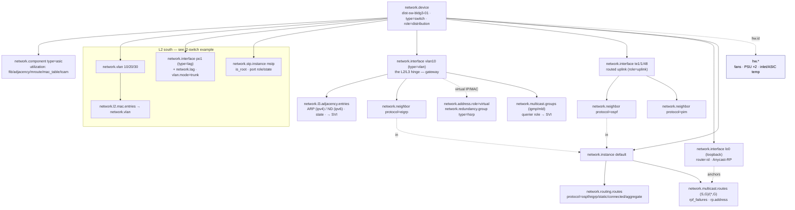

# Example: enterprise L3 distribution switch

A worked, end-to-end mapping of a campus **layer-3 distribution switch** (a box that
is *both* a switch and a router) onto `network.*`, with each value traced back to the
SNMP MIB object and OpenConfig path it comes from.

> **Who this is for.** You operate a campus distribution-layer L3 switch — inter-VLAN
> routing on SVIs, an IGP to the core, ARP/ND resolution, HSRP/VRRP first-hop
> redundancy, and PIM/IGMP multicast — *while also* being a plain L2 switch
> underneath. This example is the meeting point of two earlier ones: it reuses the
> [L2 switch](../l2-switch/README.md) wholesale for its south side (VLANs, MSTP, LAG,
> MAC table) and the routing control plane of the [core router](../core-router/README.md)
> for its north side, so those shared shapes are referenced rather than repeated. Its
> own new ground is the **L3 resolution plane** that sits between them: ARP/ND, the
> multicast routing plane, and FHRP.

---

## 1. The device

`dist-sw-bldg3-01` is a stacked campus distribution switch aggregating several
access-layer stacks and routing northbound to the campus core. It runs with a
redundant peer, `dist-sw-bldg3-02`, with which it shares a first-hop gateway on every
VLAN.

```
                 CORE (OSPF area 0)            legacy wing (EIGRP AS 100)
                      │                                  │
        ┌─────────────▼──────────────────────────────────▼─────────────┐
        │ dist-sw-bldg3-01    type=switch · role=distribution           │
        │                                                               │
        │ L3 NORTH / inter-VLAN routing                                 │
        │   te1/1/48  routed uplink to core ── OSPF area 0              │──▶ core
        │   SVIs vlan10/20/30  ── default gateways (HSRP virtual IP/MAC) │
        │   OSPF + EIGRP + static/connected/aggregate ── RIB/FIB         │
        │   ARP (v4) + ND (v6)  ── the L3↔L2 resolution table           │
        │   PIM-SM + IGMP/MLD   ── mroute (S,G)/(*,G), RP, RPF           │
        │   lo0  ── router-id / PIM source / Anycast-RP                 │
        ├───────────────────────────────────────────────────────────────┤
        │ L2 SOUTH                                                      │
        │   VLAN 10 (data) / 20 (voice) / 30 (guest)                    │
        │   po1 / po2  LACP LAGs (802.1Q trunks) ── MSTP root           │
        │   MAC forwarding database                                     │
        │                                                               │
        │ Forwarding ASIC (FIB / ARP / ND / mroute / MAC / TCAM) ·       │
        │ stack fans · 2× PSU · inlet + ASIC temp                       │
        └────┬──────────────────────┬───────────────────────────────────┘
         po1 │                      │ po2     (LACP, dual-homed to access)
        ┌─────▼──────┐        ┌──────▼─────┐
        │ access A   │        │ access B   │   (L2 only — users / phones / APs)
        └────────────┘        └────────────┘
```

| Property | Value |
|----------|-------|
| Identity | `network.device.id = dist-sw-bldg3-01` |
| Type / role | `type = switch` (it also routes — see [§3](#3-identity-and-the-switch-and-router-question)) · `role = distribution` |
| Redundancy | HSRP pair with `dist-sw-bldg3-02`; one virtual IP + virtual MAC per SVI |
| L2 south | VLAN 10/20/30, `po1`/`po2` LACP trunks to access stacks, MSTP root bridge, MAC FDB |
| L3 north | SVIs `vlan10/20/30` (default gateways), routed uplink `te1/1/48`, `lo0` |
| IGP | OSPF area 0 to the core; EIGRP AS 100 to a legacy wing |
| Routes | OSPF + EIGRP + a large body of static / connected / aggregate routes |
| Resolution | ARP (IPv4) + ND (IPv6) caches per SVI |
| Multicast | PIM-SM router for the campus; IGMP/MLD on the SVIs; Anycast-RP on `lo0` |
| Hardware | switching ASIC (table fill), stack fans, 2 PSUs, inlet + ASIC temp |

Stacked/fixed-form, so the `network.device` *is* the inventory unit — no
`chassis`/`module` shells. As on the [L2 switch](../l2-switch/README.md#1-the-device),
the switching **ASIC is the one exception**: it becomes a `network.component` *only*
because forwarding-table-fill telemetry attaches to it. See the
[fixed-form profile](../../docs/entity-model.md#the-fixed-form-profile).

---

## 2. Structure at a glance



The defining feature is the **SVI as the L2/L3 hinge**. A switched virtual interface
(`vlan10`) is the L3 interface for an L2 VLAN — the single object where inter-VLAN
routing, ARP/ND resolution, the HSRP virtual address, and IGMP membership all attach.
Modelling the SVI itself is trivial (it is just a `network.interface` of `type=vlan`);
the interesting telemetry is everything that hangs off it.

Three layers stack between the MAC table and the RIB, and the model has a distinct
home for each:

| Layer | Question it answers | `network.*` |
|-------|---------------------|-------------|
| MAC FDB (L2) | which **port** is this MAC on? | `network.l2.mac.entries` |
| **ARP/ND (L2↔L3)** | which **MAC** is this next-hop IP? | `network.l3.adjacency.entries` |
| RIB / neighbours (L3) | which **next-hop** for this prefix? | `network.routing.routes` / `network.neighbor` |

---

## 3. Identity and the switch-*and*-router question

The one genuinely new identity wrinkle this device raises: `network.device.type` lists
`switch` and `router` as distinct values, and an L3 switch is **both** — it bridges
VLANs *and* routes between them on the same box.

`type` is resolved by the [type-vs-role rule](../../docs/entity-model.md#type-vs-role):
`type` is the device's *dominant* forwarding class and a device performing multiple
functions uses the dominant one. Set `type = switch` (the chassis is a switch that
gained a routing personality), and let the **presence of the routing signals** —
`network.neighbor` adjacencies, `network.routing.routes`, the SVIs — carry the rest.
The heavier weight is on `role = distribution` (positional, what it does in this
design), which the enum carries without a fight.

| `network.*` | SNMP | OpenConfig |
|-------------|------|------------|
| `network.device` `type=switch`, `role=distribution` | `sysName` / `sysObjectID` | `/system/state/hostname` |
| `network.device.vendor.name` (e.g. `cisco`) + `vendor.id` (PEN) | `sysObjectID` | — |
| `network.component` `type=asic` *(only because table-fill attaches — [§10](#10-system--hardware-health))* | `entPhysicalClass` (ENTITY-MIB) | `/components/component[type=INTEGRATED_CIRCUIT]` |
| `network.instance` `name=default`, `type=default` *(the global routing table)* | global routing context | `/network-instances/network-instance[default]` |
| `network.device.uptime` / `cpu.utilization` / `memory.utilization` | `sysUpTime` / vendor MIBs | `/system/state` |

The HSRP peer `dist-sw-bldg3-02` is a *separate* `network.device`; the two are tied
together only by the shared first-hop redundancy group — see [§8](#8-first-hop-redundancy--hsrpvrrp).

---

## 4. The L2 south side — by reference

Underneath the routing, this is a full L2 switch, and that half maps **exactly** as the
[L2 switch example](../l2-switch/README.md) — it is referenced here, not repeated:

| Concept | `network.*` | See |
|---------|-------------|-----|
| Access VLANs 10/20/30 | `network.vlan` | [l2-switch §5](../l2-switch/README.md#5-vlans--the-mac-forwarding-database) |
| Switchport mode / trunk / native / allowed-list | `network.interface.vlan.mode` / `.tagged` / `.native` | [l2-switch §4](../l2-switch/README.md#4-interfaces--switchport-membership) |
| MAC forwarding database (per-VLAN occupancy) | `network.l2.mac.entries` → `network.vlan` | [l2-switch §5](../l2-switch/README.md#5-vlans--the-mac-forwarding-database) |
| MSTP root + per-port role/state | `network.stp.instance` (`is_root`, `instance.vlans`) + `network.stp.port.role`/`.state` | [l2-switch §6](../l2-switch/README.md#6-spanning-tree) |
| LACP LAGs `po1`/`po2` to access stacks | `network.lag` + `type=lag` `network.interface` + `network.neighbor protocol=lacp` | [l2-switch §7](../l2-switch/README.md#7-the-lacp-uplink-bundle) |
| MAC move / MAC-limit | `network.l2.mac.moved` (record) / `network.l2.mac_limit.exceeded` (alarm) | [l2-switch §10](../l2-switch/README.md#10-events-traps) |

The new content begins at the SVI, the object that exists *because* this box bridges
and routes at once.

---

## 5. SVIs & interfaces — the L2/L3 hinge

All ports are `network.interface`; state and counters map exactly as on the
[CPE example §4](../cpe-router/README.md#4-interfaces). The distribution-switch-specific
set is the SVIs and the routed uplink.

| # | Interface | `type` | Notes |
|---|-----------|--------|-------|
| 1 | `vlan10`, `vlan20`, `vlan30` (SVIs) | `vlan` | the L3 interface for an L2 VLAN — gateway, ARP/ND, HSRP, IGMP attach here |
| 2 | `po1`, `po2` (LACP LAGs to access) | `lag` | aggregate counters; bundle view on `network.lag` ([l2-switch §7](../l2-switch/README.md#7-the-lacp-uplink-bundle)) |
| 3 | `te1/1/1…` (trunk members to access) | `ethernet` | 802.1Q trunk ports (switchport `vlan.mode=trunk`) |
| 4 | `te1/1/48` (routed uplink to core) | `ethernet` | L3 routed port (`role=uplink`, no switchport) — OSPF runs here |
| 5 | `lo0` | `loopback` | router-id, OSPF/PIM source, Anycast-RP address |

| `network.*` | SNMP | OpenConfig |
|-------------|------|------------|
| `network.interface` `type=vlan` *(the SVI)* | `ifTable` (ifType `l3ipvlan(136)`) | `/interfaces/interface[vlan10]` (`type=l3ipvlan`) |
| `network.interface.mac.address` *(the SVI MAC — often the HSRP virtual MAC; see [§8](#8-first-hop-redundancy--hsrpvrrp))* | `ifPhysAddress` | `.../ethernet/state/mac-address` |
| `network.interface.role = uplink` *(the routed uplink)* | — (operator metadata) | derived |
| `network.interface.io` / `packets` / `errors` / `discards` | `ifHC*` counters (IF-MIB) | `/interfaces/interface/state/counters` |
| `network.interface.oper_state` (+ `admin_state`) | `ifOperStatus` / `ifAdminStatus` | `.../state/oper-status` |

The SVI carries the standard interface counters like any other interface; what makes it
the hinge is the three planes that anchor on it next — ARP/ND ([§6](#6-arp--nd--the-l3l2-resolution-table)),
the HSRP virtual address ([§8](#8-first-hop-redundancy--hsrpvrrp)), and IGMP membership
([§9](#9-multicast--pim-sm--igmpmld)).

---

## 6. ARP / ND — the L3↔L2 resolution table

Every SVI resolves next-hop IPv4 addresses to MACs via **ARP** and IPv6 addresses to
MACs via **ND**. This table sits *between* the two the L2 switch and the core router
already model — the MAC FDB (MAC→port) below it and the RIB (prefix→next-hop-IP) above
it — and it is its own thing: a data-plane resolution cache, **not** a `network.neighbor`
(which is a hello-based control-plane *session*). The model gives it the `network-l3`
package, the L3 twin of the L2 MAC FDB.

| `network.*` | SNMP | OpenConfig |
|-------------|------|------------|
| `network.l3.adjacency.entries` *(occupancy of the ARP/ND table)* | `ipNetToPhysicalTable` (IP-MIB) | `/interfaces/interface/.../ipv4/neighbors` + `.../ipv6/neighbors` |
| `network.type = ipv4` *(ARP)* / `ipv6` *(ND)* — the table split | `ipNetToPhysicalType` AF | address family of the entry |
| `network.l3.adjacency.entry.type` (`dynamic`/`static`/`control_plane`) | `ipNetToPhysicalType` | neighbor `origin` (`DYNAMIC`/`STATIC`) |
| `network.l3.adjacency.state` (`reachable`/`stale`/`probe`/`incomplete`/`permanent`) | `ipNetToPhysicalState` | neighbor-state (RFC 4861 ND FSM) |
| `network.l3.adjacency.native_state` *(verbatim, e.g. `REACHABLE`/`STALE`)* | (verbatim) | (verbatim) |

The entries are a **count, not entities** — a busy distribution switch holds tens of
thousands, churning constantly, so per-entry series would be the cardinality explosion
the spec refuses (the same discipline as the [MAC FDB](../l2-switch/README.md#5-vlans--the-mac-forwarding-database)).
The occupancy gauge associates with the `network.interface` (the per-SVI cache) and, for
a per-VRF total, with `network.instance`.

`network.l3.adjacency.state` is a **dedicated normalized enum, not folded into**
`network.neighbor.state`: `stale` and `probe` are healthy, intentional ND states that
mapping to `up`/`down` would misreport, the same lesson as
[OSPF `2-Way`](#72-the-state-table--normalized--native) and the
[STP blocking role](../l2-switch/README.md#6-spanning-tree). `incomplete` is the one
fault state — a next-hop that is not answering — and is reported as its own occupancy
series, so "how many unresolved adjacencies?" is a first-class signal.

> **What's deferred.** The ARP/ND *security* events — duplicate-IP detection,
> ARP/ND-spoof (Dynamic ARP Inspection), and the L3 MAC-move — are not yet authored;
> they will refine the move-record base (the L3 sibling of `network.l2.mac.moved`).
> See [§12](#12-what-this-switch-does-not-yet-model).

---

## 7. Routing — OSPF, EIGRP, and the routes that have no neighbour

The routing control plane maps **exactly** as the
[core router's IS-IS/BGP did](../core-router/README.md#6-control-plane--is-is-bgp-bfd):
each adjacency is a `network.neighbor`, route counts are
[`network.routing.routes`](../core-router/README.md#9-routing-at-scale--rib--fib), and
the adjacency transition is `network.neighbor.state.changed`. The interesting part on a
campus box is that the same shape generalises to an IGP, to a proprietary protocol, and
to routes with no peer at all.

### 7.1 OSPF and EIGRP adjacencies

| `network.*` | SNMP | OpenConfig |
|-------------|------|------------|
| `network.neighbor` `protocol=ospf` *(adjacency to the core)* | `ospfNbrTable` (OSPF-MIB) | `.../protocols/protocol[OSPF]/ospfv2/.../neighbors/neighbor` |
| `network.neighbor` `protocol=eigrp` *(adjacency to the legacy wing)* | `cEigrpPeerTable` (CISCO-EIGRP-MIB) | RFC 7868 / OpenConfig EIGRP |
| `network.neighbor.state` + `native_state` | `ospfNbrState` / vendor | `.../neighbor/state/adjacency-state` |
| `network.neighbor.address` | `ospfNbrIpAddr` | `.../neighbor/state/neighbor-address` |
| associates with `network.instance = default` | global context | `[name=default]` |
| `network.protocol.messages` (`message.type` ∈ hello/dbd/ls_update…, direction) | `ospfIfEvents` / vendor | `.../ospfv2/.../state` |
| `network.neighbor.state_changes` *(adjacency flap counter)* | `ospfNbrEvents` | `.../neighbor/state/...` |

`protocol` is **identifying**, so the box's adjacencies are distinct entities per
protocol — exactly as the core router's BGP and BFD sessions to the same address are.
**EIGRP** was long treated as Cisco-proprietary, but it is now **IETF RFC 7868**
(Informational, with a second independent implementation in FRRouting), so the series
treats it as a standard IGP rather than a vendor protocol: `eigrp` is a normalized value
in both the `network.neighbor.protocol` and `network.routing.protocol` enums, the
adjacency is an ordinary `network.neighbor`, and most of EIGRP maps straight to core —
the DUAL PDU types (`hello`/`update`/`query`/`reply`/`ack`/`sia_query`/`sia_reply`) are
`network.protocol.message.type` values, Stuck-In-Active is `network.protocol.errors` with
`error.type=stuck_in_active`, and adjacency up/down is `network.neighbor.state`. The
genuinely EIGRP-specific per-peer transport state that core has no field for — SRTT, RTO,
and the reliable-transport send-queue depth (the SIA precursor) — is a **core refinement**
under the protocol-qualified `network.neighbor.eigrp.*` namespace
(`network.neighbor.eigrp.srtt` / `.rto` / `.queue_depth`), emitted only when
`protocol=eigrp`. That is the refinement pattern: a *standard* discriminator gates a small
set of protocol-specific signals — **no vendor namespace required**. (The per-*prefix*
DUAL topology table — feasible/reported distance and the composite-metric K-values per
route — is *not* modelled: it is per-prefix and so belongs on route records, not the
per-instance route counts; see [§12](#12-what-this-switch-does-not-yet-model).)

### 7.2 The state table — normalized + native

OSPF has an eight-state FSM, and the `network.neighbor.state` normalized enum
(`up`/`connecting`/`degraded`/`down`/`unknown`) maps it via the
[state-modelling table](../../docs/conventions.md#state-modelling), with the verbatim
term preserved in `native_state`:

| Protocol | `up` | `connecting` | `down` |
|----------|------|--------------|--------|
| OSPF | `Full`, `2-Way`\* | `Attempt`, `Init`, `ExStart`, `Exchange`, `Loading` | `Down` |
| EIGRP | (adjacency up) | — | (adjacency down) |
| PIM | (neighbour present) | — | (hold-time expired) |

\* OSPF **`2-Way`** is a *healthy steady state* for non-DR/BDR pairs on a broadcast
segment — it normalizes to `up`, not `down`, so a pair sitting in `2-Way` by design does
not page anyone; an operator detecting a pair *stuck* at `2-Way` that should reach `Full`
disambiguates via `native_state`. The **DR/BDR election** (and the IGMP querier in
[§9](#9-multicast--pim-sm--igmpmld)) are *elected roles, not health states*, and stay off
this enum deliberately.

### 7.3 Routes — including the ones with no neighbour

| `network.*` metric | SNMP | OpenConfig |
|--------------------|------|------------|
| `network.routing.routes` (`network.routing.protocol`, `address_family`, `route.state`) | `inetCidrRouteTable` (IP-FORWARD-MIB) | `.../afts/...` + per-protocol RIB |
| `network.routing.updates` *(route churn)* | per-protocol update counters | `.../state/messages` |
| `network.routing.ecmp.routes` (`ecmp.width`) | `inetCidrRouteTable` rows per prefix | `.../afts/.../next-hop-group` |

A distribution switch's RIB is *dominated* by routes that came from no session —
connected routes (one per SVI subnet), local host routes, static routes, and the
summary/aggregate routes it originates upward. The `network.routing.protocol` value
space folds these in directly: alongside `ospf`/`eigrp`/`bgp` it carries **`static`**,
**`connected`**, **`local`**, and **`aggregate`**, so the routes that are most of the
table have clean provenance and the neighbour-centric model does not leak. The split
between RIB-best and hardware-programmed is `route.state = active` vs `route.state = fib`.

---

## 8. First-hop redundancy — HSRP/VRRP

`-01` and `-02` form an HSRP pair: each SVI has one **virtual IP and virtual MAC**
shared between the two switches, so hosts have a stable default gateway that survives a
switch failure. This is the campus instance of *deliberately-replicated identity* — the
same primitive the [DC fabric uses for its anycast gateway and MLAG](../dc-fabric/README.md#7-anycast-gateway--mlag--deliberately-replicated-identity).

| `network.*` | SNMP | OpenConfig |
|-------------|------|------------|
| `network.address.role = virtual` *(on the SVI's virtual IP/MAC)* | `cHsrpGrpVirtualIpAddr` / vendor | `.../vrrp/vrrp-group/state/virtual-address` |
| `network.redundancy.group.id` *(the FHRP group, e.g. `hsrp:vlan10:1`)* | `cHsrpGrpNumber` | vrrp-group id scoped to the SVI |
| `network.redundancy.group.type = hsrp` *(or `vrrp`)* | (MIB module) | model in use |
| `network.redundancy.role` (`active`/`standby`) | `cHsrpGrpStandbyState` | `.../vrrp-group/state/...` |
| failover / coup / preempt | `network.redundancy.switchover` *(alarm, `cause=redundancy_lost`)* | trap |

The **rule** is explicit: an address marked `virtual` (or `anycast`) is non-unique *by
design* and **must not** be used as an identity or reconciliation key — otherwise a
backend deduplicating by IP would merge the two switches or raise a false duplicate-IP
alarm. See [the reconciliation problem](../../docs/entity-model.md#the-reconciliation-problem).
`network.redundancy.role` is an *elected role, not a health state* — a `standby` member
is healthy and intentional. The failover **notification** is
`network.redundancy.switchover`; the FHRP protocol detail (priority, preempt, track) is
deferred to a future FHRP package.

---

## 9. Multicast — PIM-SM + IGMP/MLD

The distribution switch is the campus's PIM-SM router: it holds an mroute table, does
RPF checks, anchors an Anycast-RP, and runs IGMP/MLD on its SVIs to track per-segment
group membership. The `network-multicast` package carries this — no new entity (the
unicast-routing discipline): multicast runs inside the `network.instance`, forms PIM
adjacencies on `network.neighbor`, and learns membership per `network.interface`.

| `network.*` | SNMP | OpenConfig |
|-------------|------|------------|
| `network.neighbor` `protocol=pim` *(PIM adjacency)* | `pimNeighborTable` (PIM-STD-MIB) | `.../pim/interfaces/interface/neighbors` |
| `network.multicast.routes` (`route.type` ∈ `sg`/`star_g`, `address_family`) *(the mroute count)* | `ipMRouteTable` (IPMROUTE-STD-MIB) | `.../afts/.../multicast` |
| `network.multicast.rpf_failures` *(the signature multicast fault)* | mroute RPF-drop counters | mroute RPF drops |
| `network.multicast.groups` (`membership.protocol` ∈ `igmp`/`mld`) → SVI | `igmpCacheTable` (IGMP-STD-MIB) | `.../igmp` / `.../mld` |
| `network.multicast.querier` (`querier`/`non_querier`) — elected role gauge → SVI | `igmpInterfaceQuerier` | igmp querier state |
| `network.multicast.pim.dr` *(boolean DR role on the interface)* | `pimInterfaceDR` | pim DR |
| `network.multicast.rp.address` + `rp.type` (`anycast` here) | `pimRPTable` / vendor | pim rp |
| group join/leave | `network.multicast.membership.changed` *(record: group + action + source)* | IGMPv3/MLDv2 report |

The mroute is a **count + record**, exactly like the unicast RIB: `(S,G)`/`(*,G)`
totals are a bounded series (`network.multicast.routes`), while per-`(S,G)` forwarding
flags and RPF interface are high-cardinality record detail, never metric dimensions.
`rpf_failures` — a unicast-vs-multicast topology mismatch — is the primary multicast
troubleshooting signal and has no unicast analogue. The **IGMP querier** is an *elected
role* (`querier`/`non_querier`), reported as an enum-as-attribute gauge and kept off any
health enum, the same discipline as OSPF `2-Way`. The **Anycast-RP** loopback address is
`network.address.role = anycast` — another deliberately-shared identity that must never
be reconciled on, tying multicast back to the [redundancy rule](#8-first-hop-redundancy--hsrpvrrp).

---

## 10. System & hardware health

Device health is `network.device.*`; physical health is `hw.*` (see the
[CPE health section](../cpe-router/README.md#9-system-health--the-hw-boundary)). The
distribution-switch-specific capacity telemetry is the ASIC's **table fill** — and on
this box it is multi-dimensional, because the ASIC holds *four* tables that exhaust
independently:

| `network.*` / `hw.*` | Meaning | Source |
|----------------------|---------|--------|
| `network.component.utilization` `resource=fib` | unicast FIB fill | vendor capacity MIB / `oc-platform` utilization |
| `network.component.utilization` `resource=adjacency` | ARP/ND adjacency-table fill | vendor capacity MIB |
| `network.component.utilization` `resource=mroute` | multicast-route table fill | vendor capacity MIB |
| `network.component.utilization` `resource=mac_table` / `tcam` | MAC table / TCAM fill | vendor capacity MIB |
| `hw.fan.speed` / `hw.status` / `hw.temperature` (inlet, **ASIC**) / `hw.power.*` (PSU) | physical environment | `entPhySensorValue` (ENTITY-SENSOR-MIB) |

ASIC temperature is `hw.temperature` keyed by `hw.id`, **not**
`network.component.temperature` — physical health is always `hw.*`. The
`network.component` exists only for the table-fill above. On a campus L3 switch the ASIC
runs out of ARP, FIB, or mroute space long before CPU, which is exactly why the
`adjacency` and `mroute` resource values matter.

---

## 11. Events

The switch's defining traps refine the standard
[event envelopes](../../docs/conventions.md#events):

| Trap | Authored event |
|------|----------------|
| linkUp / linkDown on SVIs / uplinks | `network.interface.state.changed` |
| OSPF / EIGRP / PIM neighbour change | `network.neighbor.state.changed` *(native endpoints, e.g. `Full`→`Down`)* |
| STP topology / root change, port forwarding↔blocking | `network.stp.topology.changed` / `network.stp.port.state.changed` ([l2-switch §10](../l2-switch/README.md#10-events-traps)) |
| MAC move / MAC-limit | `network.l2.mac.moved` / `network.l2.mac_limit.exceeded` |
| HSRP/VRRP failover / coup / preempt | `network.redundancy.switchover` (`cause=redundancy_lost`) |
| IGMP/MLD join / leave | `network.multicast.membership.changed` *(record)* |
| fan / PSU / over-temp | `network.hardware.alarm` (keyed by `hw.id`) |
| device / stack-member reboot | `network.device.state.changed` |

The reconstructable transition **counters** (`network.neighbor.state_changes`,
`network.routing.updates`, `network.l2.mac.entries`) survive a collector restart where a
stream of point-in-time events would not.

---

## 12. What this switch does *not* (yet) model

Deliberately out of scope, to keep the boundaries honest:

- **ARP/ND security events** — duplicate-IP detection, ARP/ND-spoof (Dynamic ARP
  Inspection / ND inspection), and the L3 MAC-move are not yet authored. The occupancy
  and `incomplete`-state series in [§6](#6-arp--nd--the-l3l2-resolution-table) are
  modelled; the move/spoof *records* (the L3 sibling of `network.l2.mac.moved`) follow
  the move-record base when authored.
- **FHRP protocol telemetry** — the HSRP/VRRP *group* and its shared identity are
  modelled ([§8](#8-first-hop-redundancy--hsrpvrrp)); the per-group priority, preempt,
  and interface-tracking detail is deferred to a future FHRP package.
- **EIGRP per-prefix DUAL internals** — the per-peer transport state (SRTT/RTO/queue
  depth) *is* modelled as the `network.neighbor.eigrp.*` refinement, and SIA folds into
  `network.protocol.errors` ([§7.1](#71-ospf-and-eigrp-adjacencies)); what stays deferred
  is the per-*prefix* topology table — feasible/reported distance and the composite-metric
  K-values per route — which is per-prefix and so belongs on route records, not the
  per-instance `network.routing.routes` count. (EIGRP is RFC 7868, so none of this is
  vendor-namespaced.)
- **No modular `chassis` / `module`** — stacked/fixed-form, so the `network.device` is
  the inventory unit; the only sub-entity is the ASIC `network.component`, justified by
  table-fill. (For the modular hierarchy see the
  [core router](../core-router/README.md#3-inventory--the-modular-hierarchy).)

Everything else — the L2 south side, the SVI/interface layer, ARP/ND occupancy and
state, the OSPF/EIGRP control plane and route provenance, HSRP shared identity, and the
PIM/IGMP multicast plane — is modellable end-to-end as inventory + state + counts.
