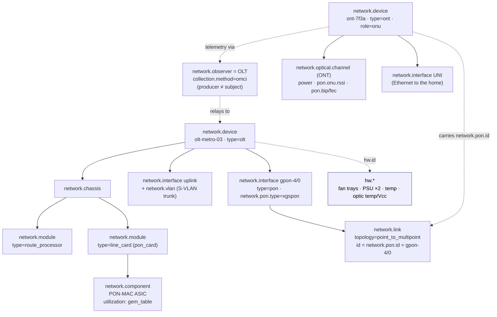

# Example: OLT + ONTs (GPON / XGS-PON)

A worked, end-to-end mapping of a **PON access node** — a chassis OLT and the ONTs
hanging off it — onto `network.*`, with each value traced back to the SNMP MIB
object and OpenConfig/TR-385 path it comes from.

> **Who this is for.** You operate a PON access network (an OLT serving thousands of
> ONTs over GPON/XGS-PON) and want to emit OpenTelemetry network conventions for the
> southbound PON plane — the 1:N optical tree, per-ONT burst optics, the activation
> state machine, DBA bandwidth — *and* model each ONT as its own device even though
> only the OLT can see it. That last part is the interesting one: PON is the case
> where **the thing producing the telemetry is not the thing the telemetry is
> about**. This example builds on the [core router](../core-router/README.md)
> (modular chassis) and [CPE router](../cpe-router/README.md) (interfaces, optics,
> VLAN), so those shared shapes are referenced rather than repeated.

---

## 1. The devices

Two device classes are in play: one OLT, and the ONTs it serves.

```
   ┌──────────────────────────────────────────────────────────────────────────┐
   │ OLT  olt-metro-03  (type=olt) — chassis, dual RP, PON line cards          │
   │  ├─ RP0 / RP1   route processors (redundant)                              │
   │  ├─ FC0…FC1     fabric cards                                              │
   │  ├─ UPLINK      100G uplink to the BNG (S-VLAN trunk)                     │
   │  └─ PONCARD ── gpon-4/0 … gpon-4/15  PON ports                            │
   │                    │                                                      │
   │                    │  network.link  topology=point_to_multipoint         │
   │                    │  id = network.pon.id = gpon-4/0                      │
   │             1:32 / 1:64 optical splitter (ODN)                           │
   │            ┌───────┼───────┬───────┬───────────┐                         │
   │           ONT-1  ONT-7   ONT-14  …  ONT-127                              │
   └──────────────────────────────────────────────────────────────────────────┘

   ONT  ont-7f3a  (type=ont, role=onu) — its own network.device
     ├─ upstream optics (burst-mode)        UNI ports (Ethernet to the home)
     └─ telemetry RELAYED by the OLT over OMCI  ── the OLT is the observer
```

| Property | Value |
|----------|-------|
| OLT identity | `network.device.id = olt-metro-03` · `type = olt` |
| PON technology | XGS-PON (`network.pon.type = xgspon`) — 10G symmetric |
| Split ratio | 1:32 / 1:64 per PON port |
| Uplink | 100G to the BNG, per-subscriber S-VLANs |
| ONT identity | `network.device.id = ont-7f3a` · `type = ont` · `role = onu` |
| ONT telemetry | measured by the OLT, relayed over **OMCI** (ITU-T G.988) |

The OLT is a modular chassis exactly like the [core router](../core-router/README.md);
the genuinely new material here is everything *south* of the PON port. The headline
shape: **one OLT relays for thousands of ONTs, each an independent `network.device`,
with the OLT as `network.observer`.**

---

## 2. Structure at a glance



The two things to read off this diagram:

1. The **PON port is a point-to-multipoint `network.link`** (§4) — not a chain of
   point-to-point links. Its id is the `network.pon.id`, and every ONT joins the
   tree by carrying that id.
2. The **ONT is a separate device**, but its Resource names the OLT as observer (§9).
   The arrow from `ONT` to `OBS` is the producer≠subject relationship that PON forces.

---

## 3. Inventory — the modular OLT chassis

Mechanically identical to the [core router's modular inventory](../core-router/README.md#3-modular-inventory)
— `network.chassis` → `network.module` → `network.component`. The only PON-specific
note is that the PON line card's forwarding ASIC (the PON-MAC / GEM table) is the
`network.component` whose table-fill you watch.

| What | `network.*` | SNMP | OpenConfig |
|------|-------------|------|------------|
| Chassis | `network.chassis` | `entPhysicalClass=chassis` (ENTITY-MIB) | `/components/component[type=CHASSIS]` |
| Route processor (×2) | `network.module` `type=route_processor` | `entPhysicalClass=module` | `/components/component[type=CONTROLLER_CARD]` |
| PON line card | `network.module` `type=line_card` | `entPhysicalClass=module` | `/components/component[type=LINECARD]` |
| PON-MAC ASIC | `network.component` | `entPhysicalClass=other` | `/components/component[type=INTEGRATED_CIRCUIT]` |
| Per-RP CPU / memory | `network.device.cpu.utilization` / `.memory.utilization` (+ `network.component.id`) | `cpmCPUTotal5minRev` (CISCO-PROCESS-MIB) | `/components/component/state/utilization` |
| GEM / PON-MAC table fill | `network.component.utilization` (`resource=gem_table`) | vendor PON-MIB | vendor `oc-platform` utilization |

The per-RP dimensioning (`network.component.id` on the device CPU/memory metrics) is
the same pattern the core router uses for its dual route processors. See the
[entity catalogue](../../docs/entity-model.md#entity-catalogue).

> **RP redundancy.** The two route-processor `network.module`s carry
> `network.redundancy.role` (`active` / `standby`) within a
> `network.redundancy.group.type=route_processor` group, and a supervisor
> switchover raises `network.redundancy.switchover` (carrying the
> `network.module.id` that became active). This is the intra-device case of the
> redundancy model — no shared-address wrinkle, unlike anycast/MLAG/FHRP.

---

## 4. The PON port as a 1:N tree

This is the shape PON needs that nothing else in the model does: a single OLT port
feeds an optical splitter that fans out to many ONTs. The model expresses it as **one
`network.link` with `topology = point_to_multipoint`**, owned and emitted by the OLT
(the head-end), with each ONT joining by reference. No n-ary edge is invented; "every
ONT on this PON" is just a query over `network.pon.id`. See
[logical containment is not OTel nesting](../../docs/entity-model.md#logical-containment-is-not-otel-nesting).

| What | `network.*` | SNMP | OpenConfig / TR-385 |
|------|-------------|------|---------------------|
| PON port as an interface | `network.interface` (`type=pon`) | `ifType` vendor PON value | `/interfaces/interface[type=pon]` |
| PON technology | `network.pon.type = xgspon` | vendor PON-MIB | `bbf-xpon` channel-termination |
| The 1:N ODN tree | `network.link` `topology=point_to_multipoint`, `local.*` = OLT + PON port, `id = network.pon.id` | vendor PON-MIB | `bbf-xpon` v-ani / channel-group |
| ONT-to-tree membership | each ONT carries `network.pon.id` (hub-and-spoke) | — | — |
| Port counters | `network.interface.io` / `.packets` | `ifHCInOctets` / `ifHCOutOctets` (IF-MIB) | `/interfaces/interface/state/counters` |

The point-to-multipoint link is the **head-end-owned hub**: the OLT owns and emits
the link object, each ONT attaches by id. The ODN/splitter as physical plant (fibre
runs, splitter stages) is deferred — only the logical 1:N relationship is modelled
here.

---

## 5. PON optics — burst-mode RSSI + BIP/FEC

Most PON optics is just the [CPE's optical DOM](../cpe-router/README.md#8-optical-dom)
reused: OLT downstream Tx, ONU downstream Rx, and ONU upstream Tx are ordinary
`network.optical.channel` + `network.optical.power` with `network.optical.wavelength`
carrying the band plan. PON adds only two genuinely new optical signals.

| What | `network.*` | SNMP | OpenConfig / TR-385 |
|------|-------------|------|---------------------|
| OLT Tx ↓ / ONU Rx ↓ / ONU Tx ↑ power | `network.optical.power` (+ `network.io.direction`) | vendor optical-DOM MIB | `bbf-xpon` / `oc-platform` transceiver |
| Band plan (1577↓ / 1270↑ for XGS-PON) | `network.optical.wavelength` | vendor optical-DOM MIB | transceiver channel wavelength |
| **Per-ONU upstream burst RSSI (at the OLT)** | `network.pon.onu.rssi` (`dB[mW]`, receive-only) | vendor PON-MIB per-ONU Rx | `bbf-xpon` ont-rssi |
| **PON BIP-8 errored blocks** | `network.pon.bip.errors` (+ direction) | vendor PON-MIB BIP | `bbf-xpon` channel BIP |
| **FEC corrected / uncorrectable** | `network.pon.fec.corrected` / `.uncorrectable` (+ direction) | vendor PON-MIB FEC | `bbf-xpon` FEC counters |
| Upstream span loss | derived: ONU `optical.power transmit` − OLT-measured `onu.rssi` | — | — |
| Module temp / Vcc / status | `hw.temperature` / `hw.voltage` / `hw.status` | ENTITY-SENSOR-MIB | `oc-platform` transceiver sensors |

The burst-mode **RSSI** — "ONU 14's upstream light is low," the #1 PON
troubleshooting signal — is named `rssi` (not `*.rx_power` with a direction)
precisely because it is a receive-only head-end measurement with no transmit
counterpart, so `network.io.direction` does not apply to it. PON BIP/FEC is the
direct-detect analogue of the coherent BER the core router reports; OSNR/CD/PMD are
correctly **absent** here (those are coherent-only). See the
[cardinality firewall](../../docs/conventions.md#the-cardinality-firewall) for why
these are per-channel metrics, not per-ONT entities.

---

## 6. ONT activation / ranging — the PON control plane

When an ONT powers on it walks a registration state machine (offline → ranging →
operational) while the OLT measures its round-trip distance. This is a dedicated
enum, **not** normalized into `up`/`down`: `ranging` and `emergency_stop` carry
meaning the coarse vocabulary would lose. See
[state modelling](../../docs/conventions.md#state-modelling).

| What | `network.*` | SNMP | OpenConfig / TR-385 |
|------|-------------|------|---------------------|
| ONT activation state (gauge) | `network.pon.onu.state` = `offline`/`standby`/`ranging`/`operational`/`emergency_stop` | vendor PON-MIB ONU-state | `bbf-xpon` ont oper-state |
| Verbatim vendor state | `network.pon.onu.native_state` | vendor PON-MIB | vendor state leaf |
| Ranging distance (fibre length) | `network.pon.onu.distance` (`m`) | vendor PON-MIB ranging | `bbf-xpon` ont ranging-time |
| ONU-ID (on-tree address) | `network.pon.onu.id` | vendor PON-MIB ONU index | `bbf-xpon` ont onu-id |

The activation state follows the K8s `status.phase` pattern: one UpDownCounter series
per possible state value, value `1` for the ONT's current state — the same shape the
[L2 switch uses for spanning-tree port state](../l2-switch/README.md#6-spanning-tree).
The ranging **distance** doubles as inventory ("ONU is 18.4 km out") and a fault
signal (a sudden jump means a fibre/splice change).

---

## 7. DBA — upstream bandwidth

PON shares upstream capacity across ONTs via Dynamic Bandwidth Allocation. The
capacity-planning number is granted-vs-used upstream bandwidth, expressible per ONT
or per T-CONT.

| What | `network.*` | SNMP | OpenConfig / TR-385 |
|------|-------------|------|---------------------|
| Granted upstream bandwidth | `network.pon.dba.granted` (`bit/s`, + `network.pon.tcont.id`) | vendor PON-MIB DBA | `bbf-xpon` t-cont allocated |
| Used upstream bandwidth | `network.pon.dba.used` (`bit/s`, + `network.pon.tcont.id`) | vendor PON-MIB DBA | `bbf-xpon` t-cont used |
| T-CONT handle | `network.pon.tcont.id` (optional dimension) | vendor PON-MIB T-CONT index | `bbf-xpon` t-cont id |

`used / granted` is the upstream utilisation. The T-CONT id is an **optional
dimension** on the bandwidth metrics, not a separate entity — the full GEM-port /
Alloc-ID **service-mapping** plane (which GEM carries which service to which VLAN) is
deferred to a future access package.

---

## 8. Uplinks, forwarding context & hardware health

Northbound, the OLT is conventional and maps exactly like the
[L2 switch](../l2-switch/README.md#4-interfaces--switchport-vlan-membership): uplink
`network.interface` + counters + optics, `network.vlan` with `vlan.mode = trunk` for
the per-subscriber S-VLANs to the BNG, and `network.instance` for forwarding context.

Hardware health follows the [namespace boundary](../../docs/architecture.md#namespace-layering)
used by every other device: fans, PSUs, generic temperatures and transceiver
temp/Vcc are `hw.*`; device uptime/CPU/memory are `network.device.*`.

| What | `network.*` / `hw.*` | SNMP | OpenConfig |
|------|----------------------|------|------------|
| Uplink VLAN membership | `network.vlan` + `vlan.mode=trunk` | `dot1qVlanStaticTable` (Q-BRIDGE-MIB) | `/interfaces/.../switched-vlan` |
| Device uptime | `network.device.uptime` | `sysUpTime` | `/system/state/boot-time` |
| Fans / PSU / chassis temp | `hw.status` / `hw.temperature` | ENTITY-SENSOR-MIB | `oc-platform` sensors |
| Transceiver temp / Vcc | `hw.temperature` / `hw.voltage` | ENTITY-SENSOR-MIB | `oc-platform` transceiver |

---

## 9. The ONT — producer ≠ subject

This is the part PON forces that no other device does. An ONT is its own
`network.device`, but it cannot report for itself over the management plane — the
**OLT** measures it and relays over OMCI. The model expresses this with
`network.observer`: the Resource represents the **subject** (the ONT), and
`network.observer.id` names the OLT as the relaying producer.

| What | `network.*` | Source |
|------|-------------|--------|
| The ONT | `network.device` `type=ont`, `role=onu` | the subject |
| Producer ≠ subject | Resource = the **ONT**; `network.observer.id` = the OLT | OMCI session |
| Collection method | `network.observer.collection.method = omci` | ITU-T G.988 |
| Which OLT/PON serves the ONT | `network.observer.id` + `network.pon.id` link membership | OLT view |
| ONT optics / UNI ports / CPU / uptime | `network.optical.*` / `network.interface` (+ duplex) / `network.device.*` | relayed over OMCI |
| Subscriber identity (opt-in, PII) | `network.access.subscriber.id` | record-level only |

`network.observer.id` is a **Resource-level** attribute — it identifies who relayed
the telemetry, not a per-data-point dimension. A different OLT taking over re-homes
one Resource attribute, not every series. The same controller-relay shape is reused
across the access estate: `omci` for PON here, `capwap` for a
[WiFi WLC](../../docs/entity-model.md#entity-catalogue), `vmanage` for SD-WAN.

> **Still open upstream.** The precise mechanism for an observer to attach OTel
> *entity context* to a third-party subject is pending the OpenTelemetry entities
> SIG. This project settles the `network.*` side (subject Resource + observer id);
> the generic entity-attachment is parked there, not invented here.

---

## 10. Events

| Event | `network.*` | Cause / dimension |
|-------|-------------|-------------------|
| ONT online / offline / ranging transition | `network.pon.onu.state.changed` (refines `network.state.changed`) | `network.event.state.dimension=operational`; native term in previous/current |
| **Dying gasp** (last-breath power loss) | `network.pon.onu.dying_gasp` (refines `network.alarm`) | `network.alarm.cause=power_failure` |
| Loss of signal (LOSi) | `network.pon.onu.dying_gasp` | `network.alarm.cause=signal_loss` |

The **dying gasp** is the defining PON event — the last message an ONT emits as it
loses power. It is what distinguishes *"a whole street just lost power"* (many
dying-gasps at once) from *"a thousand ONTs independently failed."* It refines the
shared `network.alarm` envelope with `cause=power_failure`, while a head-end that
simply stops seeing the burst reports `cause=signal_loss`. Both associate with the
**ONT's** `network.device` and are measured at the OLT over OMCI. See
[events](../../docs/conventions.md#events).

---

## 11. What this device does NOT model

Deliberately out of scope, to keep the boundaries honest:

- **GEM-port / T-CONT / Alloc-ID service mapping** — which GEM carries which service
  to which VLAN. Only the DBA *bandwidth* half (§7) is modelled; the service-mapping
  plane is deferred to a future access package.
- **ODN / splitter physical plant** — fibre runs and splitter stages as objects. Only
  the logical 1:N `network.link` (§4) is modelled.
- **OTel entity-context attachment for third-party subjects** — the generic
  observer→subject entity binding (§9), parked pending the upstream entities SIG.

Everything else — the 1:N tree, per-ONT burst RSSI, BIP/FEC, the activation/ranging
state machine, ranging distance, DBA bandwidth, the OLT-as-observer mechanism, and
the dying-gasp alarm — is authored.
