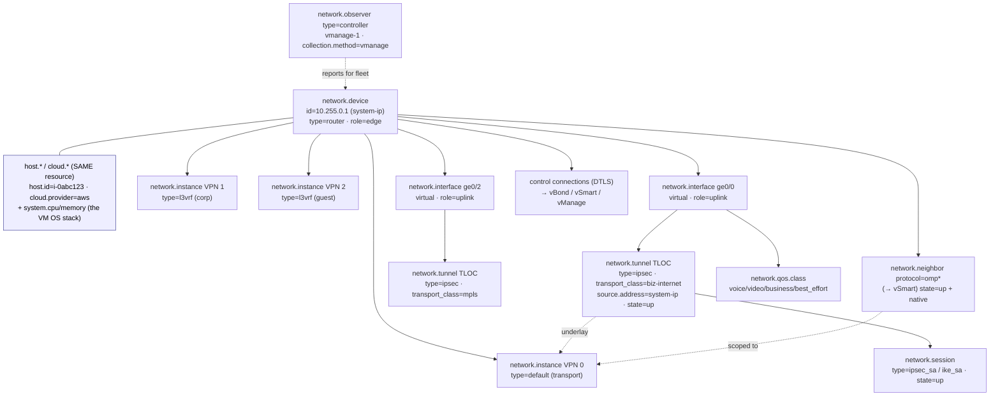

# Example: virtual SD-WAN edge (cloud VNF)

A worked, end-to-end mapping of a **virtual SD-WAN edge running as a cloud
instance** onto `network.*` — a software router/VNF that *is* an EC2 instance and
also forwards customer traffic over an IPsec overlay.

> **Who this is for.** You operate (or build telemetry for) a cloud-hosted SD-WAN
> edge — a Cisco Catalyst SD-WAN `cEdge`, a Versa/Fortinet/Palo Alto virtual edge, or
> any IPsec-overlay VNF — deployed as a VM in AWS/Azure/GCP. The recurring theme is
> **one resource, two perspectives**: the box is genuinely a `host.*`/`cloud.*`
> instance *and* a `network.device.*`, and the SD-WAN data plane is an overlay
> (`network.tunnel` TLOCs) riding virtual transports. It builds on the
> [branch CPE router](../cpe-router/README.md) (identity, interfaces, BGP, NAT) and
> reuses the [DC fabric](../dc-fabric/README.md)'s VTEP-as-source primitive for the
> TLOC mesh, so those shapes are referenced rather than repeated. Its physical
> sibling — many VNFs on one box — is the [whitebox uCPE](../ucpe/README.md).

---

## 1. The device

`vedge-aws-use1-01` is a virtual SD-WAN edge, deployed as an AWS EC2 instance acting
as a regional cloud gateway. There is **no chassis, no line card, no serial number,
no optic, no fan** — it is spun up by automation and can be autoscaled, torn down, and
replaced.

```
                       ┌──────────────────────────────────────────────────────────┐
   ISP-A (biz-internet)│ ge0/0  TLOC color=biz-internet  (public IP, DHCP)         │
   ─────────────────────┤  └─ IPsec/BFD tunnels ─▶ every remote TLOC (full mesh)   │
                       │                                                            │
   ISP-B (public-net)  │ ge0/1  TLOC color=public-internet                         │
   ─────────────────────┤  └─ IPsec/BFD tunnels ─▶ …                               │
                       │                                                            │
   MPLS / DX (private) │ ge0/2  TLOC color=mpls  (private underlay)                │
   ─────────────────────┤  └─ IPsec/BFD tunnels ─▶ …                               │
                       │                                                            │
   Control plane (DTLS/TLS):  vBond (orchestrator) · vSmart (OMP) · vManage (NMS)   │
   Service VPNs:  VPN 0 (transport/underlay) · VPN 512 (mgmt)                       │
                  VPN 1 (corp) · VPN 2 (guest)   ← these route customer traffic     │
                       └──────────────────────────────────────────────────────────┘
   It is ALSO:  an AWS EC2 instance  i-0abc123…  (cloud.provider=aws, host.id=…)
   Logical identity:  system-ip=10.255.0.1 · site-id=5001 · org=acme  (controller-minted)
```

| Property | Value |
|----------|-------|
| Identity | `network.device.id = 10.255.0.1` (the controller system-ip — stable across VM replacement) |
| Type / role | `type = router` (what it *is*) · `role = cpe` / `edge` (where it *sits*) |
| Also a host | `host.id = i-0abc123…` · `cloud.provider = aws` · `cloud.region = us-east-1` |
| Transports | `ge0/0` biz-internet · `ge0/1` public-internet · `ge0/2` mpls (all virtual NICs) |
| Overlay | IPsec full mesh, one tunnel per remote TLOC, OMP-discovered |
| Control | OMP to vSmart; DTLS control connections to vBond / vSmart / vManage |
| Segmentation | Service VPNs 0 / 1 / 2 / 512 |
| Telemetry source | self-report (NETCONF / gNMI / streaming) **and** vManage relay |

Because it is **fixed-form** (a single VM, no removable cards), the `network.device`
*is* the inventory unit — no `chassis` / `module` / `component` entities (see the
[fixed-form profile](../../docs/entity-model.md#the-fixed-form-profile)). The optical,
fan, and PSU planes that dominate a physical router are simply **absent** — the
hypervisor owns the hardware.

---

## 2. Structure at a glance



Two things to read off this diagram: (1) the `network.device` and the `host.*`/`cloud.*`
facet are **one resource related by shared identity, not merged** (§3); and (2) the
SD-WAN data plane is an **overlay of `network.tunnel` TLOCs** riding the virtual
transports — a *source endpoint that anchors a discovered mesh*, exactly the
[DC-fabric VTEP](../dc-fabric/README.md#6-the-vtep--a-source-not-n-tunnels), not N
point-to-point tunnels.

---

## 3. Identity — the device that *is* a host, in its purest form

A physical router has a chassis serial to anchor identity. This VNF has none. The two
identities it *does* have answer **different lifecycle questions**, and the model keeps
them as two perspectives of one resource (see
[a network device may also be a host](../../docs/entity-model.md#a-network-device-may-also-be-a-host)).

| Perspective | Namespace | Identity | Lifecycle question it answers |
|-------------|-----------|----------|-------------------------------|
| The logical network element | `network.device.*` | `network.device.id` = `system-ip` (`10.255.0.1`) | "is this the *same SD-WAN edge*?" — survives VM teardown/replace/autoscale |
| The cloud VM it runs on | `host.*` / `cloud.*` | `host.id` = `i-0abc123…` | "is this the *same instance*?" — a replacement VM is a new `host.id` |

The model's `network.device.id` contract explicitly blesses **a controller-assigned
system-ip** as an id source — so the SD-WAN control-plane identity is the natural,
stable, producer-independent key here, and a replacement VM that re-registers with the
same `system-ip` is correctly the *same* `network.device`.

| `network.*` | Source |
|-------------|--------|
| `network.device.id = 10.255.0.1` *(identifying — the system-ip)* | SD-WAN control plane (vManage / device config) |
| `network.device.name = vedge-aws-use1-01` | `sysName` / `/system/state/hostname` |
| `network.device.type = router` · `role = edge` | operator metadata |
| `network.device.vendor.name = cisco` · `vendor.id` (IANA PEN) | platform |
| `network.device.os.name` / `os.version` | `/system/state/software-version` |
| `host.id` / `host.name` / `cloud.provider` / `cloud.region` / `cloud.account.id` | upstream OTel `host.*` / `cloud.*` (same resource) |

> **No serial, no model leaf.** `hw.serial_number` / `hw.model` are simply **absent** —
> they are descriptive on a physical box and have no meaning on a VM. The site/org
> context (`site-id=5001`, `org=acme`) that has no identifying attribute of its own is
> carried as `network.device.label.site_id` / `…org` — operator metadata, never an
> identity key (the [tagging ladder](../../docs/entity-model.md#classification-the-tagging-ladder)).

### 3.1 Two CPUs, two memories — relate, don't double-count

On a physical router the NOS CPU *is* the device CPU. On a VM there are two numbers, and
the model keeps them in their own namespaces (do **not** duplicate OS metrics under
`network.*`):

| What | Metric | Namespace | Meaning |
|------|--------|-----------|---------|
| The VM's OS stack | `system.cpu.utilization` / `system.memory.utilization` | `system.*` (host) | the whole guest OS, incl. the hypervisor's slice as the cloud meters it |
| The forwarding/control element | `network.device.cpu.utilization` / `.memory.utilization` | `network.*` | the NOS data-plane/control-plane view, as the [CPE emits it](../cpe-router/README.md#9-system-health--the-hw-boundary) |

They are **related (shared resource identity), not summed** — a dashboard reads the
`system.*` figure for "is the VM starved?" and the `network.device.*` figure for "is the
forwarding element busy?". This is the one place a VNF differs materially from the
physical examples, and the rule is the namespace-layering rule:
[the one legitimate overlap](../../docs/architecture.md#the-one-legitimate-overlap-a-device-that-is-a-host).

---

## 4. Segmentation — service VPNs are `network.instance`

The cleanest mapping in the whole device: SD-WAN **service VPNs** drop 1:1 onto the
authored `network.instance` entity — the same best-in-class fit
[EVPN IRB got on the DC fabric](../dc-fabric/README.md#3-the-instance-model--the-overlay-context).

| Real thing | `network.instance` | `type` |
|------------|--------------------|--------|
| VPN 0 — transport / underlay | `default` | `default` |
| VPN 1 — corp | `corp` | `l3vrf` |
| VPN 2 — guest | `guest` | `l3vrf` |
| VPN 512 — management | `mgmt` | `l3vrf` |

| `network.*` | Source |
|-------------|--------|
| `network.instance` (+ `type`) | `/network-instances/network-instance` |
| `network.instance.route_distinguisher` / `route_target[]` (corp/guest) | `.../state/route-distinguisher`, RT policy |
| interface ↔ instance binding | `.../interfaces/interface` |

Routes, neighbours, and the overlay all attach to a `network.instance`, never to a VLAN
— see [`network.instance` vs `network.vlan`](../../docs/entity-model.md#networkinstance-vs-networkvlan).

---

## 5. Transports — the TLOC underlay interfaces

The three WAN-side interfaces are `network.interface` entities, all in VPN 0 (the
transport instance). On a cloud edge they are **virtual NICs** — `type=virtual`, no
optic underneath, so the entire `network.optical.*` plane is **n/a**.

| Interface | `type` | `role` | SD-WAN concept |
|-----------|--------|--------|----------------|
| `ge0/0` | `virtual` | `uplink` | TLOC color = `biz-internet` |
| `ge0/1` | `virtual` | `uplink` | TLOC color = `public-internet` |
| `ge0/2` | `virtual` | `uplink` | TLOC color = `mpls` |

State and counters map exactly as on the
[CPE WAN interfaces](../cpe-router/README.md#4-interfaces) (`network.interface.io` /
`packets` / `errors` / `oper_state` / `mtu`) — the boring, carried-over part. The
SD-WAN-specific bit — the **transport color** — is not an interface attribute; it lives
on the overlay endpoint the interface anchors (§6).

---

## 6. The overlay — TLOC + the IPsec tunnel mesh

This is the device's core function. An SD-WAN edge terminates a **dynamically-discovered
full mesh of IPsec tunnels** — one per *(local TLOC, remote TLOC)* pair, learned via OMP
from vSmart, not configured. With 3 local colors and hundreds of remote edges that is
potentially thousands of tunnels.

The model does **not** mint a tunnel entity per peer. A **TLOC is a `network.tunnel`
source endpoint** — the local origin (system-ip + color + encap) that anchors the
discovered mesh — and the peer set is carried as metric dimensions, exactly the
[VTEP-as-a-source](../dc-fabric/README.md#6-the-vtep--a-source-not-n-tunnels) discipline.

| What | `network.*` | Source |
|------|-------------|--------|
| The TLOC (local source endpoint) | `network.tunnel` `type=ipsec`, `source.address=10.255.0.1` | vManage / `oc-network-instance` (encapsulation) |
| The transport **color** | `network.tunnel.transport_class` = `biz-internet`/`public-internet`/`mpls` | SD-WAN TLOC color |
| Tunnel id (the TLOC tuple) | `network.tunnel.id` = `tloc:10.255.0.1:mpls` | system-ip + color |
| **Underlay↔overlay binding** | `network.tunnel.underlay.instance = default` (VPN 0) | the transport instance |
| Discovered remote-TLOC mesh | metric **dimensions** / records — **not** entities (cardinality firewall) | vManage OMP/BFD tables |
| Tunnel liveness (BFD) | `network.tunnel.state` = `up`/`down`/`degraded` + `native_state` | BFD per-tunnel state |
| Tunnel up/down | `network.tunnel.state.changed` *(event)* | BFD session transition |

`network.tunnel.transport_class` is the home for `color` — the single most-used word in
SD-WAN operations, and the per-transport dimension that app-route/SLA policy selects on.
This is the resolution of the classic many-to-many overlay trap: forcing the mesh into a
tunnel-per-peer would mint thousands of phantom entities; the TLOC source-endpoint
carries the mesh as dimensions instead.

> **Deferred (the same limits as the DC-fabric VTEP).** Per-tunnel / per-color **traffic
> counters**, per-peer **BFD liveness**, and — crucially for SD-WAN — the
> **loss/latency/jitter** measured on each tunnel are not yet authored (they land with
> the metrics package and the active-test work; see §11). Today you get the TLOC entity,
> its color, its underlay binding, and its up/down state + event.

---

## 7. IPsec / IKE security associations

Each tunnel is protected by an IKE SA (the control SA) and one or more IPsec child SAs
(the data-plane SA). These are **sessions**, not adjacencies — they have their own
negotiate→install→rekey lifecycle — and the `network.session` package is their home (the
same shape a site-to-site VPN or a firewall IKE SA uses).

| What | `network.*` | Source |
|------|-------------|--------|
| IKE SA (control) | `network.session` `type=ike_sa` | IKEv2 (RFC 7296) / vendor |
| IPsec child SA (data) | `network.session` `type=ipsec_sa` | RFC 4301/4303 / vendor |
| SA state | `network.session.state` = `connecting`/`up`/`closing` + `native_state` | SA lifecycle |
| The overlay it protects | the SA record carries the `network.tunnel.id` | — |
| Aggregate SA-table load | `network.session` count metrics (by `type`/`state`) | vManage / vendor |

Per the [session cardinality rule](../../docs/conventions.md#the-cardinality-firewall) a
session is **count + record, never an entity and never a per-session metric series** — a
hub edge with thousands of tunnels has thousands of SAs, so they are an aggregate count
plus a close record, not N time series.

---

## 8. Control plane — OMP and the controllers

An SD-WAN edge peers with **vSmart** over OMP (advertising its TLOCs/routes/services)
and holds **DTLS/TLS control connections** to vBond (orchestrator), vSmart (controller),
and vManage (NMS).

| What | `network.*` | Source |
|------|-------------|--------|
| OMP peering to vSmart | `network.neighbor` `protocol=omp`* (scoped to VPN 0) | vManage / device |
| Control-connection state up/down | `network.neighbor.state` = `up` + `native_state` (`up`/`connect`/`challenge`) | DTLS control-connection FSM |
| Control-connection / OMP transitions | `network.neighbor.state_changes` + `network.state.changed` *(event)* | vManage event log |
| Routes/TLOCs learned via OMP | `network.routing.routes` (`route.state` received/active/fib) on VPN 0 | OMP route table |

> **`omp` is not (yet) an enum value — and it is proprietary.** The authored
> `network.neighbor.protocol` enum is `bgp`/`ospf`/`isis`/`eigrp`/`bfd`/`lacp`/`lldp`/
> `cdp`/`pim`/`ldp`/`rsvp`/`msdp`; `omp` is a Cisco/Viptela control protocol and is
> absent. Until a normalized value is decided, carry it as the open-enum string `omp`
> with the verbatim controller state in `native_state`, and put any OMP internals in the
> vendor namespace (`cisco.*`, keyed off `network.device.vendor.name`) — the
> [proprietary-protocol path](../../docs/conventions.md#naming-rules). The OMP **session
> to a controller** is also not a router-to-router adjacency; the `asn`/`address` fields
> of `network.neighbor` do not apply, and the controller-session attributes
> (controller-type, org-id, DTLS state, preference) have no dedicated home — a known
> limitation shared with every controller-fronted protocol (§11).

---

## 9. Producer ≠ subject — vManage reports for the fleet

In production, **vManage collects and exports telemetry for the entire edge fabric** —
the producing resource (vManage) is *not* the subject (each `network.device`). This is
the exact [OLT-for-ONT](../olt-ont/README.md#9-the-ont--producer--subject) /
[WLC-for-AP](../wifi-ap/README.md#9-producer--subject--the-wlc-as-observer) pattern, now
on an overlay WAN — the **third independent technology** to need it, and the model has
the mechanism and the collection method already.

| What | `network.*` | Source |
|------|-------------|--------|
| vManage as the relaying producer | `network.observer` `type=controller`, `observer.id=vmanage-1` | — |
| The relay method | `network.observer.collection.method = vmanage` | — |
| The subject of the telemetry | each edge's `network.device.id` (carried alongside) | — |
| Self-reported alternative | observer **absent** (or `= device.id`) when the edge streams its own | NETCONF / gNMI / streaming |

Note the dual perspective (as on the [WiFi CPE](../wifi-cpe/README.md#8-delta-5--tr-069--usp-management)):
the same edge telemetry is identical whether vManage relays it (`observer = vmanage`,
`collection.method = vmanage`) or the edge self-reports it (observer absent) — only the
observer differs. The `vmanage` collection method joins `omci` (PON), `capwap` (WiFi),
and `tr069`/`usp` (CPE) as the controller-relay family.

---

## 10. Per-application QoS

SD-WAN shapes and queues traffic by class. The bounded **forwarding-class** plane maps
onto `network.qos.class` exactly as on any router — per-class queue depth, drops (by
`network.qos.drop.reason`), and shaped rate dimensioned by the ≤8-class ladder.

| What | `network.*` | Source |
|------|-------------|--------|
| Per-class queue counters | `network.interface` queue metrics dimensioned by `network.qos.class` (`voice`/`video`/`business`/`best_effort`/…) | vendor QoS-MIB / `oc-qos` |
| Drop discipline | `network.qos.drop.reason` = `tail`/`wred`/`policer`/`shaper` | per-queue drops |
| Marking | `network.qos.dscp` / `cos` / `exp` | DiffServ / 802.1p |

> **App-aware steering is *not* modelled.** SD-WAN's defining policy is per-*application*
> (`webex`, `office365`, `youtube` → SLA class → preferred color), but there is **no
> `network.application.*` dimension** — QoS here is per *forwarding class*, not per
> application. App-ID/DPI as a steering and QoS axis is an open gap (§11), shared with
> the firewall's app-aware policy.

---

## 11. What this device does NOT model

This is the device that lives most in the planes the model has least. Kept honest:

- **Active test driving path selection — the headline gap.** The thing that makes an
  SD-WAN edge an SD-WAN edge is the **per-tunnel loss/latency/jitter probe whose result
  *steers traffic*** ("voice failed over off biz-internet at 14:02 because jitter blew
  the SLA"). There is **no `network.test.*`** package today: no per-tunnel RTT/loss/
  jitter metric, no **SLA-class** object, no **path-change / SLA-violation / failover
  event**. The TLOC entity (§6) is where those metrics and that event will attach when
  the active-test plane is authored; until then the data plane's reason for existing is
  not expressible.
- **Application-aware routing / QoS** — no `network.application.*` steering dimension
  (§10); app→SLA-class→color binding has no home.
- **Per-app, per-path availability / SLA** — `network.device.availability` and a per-app
  SLA metric are absent. On an SD-WAN edge "is each app meeting its SLA on at least one
  transport?" is literally the product, and it has no metric (thresholded
  `network.alarm` is the nearest mechanism).
- **`omp` as a normalized protocol value**, and a dedicated **controller-session** object
  for the DTLS connections to vBond/vSmart/vManage (§8) — carried as open-enum strings +
  `native_state` + the vendor namespace for now.
- **Per-tunnel / per-color traffic counters and per-peer BFD events** — deferred with the
  metrics/events packages, as for the [DC-fabric VTEP](../dc-fabric/README.md#11-what-this-device-does-not-model)
  and `network.link`.
- **Optical / environment / hardware health** — n/a: it is a cloud VM; the hypervisor
  owns the NIC, fans, and PSU. The `network.optical.*` and `hw.*` environmental planes
  do not apply.

Everything else maps cleanly: the **device-is-a-host identity** (system-ip as the stable
key, `host.*`/`cloud.*` related not merged), the **service-VPN segmentation**, the
**TLOC overlay as a source endpoint** with its color and underlay binding, the **IPsec/
IKE SAs as sessions**, the **OMP/control plane** (with the proprietary-protocol caveat),
and **vManage as a producer-≠-subject observer** — the same patterns the physical
examples established, on the fastest-growing class of network element.
