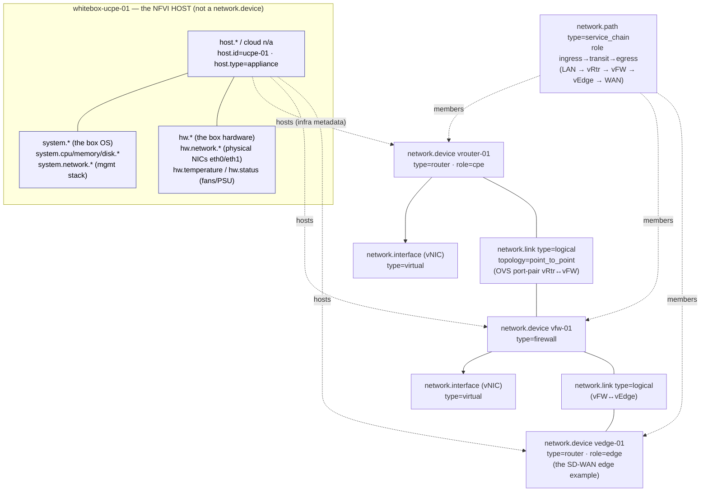

# Example: whitebox uCPE (NFVI host + VNFs)

A worked, end-to-end mapping of a **physical whitebox running multiple virtual network
functions** onto `network.*` — the example that pins down where `system.*`/`host.*`/
`hw.*` stop and `network.*` begins.

> **Who this is for.** You operate a **universal CPE (uCPE)** or a small NFV edge: one
> physical x86 appliance running Linux plus a hypervisor (KVM/QEMU) or container runtime,
> with a virtual switch (OVS-DPDK / VPP) or SR-IOV stitching together **several VNFs** —
> a virtual router, a virtual firewall, an [SD-WAN edge](../sd-wan-edge/README.md), a
> WAN-optimizer. The teaching here is the one the other examples only hint at: **the box
> is a host, each VNF is a network device, and they are different resources in different
> namespaces.** It builds directly on the [branch CPE router](../cpe-router/README.md)
> (each VNF *is* one) and the [cloud SD-WAN edge](../sd-wan-edge/README.md) (one VNF
> often *is* one), and contrasts sharply with both: this is the **one host : many
> devices** case.

---

## 1. The device(s)

`whitebox-ucpe-01` is a fanless (or 1U) x86 appliance at a branch site. By itself it
forwards nothing interesting — it is a **Linux server with NICs**. Its job is to *host*
network functions: a hypervisor runs three VNFs, a virtual switch wires them into a
chain, and the physical NICs face the LAN and the WAN.

```
 ┌────────────────────────────────────────────────────────────────────────────┐
 │ whitebox-ucpe-01   x86 appliance · Linux + KVM + OVS-DPDK                     │
 │ ── the NFVI host ──  host.*  /  system.*  /  hw.*   (NOT a network.device) ── │
 │                                                                              │
 │   ┌────────────┐      ┌────────────┐      ┌─────────────────┐                │
 │   │ VNF vRouter│      │ VNF vFW    │      │ VNF SD-WAN vEdge│  each one a     │
 │   │network.    │      │network.    │      │ network.device  │  network.device │
 │   │device      │      │device      │      │ (see sd-wan-edge)│  (fixed-form    │
 │   │type=router │      │type=firewall│     │ type=router     │   virtual)      │
 │   └─────┬──────┘      └─────┬──────┘      └────────┬────────┘                │
 │      vNIC│ (network.      vNIC│                 vNIC│                          │
 │          │  interface        │                     │                          │
 │  ────────┴──── type=virtual)─┴─────────────────────┴────  OVS / SR-IOV        │
 │          │     network.link (point_to_point) between adjacent VNFs            │
 │  ════════╪══════════════════════════════════════════════  service chain      │
 │          │     network.path  type=service_chain  (ingress → transit → egress) │
 │   ┌──────┴─────┐                                   ┌──────────────┐           │
 │   │ eth0  (LAN)│   physical NIC = hw.network.*     │ eth1  (WAN)   │           │
 │   └────────────┘   (host hardware, NOT network.*)  └──────────────┘           │
 └────────────────────────────────────────────────────────────────────────────┘
```

There are therefore **four resources** here, not one:

| Resource | Namespaces | What it is |
|----------|-----------|------------|
| `whitebox-ucpe-01` | `host.*` · `system.*` · `hw.*` | the NFVI host — a Linux server + its hardware |
| VNF `vrouter-01` | `network.device.*` (+ its own `host.*`) | a virtual router network element |
| VNF `vfw-01` | `network.device.*` (+ its own `host.*`) | a virtual firewall network element |
| VNF `vedge-01` | `network.device.*` (+ its own `host.*`) | a virtual [SD-WAN edge](../sd-wan-edge/README.md) |

The whitebox is **fixed-form hardware** (a sealed appliance — see the
[fixed-form profile](../../docs/entity-model.md#the-fixed-form-profile)); each VNF is a
**fixed-form virtual** device. The box's identity and health are a *host* story; each
VNF's forwarding, interfaces, and overlay are a *network* story.

---

## 2. Structure at a glance



The dashed **"hosts"** edges are the crux: in `network.*` terms there is no edge there at
all — `network.*` sees three independent devices wired by `network.link` and chained by
`network.path`. The fact that they share a box is **infrastructure metadata** that lives
below the network layer (§9).

---

## 3. The headline: the host is *not* a network device

This is the whole point of the example, so it gets stated plainly. Compare three
namespaces that all describe "networking on this box," and note that only one of them is
`network.*`:

| Namespace | Scope | On this box it covers… | Whose concern |
|-----------|-------|------------------------|---------------|
| `system.network.*` | the **host OS network stack** | the whitebox's own Linux interfaces, conntrack, socket stats — its management plane | the host |
| `hw.network.*` | a **physical NIC as a hardware FRU** | `eth0`/`eth1` as silicon — link, errors, the port as inventory keyed by `hw.id` | the host's hardware |
| `network.*` | a **network element's forwarding & topology** | each VNF's interfaces, routing, overlay, neighbors | each VNF (a `network.device`) |

The rule (from [namespace layering](../../docs/architecture.md#namespace-layering) and
[the one legitimate overlap](../../docs/architecture.md#the-one-legitimate-overlap-a-device-that-is-a-host)):

> A Linux/SONiC whitebox or a virtual router genuinely **is both** a `host.*` and a
> `network.device.*` — emit both resource sets and relate them by shared identity; do
> **not** overload `host.*` to carry network-element semantics, and do **not** duplicate
> generic OS/host metrics under `network.*`.

The uCPE is the case that rule's wording does *not* quite reach, and the one this example
adds: here the host is **not** any of the network devices. The box is pure NFVI
infrastructure; the network devices are its tenants. So:

- The box emits `host.*`/`system.*`/`hw.*` and **no** `network.device.*`.
- Each VNF emits the full `network.device.*` set — and, because a VNF is itself a little
  VM/container, its **own** `host.*` (its guest identity), exactly like the
  [cloud SD-WAN edge](../sd-wan-edge/README.md#3-identity--the-device-that-is-a-host-in-its-purest-form).
- Nothing is double-counted: `system.cpu.utilization` on the box is the **whole
  appliance**; `network.device.cpu.utilization` on a VNF is **that VNF's slice**. You do
  not sum them, and you do not move either across the boundary.

---

## 4. The NFVI host — `host.*` / `system.*` / `hw.*`

The box itself maps onto the **upstream OpenTelemetry** host conventions, not onto
`network.*` at all. It is listed here only to draw the boundary — these are the metrics
`network.*` deliberately does **not** redefine.

| What | Namespace / signal | Source |
|------|--------------------|--------|
| Box identity | `host.id = ucpe-01` · `host.name` · `host.type = appliance` | OTel `host.*` |
| Box compute load | `system.cpu.utilization` · `system.memory.utilization` / `.usage` | OTel `system.*` |
| Box storage | `system.disk.io` · `system.filesystem.usage` | OTel `system.*` |
| Box's own OS network stack | `system.network.*` (mgmt interface, conntrack) | OTel `system.*` |
| **Physical NICs as hardware** | `hw.network.*` (keyed by `hw.id`) — `eth0`/`eth1` link & errors | OTel `hw.*` |
| Environment / FRUs | `hw.temperature` · `hw.status` (fans, PSU, board temp) | OTel `hw.*` / ENTITY-SENSOR-MIB |

> **A physical box *does* have a hardware plane** — unlike the
> [cloud SD-WAN edge](../sd-wan-edge/README.md), the uCPE has real NICs, fans, and PSUs,
> so `hw.*` is live here. But it belongs to the **host**, keyed by `hw.id`, and a VNF
> does **not** re-emit those ports under `network.*`. The VNF sees only its **virtual**
> NICs (§6); the physical port underneath is the host's `hw.network.*` FRU. This is the
> [don't-duplicate boundary](../../docs/architecture.md#the-one-legitimate-overlap-a-device-that-is-a-host)
> in its sharpest form.

---

## 5. The VNFs — each one a `network.device`

Every VNF is a first-class `network.device`, modelled exactly like its bare-metal or
cloud equivalent. Nothing about being virtual or co-resident changes the mapping — that
is the payoff of having a clean device model.

| VNF | `network.device.type` | `role` | Models like… |
|-----|-----------------------|--------|--------------|
| `vrouter-01` | `router` | `cpe` | the [branch CPE router](../cpe-router/README.md) (identity, interfaces, BGP, NAT) |
| `vfw-01` | `firewall` | — | a firewall (sessions, NAT, policy) |
| `vedge-01` | `router` | `edge` | the [cloud SD-WAN edge](../sd-wan-edge/README.md) (TLOC overlay, OMP, vManage) |

| `network.*` | Source |
|-------------|--------|
| `network.device.id` (per VNF — its own stable id) | VNF config / orchestrator |
| `network.device.type` / `role` / `vendor.name` / `os.*` | per-VNF platform |
| `network.device.uptime` / `.cpu.utilization` / `.memory.utilization` | per-VNF NOS view |
| each VNF's own `host.id` (the guest VM/container) | OTel `host.*` on the VNF resource |

Each VNF has **its own independent identity** — there is no shared chassis serial, and
crucially **no parent `network.device` for the box**, because the box is not a network
device. Three VNFs on one whitebox are three `network.device` entities, the same as three
routers in a rack. The SD-WAN VNF (`vedge-01`) is the entire
[cloud SD-WAN edge example](../sd-wan-edge/README.md) dropped onto a slot of this box —
TLOC overlay, OMP, IPsec SAs, and all.

---

## 6. vNICs — `network.interface` `type=virtual`

A VNF's interfaces are **virtual NICs** presented by the hypervisor/vSwitch (virtio,
vhost-user, or an SR-IOV virtual function). They are ordinary `network.interface`
entities on the VNF, with `type=virtual` — the same value the
[cloud edge transports](../sd-wan-edge/README.md#5-transports--the-tloc-underlay-interfaces)
use.

| What | `network.*` | Source |
|------|-------------|--------|
| The vNIC | `network.interface` `type=virtual` (on the VNF) | VNF NOS / `oc-interfaces` |
| Up/down, MTU, MAC | `network.interface.oper.state` / `.mtu` / `.mac.address` | VNF NOS |
| Counters | `network.interface.io` (By) / `.packets` / `.errors` / `.discards` | VNF NOS |
| Which physical port it rides | the host's `hw.network.*` (NOT a VNF attribute) | host `hw.*` |

The mapping is deliberately boring: a virtual interface is just an interface. What is
*not* an interface attribute is the binding to the physical NIC underneath — that is the
host's hardware (§4), and the wire between two VNFs is a `network.link` (§7), not an
interface property.

---

## 7. Inter-VNF wiring — `network.link`

The virtual switch (OVS port-pairs, VPP, or SR-IOV) connects one VNF's vNIC to the
next's. A wire **between two devices** is the textbook
[`network.link`](../../docs/entity-model.md) case — a cross-device edge, not a per-device
interface attribute, exactly as physical cabling is modelled on the
[L2 switch](../l2-switch/README.md) and DC fabric.

| What | `network.*` | Source |
|------|-------------|--------|
| vRouter ↔ vFW virtual wire | `network.link` `type=logical`, `topology=point_to_point` | vSwitch / OVS port-pair |
| vFW ↔ vEdge virtual wire | `network.link` `type=logical`, `topology=point_to_point` | vSwitch / OVS port-pair |
| The two endpoints | `network.link.id` referencing each VNF's `network.interface` | OVS flow/port table |

`network.link.type` is an **open enum** (`physical`/`logical`/`optical`/`lag`/`tunnel`/
`pseudowire`); an OVS port-pair is a `logical` link. The endpoints are membership-by-
reference (the link names the two interfaces), so no "vSwitch" entity is invented — the
virtual switch is the *producer* of these links, not a modelled object (§11).

---

## 8. The service function chain — `network.path`

The reason a uCPE exists is the **service chain**: traffic enters from the LAN, is
steered LAN → vRouter → vFirewall → vEdge → WAN, each VNF applying its function in order.
A directed, multi-device traversal is precisely
[`network.path`](../core-router/README.md#71-mpls-lsps-networkpath) — the **same
primitive** as an MPLS LSP, an SR policy, or the
[WiFi mesh backhaul](../wifi-cpe/README.md), reused without change.

| What | `network.*` | Source |
|------|-------------|--------|
| The chain | `network.path` `type=service_chain`* | NFV orchestrator / service definition |
| The ingress VNF (LAN side) | `network.path.role = ingress` (+ `local.device.id` = `vrouter-01`) | chain definition |
| The middle VNF | `network.path.role = transit` (`vfw-01`) | chain definition |
| The egress VNF (WAN side) | `network.path.role = egress` (`vedge-01`) | chain definition |
| Chain identity | `network.path.id` (spans devices, not device-scoped) | orchestrator |
| Per-segment traffic | `network.path.io` (By) / `network.path.packets` — each VNF reports **its own segment** (shared `path.id` + its `role`) | per-VNF NOS |

> **`service_chain` is a custom open-enum value.** The authored `network.path.type` enum
> is `mpls_lsp`/`sr_policy`/`srv6_policy`/`te_tunnel`/`optical_lightpath` — a service
> function chain is **not** one of those, but `network.path.type` is an **open enum**, so
> `service_chain` is a legitimate custom value (the
> [open-enum path](../../docs/conventions.md#naming-rules)). The structure is a perfect
> fit — ordered ingress/transit/egress membership across devices — even though the value
> is new. That a forwarding-plane NFV chain and an MPLS transport LSP share one primitive
> is the model working as intended, down to the **per-segment traffic counters**
> (`network.path.io` / `.packets`): each VNF reports the bytes/packets crossing *its* hop
> of the chain, exactly as a transit LSR reports its LSP segment. The MPLS-specific path
> metrics (`label.operations`, `protection.switches`) are simply n/a for a service chain,
> and per-hop *drops* read from each VNF's `network.interface`/`network.qos` rather than a
> chain metric (§11).

---

## 9. The 1:N hosting relationship — and why it is *not* `network.*`

The defining structural fact of a uCPE — **one box hosts many VNFs** — is the dashed edge
in §2, and the model's honest answer is that **`network.*` does not carry it**.

- A VNF↔box hosting relationship is **infrastructure metadata**, the same category as
  "which hypervisor runs this VM" or "which Kubernetes node runs this pod." It belongs to
  the host/compute layer, not the network-element layer.
- The OTel-native way to express it today is to put the **NFVI host's identity on the
  VNF's resource** — each VNF resource already carries its own `host.*`; the box it runs
  on is captured as host/infrastructure context (e.g. the underlying `host.id`), not as a
  `network.*` attribute. `network.*` deliberately stays out of it.
- There is **no `hosted_on` attribute, no NFVI/hypervisor/VNF-manager entity, and no
  "parent device"** in `network.*` — and that is correct, not a defect. From the network
  plane's point of view there are simply N independent `network.device`s wired by
  `network.link` and chained by `network.path`; whether they sit on one whitebox or ten
  is below its concern.

This is the inverse of the cloud edge's identity story, and the contrast is the lesson
(§10).

---

## 10. Cloud edge vs uCPE — 1:1 vs 1:N

The two virtual examples are deliberately a matched pair. Read them together:

| | [Cloud SD-WAN edge](../sd-wan-edge/README.md) | Whitebox uCPE (this) |
|--|----------------------------------------------|----------------------|
| Host : device ratio | **1 : 1** — the VM *is* the device | **1 : N** — the box *hosts* the devices |
| The host | the EC2 instance the edge runs on — **same resource** as the device | the appliance — a **separate** resource from every VNF |
| Where `network.device` sits | on the **same** resource as `host.*`/`cloud.*` | on a **different** resource than the box's `host.*` |
| `system.*` / `hw.*` | the VM's slice; no real hardware (cloud) | the **whole box**; real `hw.*` (NICs/fans/PSU) |
| Relationship | shared identity ([device *is* a host](../../docs/entity-model.md#a-network-device-may-also-be-a-host)) | infra hosting metadata, **not** `network.*` (§9) |
| What `network.*` sees | one device that also reports host metrics | N independent devices wired by `network.link` + `network.path` |

Same `network.device` model, same `type=virtual` interfaces, same overlay primitives — two
very different host topologies, and the namespace boundary is what keeps both honest.

---

## 11. What this device does NOT model

The uCPE is mostly a *composition* of patterns the other examples already cover (each VNF
is a CPE/firewall/SD-WAN edge), so the gaps here are about the **NFVI substrate**, which
is largely out of `network.*`'s scope by design:

- **NFVI / hypervisor / VNF-manager primitives** — there is no `network.*` entity for the
  hypervisor (KVM/QEMU), the **VNF as a lifecycle object** (instantiate/scale/heal), or
  the MANO/NFV-Orchestrator stack. VNF lifecycle is an orchestration concern (ETSI MANO),
  not a network-element one. A VNF *running* is a `network.device`; a VNF *being deployed*
  is not modelled.
- **The `hosted_on` relationship as a `network.*` attribute** (§9) — the 1:N box↔VNF
  binding is infra metadata carried via host identity, not a network attribute.
- **The virtual switch / SR-IOV fabric as an entity** — OVS/VPP/DPDK is the *producer* of
  the [inter-VNF links](#7-inter-vnf-wiring--networklink) and the host's NIC plumbing; it
  is not itself a modelled object. SR-IOV VF↔PF mapping, DPDK queue stats, and OVS flow
  tables have no `network.*` home (they are host/dataplane internals).
- **Per-VNF resource guarantees / NUMA / CPU-pinning** — how many vCPUs or hugepages a VNF
  is pinned to is `system.*`/scheduler placement, not `network.*`.
- **Chain-level SLA / per-hop latency** — per-segment *traffic* is covered
  (`network.path.io` / `.packets`, [§8](#8-the-service-function-chain--networkpath)), but
  there is no per-hop latency or chain-level SLA metric, and per-hop *drops* read from
  each VNF's `network.interface` / `network.qos`, not from the path — the same active-test
  / SLA gap the [SD-WAN edge](../sd-wan-edge/README.md#11-what-this-device-does-not-model)
  flags, here on the intra-box chain.
- **Everything inside each VNF that its own example already flags** — the
  [SD-WAN edge's](../sd-wan-edge/README.md#11-what-this-device-does-not-model) active-test/
  app-steering/`omp` gaps apply unchanged to `vedge-01`.

Everything else maps cleanly by *reuse*: the box is a textbook `host.*`/`system.*`/`hw.*`
resource (`network.*` correctly declines to redefine it), each VNF is a full
`network.device` indistinguishable from its physical twin, the vNICs are
`type=virtual` interfaces, the OVS wiring is `network.link`, and the service chain is a
`network.path` — the same six primitives the physical examples use, now composed on a
single box, with the namespace boundary doing exactly the job it was designed for.
