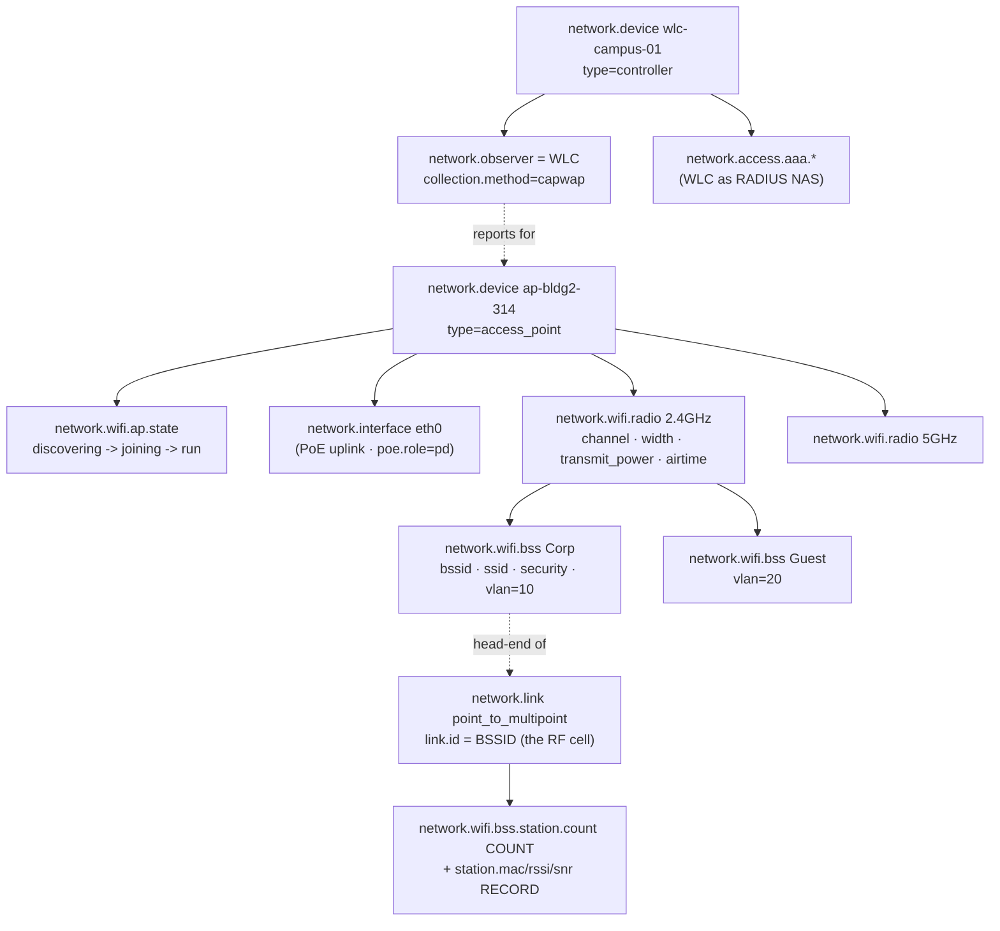

# Example: WiFi AP (controller-managed WLAN)

A worked, end-to-end mapping of a **controller-managed enterprise WLAN** onto
`network.*`, with each value traced back to the SNMP MIB object, the TR-181 data model,
and the OpenConfig/gNMI path it comes from.

> **Who this is for.** You run a wireless LAN — a WLAN controller (WLC) plus a fleet of
> access points — and want to emit OpenTelemetry network conventions for the RF layer:
> radios, BSSes, associated stations, airtime, signal quality, and the AP-join state
> machine. The two ideas that shape everything here are **producer ≠ subject** (the WLC
> reports *for* the APs — the same observer mechanism the
> [OLT reports for its ONTs](../olt-ont/README.md#9-the-ont--producer--subject)) and
> the **cardinality firewall** (a station is transient and MAC-randomised, so it is a
> count + record, never an entity — the same discipline the
> [BNG applies to subscribers](../bng/README.md#3-the-cardinality-firewall--the-whole-point)).
> Client-side AAA reuses the
> [BNG's RADIUS model](../bng/README.md#5-aaa--radius--the-client-nas-view) verbatim.

---

## 1. The deployment

`wlc-campus-01` is a controller managing ~800 APs; `ap-bldg2-314` is one of them.

```
                    ┌────────────────────┐
                    │  wlc-campus-01      │  network.device type=controller
                    │  (RADIUS NAS, RRM)  │  == network.observer (CAPWAP)
                    └─────────┬──────────┘
                       CAPWAP │ (control + telemetry relay)
              ┌───────────────┼───────────────┐
        ┌─────┴─────┐   ┌─────┴─────┐    (… ~800 APs)
        │ap-bldg2-314│  │ap-bldg2-315│   network.device type=access_point
        └─────┬─────┘   └───────────┘
       PoE eth0│
   ┌───────────┼────────────┐
   │ radio0    │ radio1      │   network.wifi.radio  (2.4 / 5 / 6 GHz)
   │ 2.4GHz    │ 5GHz        │
   └──┬────┬───┘   └────┬────┘
   BSS Corp BSS Guest  BSS Corp     network.wifi.bss  (BSSID per virtual-AP)
      │
   ( RF cell = point_to_multipoint network.link, link.id = BSSID )
      │
   stations ── count + record (MAC-randomised, transient)
```

| Property | Value |
|----------|-------|
| Controller | `network.device.id = wlc-campus-01` · `type = controller` |
| AP | `network.device.id = ap-bldg2-314` · `type = access_point` |
| Radios | 2.4 GHz / 5 GHz / 6 GHz (WiFi-6E), RRM auto-RF, DFS on 5 GHz |
| SSIDs | `Corp` (WPA3-Enterprise → VLAN 10), `Guest` (WPA2-PSK → VLAN 20) |
| Uplink | PoE Ethernet (802.3at, `poe.role=pd`) |
| Telemetry path | WLC relays AP/station telemetry over CAPWAP |

A cloud-managed deployment (Meraki/Mist) is the **same shape** — the cloud controller
is the observer. A standalone autonomous AP is producer = subject (observer absent), and
the radio/BSS telemetry below is identical either way.

---

## 2. Structure at a glance



Two structural notes: the WLC is **not** the parent of the AP in the entity tree — it
is the AP's `network.observer` (§9); and each BSS is both an entity *and* the head-end
of a 1:N RF cell modelled as a `point_to_multipoint` `network.link` whose id is the
BSSID — the same shape as the [PON tree](../olt-ont/README.md#4-the-pon-port-as-a-1n-tree).


---

## 3. Inventory — WLC and APs as devices

| What | `network.*` | SNMP | TR-181 / OpenConfig |
|------|-------------|------|---------------------|
| The controller | `network.device` `type=controller` | vendor WLC-MIB | — |
| The AP | `network.device` `type=access_point` | vendor AP-MIB | `Device.WiFi` / `oc-wifi` ap-manager |
| PoE Ethernet uplink + counters | `network.interface` (+ I/O counters) | IF-MIB `ifTable` | `Device.Ethernet` / `/interfaces` |
| PoE negotiation — the AP is the **powered device** | `network.interface.poe.*` (`role=pd`, `standard`, `class`, `state`) | RFC 3621 + LLDP-MED | `oc-if-poe` |
| Uptime / CPU / memory | `network.device.uptime` / `.cpu.utilization` / `.memory.utilization` | `sysUpTime` / vendor | `/system/state` |
| Radio / AP hardware, PoE power draw, temperature | `hw.*` | ENTITY-SENSOR-MIB | `oc-platform` sensors |

The AP is fixed-form (no chassis/module shells). PoE splits along the namespace
boundary: the power **draw** (watts / voltage / current) is `hw.*`, but the 802.3 class
**negotiation** is `network.interface.poe.*` with `role=pd` — the AP reporting its own
powered uplink, the PD side of the [switch's PSE budget
story](../l2-switch/README.md#42-poe--powering-the-access-ports). The AP signals its
power need over LLDP-MED, surfaced as `network.interface.poe.power.requested`.

---

## 4. The radio — the RF signal entity

A `network.wifi.radio` is one PHY on one band. It is the RF-signal analogue of
[`network.optical.channel`](../core-router/README.md#8-coherent-optics--400g-uplink): the radio
*hardware* is a `hw.*` FRU (by `hw.id`), the L2 view (when present) is a
`network.interface` (`type=radio`), and `network.wifi.radio.*` carries only the RF
signal those cannot express. A tri-band AP has three radio entities.

| What | `network.*` | SNMP | TR-181 / OpenConfig |
|------|-------------|------|---------------------|
| Band | `network.wifi.radio.band` = `2.4ghz`/`5ghz`/`6ghz`/`60ghz` | vendor radio-MIB | `Device.WiFi.Radio.OperatingFrequencyBand` |
| Channel / width | `network.wifi.radio.channel` / `.channel.width` (MHz) | vendor radio-MIB | `.Channel` / `.OperatingChannelBandwidth` |
| 802.11 generation | `network.wifi.radio.standard` (`802.11ax`, `802.11be`, …) | vendor radio-MIB | `.OperatingStandards` |
| Radio role(s) | `network.wifi.radio.mode` (`ap`/`sta`/`mesh`/`monitor`/`sensor`) | vendor radio-MIB | `oc-wifi` phy |
| Transmit power | `network.wifi.radio.transmit_power` (`dB[mW]` = dBm) | vendor radio-MIB | `Device.WiFi.Radio.TransmitPower` |
| Noise floor | `network.wifi.radio.noise_floor` (`dB[mW]`) | vendor radio-MIB | `oc-wifi` phy |
| **Airtime utilisation** | `network.wifi.radio.airtime.utilization` (+ `network.wifi.airtime.type` = `busy`/`tx`/`rx`/`interference`) | vendor radio-MIB | `.Stats.ChannelUtilization` |
| RF retries | `network.wifi.radio.retries` (+ `network.io.direction`) | vendor radio-MIB | `.Stats.*Retrans*` |

`network.wifi.radio.airtime.utilization` with `airtime.type=busy` is the single most
important RF capacity number — "the 2.4 GHz band in the atrium is 90% busy." A radio on
a shared medium is capacity-bound by **airtime, not bit-rate**, so this is the
utilisation metric that matters, decomposed into `tx`/`rx`/`interference`. `dB[mW]` is
UCUM for dBm — the same unit note that serves optical engineers.

> **STA / mesh self-uplink.** When a radio is itself a client (`mode` includes `sta` or
> `mesh` — a WISP CPE, travel router, or mesh backhaul leg), its own uplink signal is the
> bounded per-radio gauges `network.wifi.radio.rssi` / `.snr` (self-reported), distinct
> from the per-station record fields in §6.

---

## 5. The BSS — virtual-AP and head-end of the RF cell

A `network.wifi.bss` is one SSID on one radio (a "virtual AP"), identified by its BSSID.

| What | `network.*` | SNMP | TR-181 / OpenConfig |
|------|-------------|------|---------------------|
| BSSID | `network.wifi.bss.bssid` (= the RF cell's `network.link.id`) | vendor BSS-MIB | `Device.WiFi.SSID.BSSID` |
| SSID (network name) | `network.wifi.bss.ssid` | vendor BSS-MIB | `Device.WiFi.SSID.SSID` |
| Security mode | `network.wifi.bss.security` (`wpa3_enterprise`, `wpa2_personal`, `owe`, …) | vendor BSS-MIB | `Device.WiFi.AccessPoint.Security.ModeEnabled` |
| **SSID → VLAN binding** | `network.wifi.bss.vlan` | vendor BSS-MIB | `Device.WiFi.AccessPoint.*.VLAN` |
| The 1:N RF cell | `network.link` `topology=point_to_multipoint`, `link.id = BSSID` | — | — |

`network.wifi.bss.vlan` is the WiFi instance of the port↔VLAN membership pattern —
"this SSID drops its clients into VLAN 10" — carried as a config attribute on the
entity, exactly as the [L2 switch carries switchport VLAN membership](../l2-switch/README.md#4-interfaces--switchport-membership).
The BSSID *is* the `point_to_multipoint` link id: the AP is the head-end, and each
station attaches by carrying that same id.

---

## 6. The station — transient, MAC-randomised, a count not an entity

A station is the hardest object in the WLAN: transient (associates, roams, idles out in
minutes), **MAC-randomised by design** (modern clients rotate their MAC per SSID/visit,
so the identifier is deliberately unstable), and numerous (thousands per WLC). It is
therefore **a count plus a record, never an entity** — the cardinality firewall, the
the same answer the [BNG gives for subscribers](../bng/README.md#3-the-cardinality-firewall--the-whole-point).

| What | `network.*` | SNMP | TR-181 / OpenConfig |
|------|-------------|------|---------------------|
| Associated-client count | `network.wifi.bss.station.count` (per BSS) | vendor BSS-MIB | `Device.WiFi.AccessPoint.AssociatedDeviceNumberOfEntries` |
| Station MAC | `network.wifi.station.mac` (**record field**, not a dimension) | — | `Device.WiFi.AccessPoint.AssociatedDevice.MACAddress` |
| Per-station RSSI | `network.wifi.station.rssi` (`dB[mW]`, record) | — | `.AssociatedDevice.SignalStrength` |
| Per-station SNR | `network.wifi.station.snr` (`dB`, record) | — | `.AssociatedDevice.*SNR*` |

`network.wifi.bss.station.count` is the low-cardinality count — "how many clients are on this
BSS" — and, compared against the radio's max-client ceiling, the
association-table-fill signal (a packed lecture hall exhausts the table while CPU looks
idle). All per-station detail (`station.mac`, `rssi`, `snr`) rides records, **never**
metric dimensions; MAC-randomisation is the explicit reason no stable identity or entity
resolution is attempted. The per-station RSSI is the client analogue of
[per-ONU burst RSSI](../olt-ont/README.md#5-pon-optics--burst-mode-rssi--bipfec).

---

## 7. Client-side AAA — the WLC as a RADIUS NAS

WPA-Enterprise makes the WLC a RADIUS authenticator, so "can clients authenticate to
corporate?" — the #1 enterprise-WLAN outage question — reuses the **shared**
`network-access` AAA model the [BNG already uses](../bng/README.md#5-aaa--radius--the-client-nas-view);
none of it is WiFi-specific.

| What | `network.*` | SNMP | OpenConfig |
|------|-------------|------|------------|
| 802.1X / RADIUS request rate | `network.access.aaa.requests` (+ `aaa.operation`/`aaa.result`) | RADIUS-AUTH-CLIENT-MIB | `oc-aaa` |
| Auth latency | `network.access.aaa.request.duration` (histogram) | — | — |
| Change-of-Authorization | `network.access.coa.requests` | — | — |

Per-station 802.1X/EAP state rides the station record, not a metric.

---

## 8. The AP-join state machine

The CAPWAP join sequence is a dedicated enum gauge — the WiFi analogue of the
[ONU activation state machine](../olt-ont/README.md#6-ont-activation--ranging--the-pon-control-plane),
kept off the coarse up/down model because `joining`/`downloading` carry meaning up/down
would lose. See [state modelling](../../docs/conventions.md#state-modelling).

| What | `network.*` | SNMP | OpenConfig |
|------|-------------|------|------------|
| AP controller-join state | `network.wifi.ap.state` (`discovering`/`joining`/`downloading`/`run`/`disconnected`/`unknown`) | vendor WLC-MIB | `oc-wifi` ap-manager |
| Vendor-native state string | `network.wifi.ap.native_state` (e.g. `Run`, `Image Download`) | vendor WLC-MIB | — |

Reported as the K8s `status.phase` pattern: one series per state value, value 1 for the
current state. "Is the AP joined and serving, and if it dropped, when?" is answerable;
the join/leave *transition event* is deferred (§10).

---

## 9. Producer ≠ subject — the WLC as observer

The WLC reports telemetry *for* hundreds of APs and thousands of stations. The subject
of that telemetry is the **AP** (the Resource), and the WLC is named as the
`network.observer` that relayed it — the exact same mechanism that lets the
[OLT report for its ONTs](../olt-ont/README.md#9-the-ont--producer--subject).

| What | `network.*` | Source |
|------|-------------|--------|
| Telemetry subject | Resource = the **AP** (`network.device` `type=access_point`) | — |
| Who relayed it | `network.observer.id` = the WLC | — |
| The relay protocol | `network.observer.collection.method = capwap` | — |
| Cloud-managed variant | same shape — the cloud controller is the observer | — |

The radio/BSS/station telemetry is **producer-agnostic**: identical whether self-emitted
by an autonomous AP or relayed by a WLC. Only `network.observer.id` and
`collection.method` differ. This is the same observer model that solved PON — a
vindication that producer ≠ subject is how access networks work generally, not a
per-technology quirk.

---

## 10. What this device does NOT model

Deliberately out of scope, to keep the boundaries honest:

- **Wireless events** — associate / disassociate / **roam**, DFS radar detected, RRM
  channel/power change, rogue-AP / interference detection. The current channel, power,
  and AP state are trackable as gauges, so current state is visible; the point-in-time
  transitions are deferred to the events package. A **roam** is designed there as
  "identity X moved from attachment point A to B" — the same shape as switch MAC-move,
  L3 MAC-move, and EVPN MAC-mobility (`network.wifi.station.previous_bss.bssid` is the
  RF sibling of `network.l2.mac.previous_interface.name`), so it lands as one member of a
  unified attachment-point-move family, not a one-off.
- **The ESS / SSID as a first-class entity** — an SSID spans many BSSes across many APs
  and is not device-scoped, so it is carried as the `network.wifi.bss.ssid` descriptor
  for now rather than an entity.
- **Per-station MCS / PHY data rate** — the negotiated per-client rate is the one RF
  value without a dedicated authored field.

Everything else — the radio/BSS hierarchy, the RF PHY telemetry (airtime, noise,
tx-power, retries), the transient MAC-randomised station as count + record, client-side
AAA, the AP-join state machine, and the producer ≠ subject observer mechanism over
CAPWAP — is authored.
