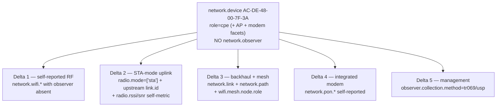

# Example: WiFi CPE (all-in-one wireless gateway)

A worked mapping of an **all-in-one home/SMB gateway** — router + switch + Wi-Fi AP +
(often) integrated modem — onto `network.*`, plus its wireless-edge variants
(Wi-Fi-WAN uplink, fixed-wireless, mesh).

> **Who this is for.** You build or operate consumer/SMB gateways and want to emit
> OpenTelemetry network conventions. This device is deliberately a *composite*: roughly
> 80% of it is already covered by the [branch CPE router](../cpe-router/README.md) (WAN,
> routing, NAT, LAN switch, VLANs) and the [WiFi AP](../wifi-ap/README.md) (radios, BSS,
> stations, RF telemetry). **This walkthrough covers only the delta** — the five things
> that are genuinely new when those two devices collapse into one self-managed box. The
> recurring theme is that the model is **producer-agnostic**: the same RF and PON
> telemetry serves whether a controller relays it or the box self-reports it.

---

## 1. The device

`AC-DE-48-00-7F-3A` is a self-reporting all-in-one gateway, with four variant forms.

```
                         INTERNET
                            │
         ┌──────────────────┴───────────────────┐
         │  AC-DE-48-00-7F-3A   role=cpe         │  network.device
         │  (+ AP facet, + modem/ONT facet)      │  NO network.observer
         │   self-reporting (producer = subject) │  (it reports for itself)
         ├───────────────────────────────────────┤
         │  WAN: fibre / DSL / Wi-Fi-WAN (STA)    │
         │  Router + NAT + LAN switch + VLANs     │  ← all CPE-covered
         │  Radios 2.4/5/6 GHz · BSSes · stations │  ← all WiFi-AP-covered
         └───────────────────────────────────────┘

  Variants:  (a) wired-WAN gateway        (c) fixed-wireless PtP/PtMP
             (b) Wi-Fi-WAN uplink (STA)    (d) mesh node (ap + backhaul)
```

| Property | Value |
|----------|-------|
| Identity | `network.device.id = AC-DE-48-00-7F-3A` · `role = cpe` (+ AP / modem facets) |
| Observer | **absent** — producer = subject (the box reports its own telemetry) |
| Managed by | an ACS / controller over TR-069 (CWMP) or USP (TR-369) |

> **Identity source.** An all-in-one home gateway is a **sealed access unit** with no
> operator-assigned hostname, so its `network.device.id` is its base hardware **MAC
> address** (`AC-DE-48-00-7F-3A`, in `host.mac` IEEE-RA hex form) — the stable
> per-unit key an ACS already keys CWMP/USP sessions on. Serial number is an equally
> valid source where the ACS exposes it; either is opaque and unprefixed. See
> [source precedence by device class](../../docs/entity-model.md#source-precedence-by-device-class).

Because the box *is* its own AP and modem, there is no `network.observer` relaying its
telemetry — the opposite of the [WLC-managed AP](../wifi-ap/README.md#9-producer--subject--the-wlc-as-observer)
and the [OLT-managed ONT](../olt-ont/README.md#9-the-ont--producer--subject).

---

## 2. What's already covered (do not re-map)

| Layer | Covered by |
|-------|-----------|
| Device shell, CPU / memory / uptime, environment (`hw.*`) | [CPE router](../cpe-router/README.md#3-inventory--identity) |
| WAN / PPPoE, routing, LAN switch, VLAN trunk, MAC table | [CPE router](../cpe-router/README.md#6-wan-access--the-pppoe-session) |
| NAT44 (source-NAT / PAT translation table) | [CPE router](../cpe-router/README.md#10-nat44--the-translation-table) |
| Optical DOM (when fibre-fed) | [CPE router](../cpe-router/README.md#8-optical-transceiver-dom) |
| Radio / BSS / SSID, RF telemetry (airtime, noise, tx-power) | [WiFi AP](../wifi-ap/README.md#4-the-radio--the-rf-signal-entity) |
| Station as count + record (MAC-randomised) | [WiFi AP](../wifi-ap/README.md#6-the-station--transient-mac-randomised-a-count-not-an-entity) |
| AP-join state, associate / roam events | [WiFi AP](../wifi-ap/README.md#8-the-ap-join-state-machine) |

Everything below is the **delta**.

---

## 3. Structure — the five deltas



---

## 4. Delta 1 — self-reported RF (producer = subject)

On this box the radio/BSS/station telemetry is **self-telemetry**, not controller-relayed.
The model handles this by construction: `network.wifi.*` is producer-agnostic — the
attributes and metrics are identical whether self-emitted or WLC-relayed; only the
observer differs. On a self-reporting gateway the observer is simply **absent**.

| Concept | Mapping |
|---------|---------|
| Self-reported radio / BSS / station | `network.wifi.*` with **no** `network.observer` |
| Same RF model as the WLC case | identical attributes / metrics |

This is the clean factoring: the RF gaps were intrinsic to RF (closed for everyone in
the [WiFi AP example](../wifi-ap/README.md#4-the-radio--the-rf-signal-entity)), while
producer ≠ subject was a controller artifact that correctly vanishes when the AP
self-reports.

---

## 5. Delta 2 — the Wi-Fi-WAN uplink (the device as a station)

A gateway whose *uplink* is Wi-Fi (a travel router, WISP CPE, or mesh backhaul leg) is
itself a **station on someone else's AP** — it must report its own upstream association.

| Concept | Mapping | SNMP / TR-181 |
|---------|---------|---------------|
| Radio role(s) | `network.wifi.radio.mode` = `sta` (or `["ap","mesh"]`) | `Device.WiFi.Radio` / vendor |
| Wi-Fi uplink interface | `network.interface` `type=radio`, `role=uplink` | IF-MIB `ifTable` |
| **Which AP/BSSID we joined** | membership-by-reference: the device carries the upstream BSS's `network.link.id` (= the upstream BSSID) | `Device.WiFi.EndPoint.*.BSSID` |
| **Our own uplink RSSI / SNR** | `network.wifi.radio.rssi` / `network.wifi.radio.snr` (self-reported gauges, `sta`/`mesh` mode) | `Device.WiFi.EndPoint.Stats.*` |
| Our roam (uplink moved AP) | roam event (deferred) | — |

`network.wifi.radio.mode` answers the most basic wireless question — "am I serving
clients or am I a client?" — that no prior attribute could. The upstream association is
expressed by carrying the upstream BSSID as a `network.link.id`, exactly as a
[PON ONU carries `network.pon.id`](../olt-ont/README.md#4-the-pon-port-as-a-1n-tree).
And the device's **own** uplink signal quality is the bounded per-radio
`network.wifi.radio.rssi` / `.snr` gauges (self-measured, the receiving-endpoint twin of
optical Rx power / OSNR) — distinct from the AP-side per-station RSSI, which is a record
field. This is the #1 health signal for a Wi-Fi-WAN leg.

---

## 6. Delta 3 — wireless backhaul & mesh topology

Fixed-wireless and mesh introduce RF on a *link* and the first multi-hop self-forming
topology. Neither needs a new primitive — both compose from `network.link` and
`network.path`.

| Concept | Mapping |
|---------|---------|
| PtP fixed-wireless link | `network.link` `type=physical`, `topology=point_to_point` |
| PtMP sector (1:N) | `network.link` `topology=point_to_multipoint` (the same PON / BSS primitive) |
| **RF metrics on that link** | on the `network.wifi.radio` at each end (a `network.link` carries no metrics) |
| **Mesh node role** | `network.wifi.mesh.node.role` = `gateway`/`mesh_ap`/`portal` |
| **Multi-hop path to the gateway** | `network.path` — each hop carries the shared `network.path.id`; `network.path.role` orders the hops toward the root |
| Radio serving two jobs at once (AP + backhaul) | `network.wifi.radio.mode = ["ap","mesh"]` (multi-valued) |
| Re-parent / path-change event | deferred |

The multi-hop path to the root is a `network.path` — the *same* cross-device primitive
as an [MPLS/SR LSP on the core router](../core-router/README.md#7-the-mpls--sr--srv6-forwarding-plane),
here ordering wireless backhaul hops instead of label-switched ones. The only genuinely
new descriptor is `network.wifi.mesh.node.role`.

---

## 7. Delta 4 — the integrated modem / ONU (self-reported)

A gateway with an integrated GPON ONT self-reports its own PON uplink — the
producer = subject inverse of the [OLT-relayed ONU](../olt-ont/README.md#9-the-ont--producer--subject).

| Concept | Mapping |
|---------|---------|
| PON optics / state, self-reported | `network.pon.*` with **no** `network.observer` |
| The device's facets | `network.device` carries `role=cpe` and an `role=onu` facet |

`network.pon.*` is producer-agnostic just like Wi-Fi: an ONT's telemetry is identical
whether OLT-relayed (observer = OLT, `collection.method=omci`) or self-emitted by an
integrated-ONT gateway (observer absent). Same factoring as Delta 1.

---

## 8. Delta 5 — TR-069 / USP management

A home gateway is overwhelmingly managed via CWMP (TR-069) or USP (TR-369) — the
largest-footprint CPE management protocols, a third access-world collection method
after `omci` and `capwap`.

| Concept | Mapping |
|---------|---------|
| ACS / controller collecting from a fleet | `network.observer` (the ACS) |
| The management protocol | `network.observer.collection.method` = `tr069` / `usp` |

Note the dual perspective: the gateway self-reports its *data-plane* telemetry
(observer absent, Deltas 1 & 4), while an ACS that *aggregates* a fleet of gateways is
itself a `network.observer` collecting over `tr069`/`usp` — the same observer model,
applied at the management layer.

---

## 9. Consumer-Wi-Fi specifics

| Requirement | Mapping | Status |
|-------------|---------|:------:|
| Guest SSID → isolated VLAN | `network.wifi.bss.vlan` | authored |
| WPS / PSK / WPA3-Personal onboarding | `network.wifi.bss.security` + per-station auth (record) | authored / event-deferred |
| Band steering (2.4 ↔ 5 ↔ 6 GHz) | a steered move = a roam-like event (shared move family) | deferred |
| EasyMesh client roam across nodes | roam event with old/new node | deferred |
| Parental controls / per-device policy | the security/policy domain (no package yet) | gap (firewall family) |

---

## 10. What this device does NOT model

- **Wireless mobility events** — roam, band-steer, mesh re-parent. As with the
  [WiFi AP](../wifi-ap/README.md#10-what-this-device-does-not-model), the current state
  is visible (radio mode, mesh role, path role); the transitions are deferred and land
  as members of the shared attachment-point-move family
  (`network.wifi.station.previous_bss.bssid` is the move record's previous-locator half).
- **Firewall / NAT-*rule* config & per-device policy** — the NAT44 translation *table* is
  now modelled (the box-wide `network.nat.translation.count` gauge, `type=source`, exactly as
  the [CPE router emits it](../cpe-router/README.md#10-nat44--the-translation-table)); the
  carrier CG-NAT pool / port-block story is [the BNG](../bng/README.md)'s, not a home
  box's. What remains a gap is NAT/firewall **rules** — DNAT port-forwards, VIPs, and
  parental-control policy — which belong to the unauthored firewall/policy rulebase
  package.

Everything else is covered: the CPE half, the AP half, and all five deltas — self-reported
RF, the STA-mode uplink (including the self-measured `network.wifi.radio.rssi`/`.snr`),
the wireless backhaul + mesh via `network.link` + `network.path` + `mesh.node.role`, the
integrated-modem self-report, and TR-069/USP management.
